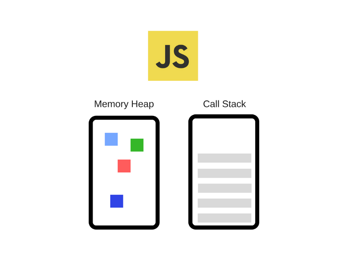
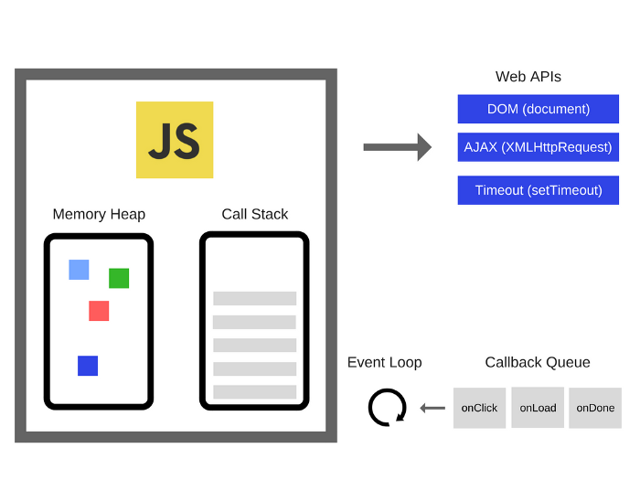

# Javascript 동작원리

javascript의 경우 싱글쓰레드 동작 언어임

> 싱글쓰레드

  하나의 프로세스에서 하나의 스레드를 실행하는 것으로 **한번에 하나의 작업만 수행할 수 있음**

but javascript의 특징에는 비동기, 동시성, 논블로킹 IO가 등장함.

이런 동시성을 어떻게 지닐 수 있고 많을 콜백함수를 사용할 수 있을까?

### Javascript 동작 원리

 

- 런타임은 메모리 힙과 콜 스텍으로 구성됨

  - 메모리힙: 메모리 할당을 담당하는 곳

  - 콜스택: 코드가 호출되면서, 스택으로 쌓이는 곳으로 **LIFO(Last In First Out)방식**으로 실행

```javascript
const foo = () => {
  bar()
  console.log('foo')
}
const bar = () => {
  console.log('bar')
}
foo();
console.log('foo and bar')
```


**콜스택 순서**

1. foo 함수 실행
2. foo 함수 내부에서 bar 함수 실행
3. console.log(‘bar’) 실행 후 콜스택에서 제거
4. bar 함수 모두 실행되었으니 제거
5. foo 함수로 돌아와서 console.log(‘foo’) 실행 후 콜스택에서 제거
6. foo 함수 모두 실행되었으니 제거
7. console.log(‘foo and bar’)가 콜스택에 추가, 실행 후 제거


### Javascript 런타임은 자체적으로 비동기를 지원하는가?

답은 Javascript의 런타임 과정에서 비동기 API를 지원하지 않고 Javascript 엔진을 구동하는 **런타임 환경**에서 담당함

- 런타임 환경: 브라우저 또는 Node.js 같은 것



- 이벤트 루프: 이벤트 발생 시 호출되는 콜백 함수들을 관리하여 태스크 큐에 전달하고, 태스크 큐에 담겨있는 콜백 함수들을 콜스택에 넘겨줌
   - 이벤트 루프가 태스크 큐에서 콜스택으로 콜백 함수를 넘겨주는 작업은 콜스택에 쌓여있는 함수가 없을때만 수행
- 태스크 큐: web api에서 비동기 작업들이 실행된 후 호출되는 콜백함수들이 기다리는 공간으로 이벤트 루프가 정해준 순서대로 줄을 서있으며, FIFO(First In First Out) 방식을 따름.
   - 태스크 큐는 하나의 큐로 이루어있지 않음. Microtask Queue, Animation Frames 등 여러개의 큐로 이루어져 있음. 단, 이해의 편의를 위해 Task Queue로 통합하여 명칭함.
- Web api: Web api는 브라우저에서 자체 지원하는 api.  Web api는 Dom 이벤트, Ajax (XmlHttpRequest), setTimeout 등의 비동기 작업들을 수행할 수 있도록 api를 지원.

 

### 런타임 환경에서 어떻게 비동기 코드가 실행되는가?

1. 먼저 코드는 호출스택에 쌓인 후 실행되면, Javascript의 엔진은 비동기 작업을 Web api에게 위임함.
2. Web api는 해당 비동기 작업을 수행하고 콜백 함수를 이벤트 루프를 통해 태스크 큐에 넘겨주게 됨.
3. 이벤트 루프는 콜스택에 쌓여있는 함수가 없을 때에, 태스크 큐에서 대기하고 있던 콜백함수를 콜스택으로 넘겨줌.
4. 콜스택에 쌓인콜백함수가 실행되고, 콜스택에서 제거됨.

여기서  **논블로킹 I/O**개념이 설명됨.

만약 http 요청과 같은 작업들이 동기로 수행될 경우 JS 엔진의 경우 해당 작업이 끝날때까지 다른 작업을 할 수 없는 상태 즉 블로킹 상태가 될 것임. 그러나 Javascript는 **비동기 작업들을 Web api에게 넘겨줌**으로써, 해당 작업이 완료될때까지 다른 코드들을 실행할 수 있어 **논블로킹**이 가능하도록 함.

```javascript
console.log('첫번째로 실행됩니다.');

setTimeout(() => console.log('최소 1초 후에 실행됩니다.'), 1000);

console.log('언제 실행될까요?');
```

출력 순서

```
첫번째로 실행됩니다.
언제 실행될까요?
최소 1초 후에 실행됩니다.
```

1. 제일 먼저 console.log(‘첫번째로 실행됩니다.’)가 콜스택에 쌓이고, 이는 바로 실행되어 제거됨.

2. 그 다음으로 setTimeout이 콜스택에 쌓임. **setTimeout이 실행되고, Web api에서 timer가 생성됨.**

3. console.log(‘언제 실행될까요?’)가 콜스택에 쌓인 후, 바로 실행되고 제거됨.

4. Web api에서 생성된 timer는 생성된 시점을 기준으로 최소 1초 후에 태스크 큐로 콜백함수를 전달함.

5. 태스크 큐에 전달되어있던 setTimeout의 콜백함수가 콜스택에 스택이 없는것을 확인한 후, 콜스택에 호출되어 실행됨.

   

#### 만약 setTimeout의 시간을 0초로 둔다면 어떨까?

```javascript
console.log('첫번째로 실행됩니다.');

setTimeout(() => console.log('최소 0초보다 늦게 실행됩니다.'), 0);

console.log('언제 실행될까요?');
```

출력순서

```
첫번째로 실행됩니다.
언제 실행될까요?
최소 0초보다 늦게 실행됩니다.
```

결과는 바뀌지 않음. 위의 프로세스를 그대로 따르게 되어 콜스텍이 비어있을때 태스크 큐에 있는 timer가 콜백 함수로 전달되기에 마지막에 실행됨.

### 결론

콜스택에 많은 함수들을 쌓아 놓는 것들은 다른 태스크들을 블로킹할 여지를 높이고, 랜더를 담당하는 랜더링 큐도 콜스택의 영향을 받기 때문에 UI 측면에서 불편함을 야기함. 따라서 적절히 테스크를 나눠서 비동기 호출을 해주어야하며 실행이 오래 걸리는 작업의 경우 태스크 큐로 보내어 다른 작업이 빠르게 진행되도록 하는 것이 하나의 방안임.