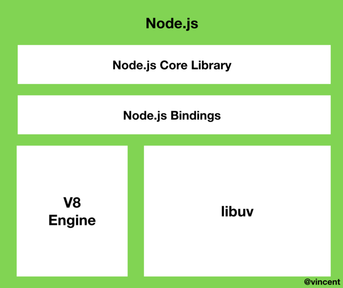
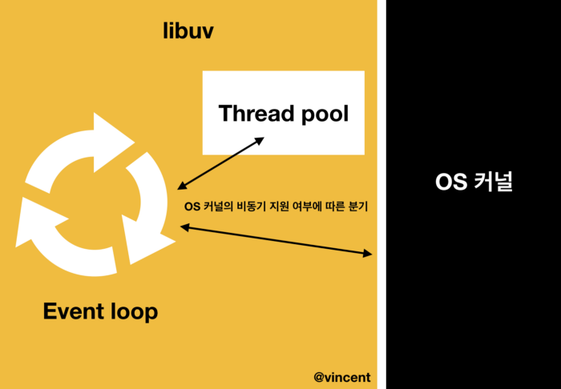

# Node.js 동작원리

## Node.js 란 무엇일까?

단 한마디로 Node.js를 표현하자면, **Javascript를 브라우저 밖에서도 실행할 수 있도록 하는 Javascript의 런타임**.

> 런타임: 특정 언어로 만든 프로그램을 실행할 수 있는 환경.

Node.js는 싱글스레드라는 말을 많이 들어보셨을 겁니다. 싱글스레드와 멀티스레드를 비교해보면서 스레드에 대한 개념을 익혀봅시다.

싱글스레드는 프로세스 내에서 하나의 스레드가 하나의 요청만을 수행합니다. 해당 요청이 수행될 때 다른 요청을 함께 수행할 수 없습니다. 이를 **싱글스레드 블로킹 모델**이라고 합니다. 진행되고 있는 요청이 예정되어 있는 요청을 블로킹하기 때문입니다.

반면에 멀티스레드는 스레드 풀에서 실행의 요청만큼 스레드를 매칭하여 작업을 수행합니다. 언뜻 보면 멀티스레드가 훨씬 좋아보이지만, 멀티스레드는 **효율성 측면에서 큰 단점**을 갖고 있습니다. 스레드 풀에 스레드가 늘어날수록 CPU 비용을 소모하고, 만약 요청이 적다면 놀고있는 스레드가 생기기 때문입니다.

Node.js는 **싱글스레드 논블로킹** 모델로 구성되어 있습니다. 하나의 스레드로 동작하지만, 비동기 I/O 작업을 통해 요청들을 서로 블로킹하지 않습니다. 즉, **동시에 많은 요청들을 비동기로 수행함으로써 싱글스레드일지라도 논블로킹이 가능합니다.**
또한 Node.js는 클러스터링을 통해 **프로세스를 포크(fork)하여 멀티스레드인것 처럼 사용될 수 있습니다.** 트래픽에 따라서 프로세스를 포크할 수 있으므로 서버의 **확장성**이 용이하다는 장점을 갖습니다.

## Node.js 는 완전한 싱글스레드 인가?

Node.js는 싱글스레드입니다. Javascript를 실행하는 스레드는 메인스레드 단 하나이기 때문입니다. 하지만 Node.js가 완전하게 싱글스레드를 기반으로 동작하지는 않습니다. **일부 Blocking 작업**들은 libuv의 스레드 풀(Thread pool)에서 수행되기 때문입니다. 

## 이벤트 기반(Event-driven)

이벤트 기반이란 이벤트가 발생할 때 미리 지정해둔 작업을 수행하는 방식을 의미합니다. Node.js는 이벤트 리스너에 등록해둔 콜백함수를 실행하는 방식으로 동작합니다.

```
router.get('/', (req,res,next)=> {
  // router.get 이벤트에 대한 콜백함수 로직
}

* 흔히 사용하고 있는 router도 이벤트 기반으로 동작하고 있습니다.
```

이벤트 기반 모델에서는 이벤트 루프 개념을 빼놓을 수 없습니다. 이벤트에 따라 호출되는 콜백함수를 관리하는 것이 바로 **이벤트 루프**입니다.


Node.js의 이벤트 루프를 설명하기 전에, Node.js가 내부적으로 어떻게 구성되어 있는지에 대해 먼저 알아봅시다.

## Node.js의 내부 구조




```
* Node.js는 Javascript와 C++언어로 구성되어 있습니다. V8엔진도 70% 이상의 C++로 구성되어 있으며, libuv는 100%의 C++언어로 구성된 라이브러리 입니다. 
하지만 우리는 C/C++언어를 몰라도  Node.js는 사용할 수 있습니다. 이는 V8 엔진에서 Javascript를 C++로 Translate 해주기 때문에 가능한 일입니다. 
또한 Node.js의 코어 라이브러리는 process.binding()을 통해 Javascript 환경에서 사용될 수 있습니다.

* Node.js에 동작하는 이벤트 루프는 libuv 내에서 구현됩니다. 
이벤트 루프가 libuv 내에서 실행된다고 해서, Javascript의 스레드와 이벤트 루프의 스레드가 별도로 존재한다고 생각하실 수 있습니다. 
하지만 Node.js는 싱글스레드이기 때문에 하나의 이벤트 루프를 갖으며, 하나의 스레드가 모든 것을 처리합니다.
```

Node.js를 크게 나눠봤을 때, 내장 라이브러리와 v8엔진 그리고 **libuv**로 구성되어 있습니다. Node.js의 특성인 이벤트 기반, 논블로킹 I/O 모델들은 모두 **libuv 라이브러리에서 구현**됩니다.

Node.js에서 작성되는 거의 모든 코드들은 콜백함수로 이루어져 있습니다. 콜백함수들은(심지어 if문까지) libuv 내에 위치한 이벤트 루프에서 관리 및 실행됩니다.
이벤트 루프는 **여러 개의 페이즈(Phase)들을 갖고 있으며, 해당 페이즈들은 각자만의 큐(Queue)를 갖습니다.** 이벤트 루프는 **라운드 로빈(round-robin) 방식**으로 노드 프로세스가 종료될때까지 **일정 규칙에 따라 여러개의 페이즈들을 계속 순회**합니다. 페이즈들은 각각의 큐들을 관리하고, 해당 큐들은 FIFO(First In First Out) 순서로 콜백함수들을 처리합니다.

```
라운드 로빈: 그룹 내에 있는 모든 요소들을 합리적인 순서에 입각하여 뽑는 방법으로서, 대개 리스트의 맨 위에서 아래로 가며 하나 씩 뽑고, 끝나면 다시 맨 위로 돌아가는 식으로 진행된다. 쉽게 말해 라운드 로빈은 “기회를 차례대로 받기”라고 이해해도 좋을 것이다. 컴퓨터 운영에서, 컴퓨터 자원을 사용할 수 있는 기회를 프로그램 프로세스들에게 공정하게 부여하기 위한 한 방법으로서, 각 프로세스에 일정시간을 할당하고, 할당된 시간이 지나면 그 프로세스는 잠시 보류한 뒤 다른 프로세스에게 기회를 주고, 또 그 다음 프로세스에게 하는 식으로, 돌아가며 기회를 부여하는 운영방식이 있는데, 이를 흔히 라운드 로빈 프로세스 스케줄링이라고 부른다.
```

이벤트 루프의 내부 동작과정에 대한 세부 설명은 아래에서 다시 다루도록 하고, 다음으로 libuv에서 논블로킹 I/O 모델은 어떻게 구현되는지 알아보겠습니다.

## 논블로킹 I/O (Non-Blocking I/O)

Node.js에서의 논블로킹 I/O 모델은 Input과 Output이 관련된 작업(http, Database CRUD, third party api, filesystem) 등의 블로킹 작업들을 백그라운드에서 수행하고, 이를 비동기 콜백함수로 이벤트 루프에 전달하는 것을 말합니다.

```
* 여기서 백그라운드란 OperatingSystem 커널 혹은 libuv의 스레드 풀을 의미합니다.
```



논블로킹 I/O들은 OS 커널 혹은 libuv 내의 스레드 풀에서 담당합니다. libuv는 OS 커널에서 어떤 비동기 작업들을 지원해주는지 알고 있기때문에, 작업 종류에 따라 커널 혹은 스레드 풀로 분기합니다. 작업이 완료되면 이벤트루프에게 이를 알려주고, 이벤트 루프에 콜백함수로 등록됩니다. libuv의 스레드 풀은 커널이 지원안하는 작업들을 수행합니다.  libuv에서 스레드 풀은 멀티스레드로 이루어져 있기 때문에 완전한 싱글쓰레드는 아닙니다. 여기서 이뤄지는 작업의 대표적인 예로는 파일시스템이 있습니다. 스레드 풀도 마찬가지로 해당 작업을 수행하면, 이벤트 루프에 콜백함수를 전달합니다.

## 이벤트 루프 동작 원리


Node.js 공식 홈페이지에 나와있는 이벤트 루프의 다이어그램

아래는 Node.js 공식 홈페이지에 나와있는 설명입니다.

> 각 단계는 실행할 콜백의 FIFO 큐를 가집니다. 각 단계는 자신만의 방법에 제한적이므로 보통 이벤트 루프가 해당 단계에 진입하면 해당 단계에 한정된 작업을 수행하고 큐를 모두 소진하거나 콜백의 최대 개수를 실행할 때까지 해당 단계의 큐에서 콜백을 실행합니다. 큐를 모두 소진하거나 콜백 제한에 이르면 이벤트 루프는 다음 단계로 이동합니다.
>
> 이러한 작업이 *또 다른* 작업을 스케줄링하거나 poll 단계에서 처리된 새로운 이벤트가 커널에 의해 큐에 추가될 수 있으므로 폴링 이벤트를 처리하면서 poll 이벤트를 큐에 추가할 수 있습니다. 그 결과 오래 실행되는 콜백은 poll 단계가 타이머의 한계 시점보다 훨씬 더 오래 실행되도록 할 수 있습니다.

Node.js가 시작되면 스레드가 생기고, 이벤트 루프가 생성됩니다. 이벤트 루프는 6개의 페이즈를 라운드 로빈 방식으로 순회하며 동작합니다. 이제 각각의 페이즈들이 세부적으로 어떤 역할을 수행하는지에 알아보겠습니다. (세부 설명에서 페이즈는 단계라고 지칭하겠습니다.)

1. timers
   `**setTimeout()**`**과** `**setInterval()**` **같은 timer 함수**들이 처리됩니다. 이벤트 루프가 페이즈를 순회하면서 timer 단계에 오면 처리할 수 있는 timer 함수들을 확인하고 콜백함수를 실행합니다. timer 함수의 입력된 지연시간은 콜백함수가 실행되는 정확한 값이 아닙니다. 단지 해당 지연시간 이후에 실행된다는 기준시간의 의미와 같습니다.
2. pending callbacks(*루프 반복으로 지연된 I/O callback 실행*)
   이 단계에서는 **다음 루프 반복으로 연기된 I/O 완료 결과**가 큐에 담깁니다. I/O 작업이 완료되면 다음번 루프에 이 단계에 들어와있게 되고, I/O 작업 블록내의 콜백함수들을 **poll 단계의 큐로 넘겨줍니다.** 또한 TCP 오류 같은 시스템 작업의 콜백을 실행합니다.
3. idle, prepare
   이 단계는 내부용으로만 사용되기 때문에, 스킵하겠습니다.
4. poll
   poll 단계에서는 I/O와 연관된 콜백(클로즈 콜백, 타이머로 스케줄링된 콜백,`setImmediate()`를 제외한 거의 모든 콜백)을 실행합니다. 또한 timer 단계에서의 실행 시간 제어를 담당합니다. 이 단계에서는 poll 큐에 쌓인 콜백함수들을 한도가 넘지 않을때까지 모두 동기적으로 실행합니다. 만약 한도가 넘거나, 더이상 실행할 콜백함수가 없을때는 별도의 규칙을 따라, 다음 단계로 넘어가거나 대기합니다.
   *- check 단계를 검사하여* `*setImmediate()*` *가 있는지 확인합니다.
   \- check 단계에* `*setImmediate()*` *있는 경우에는 check 단계로 넘어갑니다.
   \- 만약 없다면, timer 단계에서 실행할 timer 함수가 있는지 확인합니다.
   \- timer 함수를 실행할 수 있는 시간까지 대기한 후에, timer 단계로 넘어갑니다. 대기하는 동안에 poll 큐에 콜백함수가 쌓인다면 즉시 실행합니다.*
5. check
   `setImmediate()` 의 콜백함수가 실행됩니다. 위에서 언급한대로, 이벤트루프가 poll 단계에서 작업을 수행한 뒤, poll 단계가 유휴상태가 되었다면 poll 이벤트를 기다리지 않고 check 단계로 넘어가게 됩니다.
6. close callbacks
   close 이벤트에 따른 콜백함수를 실행합니다. `socket.on('close', ...)` 이벤트에 따른 콜백함수를 예로 들 수 있습니다.

Node.js의 공식문서에 나와있는 간단한 예시를 살펴보겠습니다.

```
setTimeout(() => {
  console.log('timeout');
}, 0);

setImmediate(() => {
  console.log('immediate');
});
```

위의 코드는 어느 것이 먼저 실행될 지 장담할 수 없습니다.
만약 저 코드 블락을 실행할때, 이벤트 루프가 돌고있는 시점이 timer 단계라면 `setTimeout()`의 콜백함수가 먼저 실행될 것입니다. 하지만 timer 단계를 지났다면 `setImmediate()`의 콜백함수가 먼저 실행될 것입니다.

```
const fs = require('fs');

fs.readFile(__filename, () => {
  setTimeout(() => {
    console.log('timeout');
  }, 0);
  setImmediate(() => {
    console.log('immediate');
  });
});
```

하지만 I/O 블락 내에서는 `setImmediate()`가 항상 먼저 실행됩니다. I/O의 콜백함수는 poll 단계에서 실행됩니다. poll 단계에서는 항상 check 단계의 `setImmediate()` 가 있는지를 체크하고, 만약 있으면 check 단계로 넘어가기 때문입니다.
