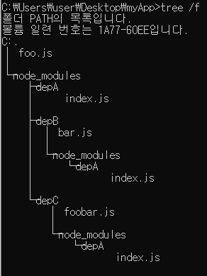
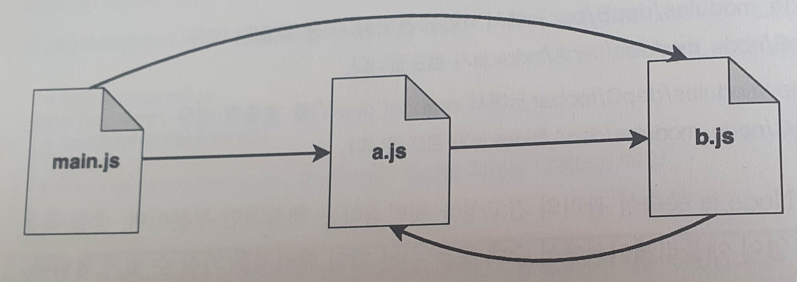

# 2장. 모듈 시스템

- 모듈이 왜 필수적이며 Node.js에서 다른 모듈 시스템이 가능한 이유
- CommonJS 내부와 모듈의 패턴
- ES 모듈(ESM)
- CommonJs와 ESM 사이의 차이점 및 상호 이용

## 2-1 모듈의 필요성

 - 코드 베이스를 나누어 여러 파일로 분할하는 방법을 제시. 코드를 구조적 관리 및 각각 독립적인 기능의 조각들로 개발하는데 도움을 줌
 - 코드 재사용성. 모듈로서 기능을 구조화하면 다른 곳에 쉽게 이동이 가능함
 - 은닉성 제공. 
 - 종속성 관리. 모듈 개발자로 하여금 기존에 있는 모듈에 의존하여 쉽게 빌드하게 해줌

## 2-2 JavaScript와 Node.js에서의 모듈 시스템
JavaScript는 오랫동안 모듈 시스템을 가지고 있지 않았음. 코드베이스는 여러 파일로 분할될 수 있었으며 다른 <script> 태그를 사용하여 임포트 될 수 있었음. 그러나 jQuery, Angular와 같은 프레임워크가 생태계를 점유해 나가며 JavaScript에 효율적으로 사용될 모듈 시스템이 정의 되기 시작함. 성공적인 것음 AMD(Asynchronous Module Definition)이고 RequireJS에 의해 대중화 되었으며 UMD(Universal Module Definition)이 나오게됨. 

Node가 처음 만들어 져을때 JavaScript를 위한 서버 런타임으로 구성됨. 따라서 모듈 관리에 있어 다른 방법을 도입할 수 있는 기회가 있었는데 이때 도입된 방법이 <script>와 URL을 통한 리소스 접근에 의존하지 않고 로컬 JavaScript 파일들에만 의존하는 것이였음. 이 모듈 시스템을 도입하기 위해 Node는 브라우저 환경이 아닌 곳에서 JavaScript 모듈 시스템을 제공할 수 있도록 고안된 CommonJS의 명세를 구현함. 이때부터 CommonJS는 Node의 주된 모듈 시스템이 됨.

2015년 ESMAScript6발표와 함께 표준 모듈 시스템에 대한 공식적인 제안이 나옴. 이때 모듈 관리에 대한 브라우저와 서버 차이점을 연결하고자 노력함. 지금 현재는 ESM이 CommonJS를 대체하여 JavaScript 모듈을 관리하는 실질적인 방법으로 되어가고 있으나 아직은 대부분의 프로젝트에서 CommonJS를 절대적으로 의존함.

## 2-3 모듈 시스템과 패턴

모듈은 은닉성을 강화 시켜주는 주된 장치임.

### 2-3-1 노출식 모듈 패턴

JavaScript의 문제점 중 하나는 네임 스페이스가 없어 모든 스크립트가 전역 범위로 실행됨. 예를 들어 A 라이브러리가 utils 전역 변수를 선언하고 사용하였고 B 라이브러리 또한 utils 전역변수를 덮어쓰거나 대체해 사용한다면 예측 불가능한 상황에 놓임. 이런 문제를 해결하기윈하 보편적인 기범임

```javascript
const myModule = (() => {
    const privateFoo = () => {}
    const privateBar = []
    
    const exported = {
        publicFoo: () => {},
        publicBar: () => {}
    }
    
    return exported
})()

console.log(myModule)
console.log(myModule.privateFoo, myModule.privateBar)
```

이 패턴은 자기 호출 함수를 사용함. 즉시 실행 팜수 표현이라 불리며 private 범위를 만들고 공개될 부분만 내보냄. 이 패턴은 비공개 정보의 은닉을 유지하고 공개될 API를 내보내기 위해 이러한 특성을 핵심적으로 잘 활요함. 이 패턴을 기반으로 CommonJS 모듈 시스템이 만들어짐

## 2-4 CommonJS 모듈

Node의 첫번째 내장 모듈 시스템이며 두 가지 주요 개념을 지님

- require는 로컬 파일 시스템으로부터 모듈을 임포트하게 해줌

- export와 module.exports는 특별한 변수로서 현재 모듈에서 공개될 기능들을 내보내기 위해 사용됨

### 2-4-1 직접 만드는 모듈 로더

CommonJS에서의 require 함수

```javascript
const require = (moduleName) => {
    const id = require.resolve(moduleName); // 모듈 이름을 입력으로 받아 id라 불리는 모듈의 전체 경로를 알아내는 것.
    
    if (require.cache[id]) { // 모듈이 이미 로드된 경우 캐시된 모듈을 사용 
        return require.cache[id].exports;
    }
    
    const module = {  // exports는 module.exports의 초기값에 대한 참조 
        exports: {}, 
        id 
    };
    
    require.cache[id] = module; // module 객체가 캐시화됨
    
    // 모듈 로드
    loadModule(id, module, require);
    
    return module.exports;
};

require.cache = {};
require.resolve = (moduleName) => {
    // 모듈이름으로 id라 불리는 모듈의 전체경로를 찾아서 반환
};
```

### 2-4-2 module.exports와 exports

exports는 module.exports의 초기 값에 대한 참조일 뿐

아래와 같이 사용할 경우 exports객체에 새로운 함수 추가됨

```javascript
exports.hello = () => {
    console.log('Hello')
}
```

아래와 같이 사용시 module.exports의 내용을 변경하지 않기에 아무런 효과 X

```javascript
exports = () => {
    console.log('Hello')
}
```
함수, 인스턴스 또는 문자열과 같은 객체 리터럴 이외의 것을 보내려면 아래와 같이 다시 할당해야함

```javascript
module.exports = () => {
    console.log('Hello')
}
```

### 2-4-3 resolve 함수

종속성 지옥이라는 것은 프로그램의 종속성이 서로 공통된 라이브러리에 의존하지만 호환되지 않은 서로 다른 버전을 필요로 하는 상황을 나타냄. 이런 문제를 해결하기 위해 resolve 알고리즘을 구성함.

resolve 함수는 모듈의 이름을 입력으로 모듈 전체 경로를 반환함. 이 경로는 코드를 로드하고 모듈을 고유하게 식별하는 사용됨. resolve 알고리즘은 다음 세가지로 나눠짐 

- 파일 모듈: moduleName이 /로 시작하면 모듈에 대한 절대 경로라 간주되어 그대로 반환됨. ./로 시작하면 상대 경로라 간주되며 요청한 모듈로부터 시작되어 계산됨
- 코어 모듈: / 또는 ./로 시작하지 않으면 코어 Node.js 모듈 내에서 검색 시도함
- 패키지 모듈: 코어 모듈이 없을 경우 요청 모듈의 경로에서 시작하여 디렉토리 구조를 탐색하여 node_modules 디렉토리에서 일치하는 모듈을 계속 찾음. 알고리즘은 파일 시스템 root에 도착할 때 까지 찾음.



위와 같은 구조에서 상세 설명
- /myApp/foo.js에서 require('depA') 호출 시 /myApp/node_modules/depA/index.js가 로드됨
- /myApp/node_modules/depB/bar.js에서 require('depA') 호출시 /myApp/node_modules/depB/node_modules/depA/index.js가 로드됨.
- /myApp/node_modules/depC/foobar.js require('depA') 호출시 /myApp/node_modules/depC/node_modules/depA/index.js가 로드됨.

### 2-4-4 순환 종속성



위와 같이 서로 참조하는 형태를 이룰 때 CommonJs가 어떻게 동작하는지 알아 보겠습니다.

- 모듈 a.js
```javascript
exports.loaded = false
const b = require('./b')
module.exports = {
    b,
    loaded: true // 이전 export문을 오버라이드
}
```
- 모듈 b.js
```javascript
exports.loaded = false
const a = require('./a')
module.exports = {
    a,
    loaded: true
}
```

- main.js
```javascript
const a = require('./a')
const b = require('./b')
console.log('a ->', JSON.stringify(a, null, 2))
console.log('b ->', JSON.stringify(b, null, 2))
```

- 결과
```javascript
a -> {
    "b": {
        "a": {
            "loaded": false
        },
        "loaded": true
    },
    "loaded": true
}

b -> {
    "a": {
        "loaded": false
    },
    "loaded": true
}
```

- 결과 설명
 1. main.js에서 처리가 시작되고 즉각적으로 require로 a.js를 불러옴
 1. 모듈 a.js는 처음으로 내보내지는 값인 loaded를 false로 설정
 1. 이 시점에서 모듈 a.js는 모듈 b.js를 require로 불러옴
 1. a.js에서와 같이 b.js에서 내보내지는 값인 loaded를 false로 설정
 1. b.js는 require로 a.js를 불러옴(순환 시점)
 1. a.js는 이미 처리되었기에 이때 내보내지는 값은 즉시 모듈 b.js의 범위로 복사됨
 1. 모듈 b.js는 마지막으로 loaed 값을 true 로 바꿈
 1. b.js는 완전이 종료가 되고 제어는 a.js로 반환됨. 현재 모듈 b.js의 상태 값을 복사하여 a.js의 범위를 가짐
 1. a.js의 마지막 단계는 loaded 값을 true로 바꿈
 1. 모듈 a.js는 현재 완전히 실행되었고 제어는 main.js로 반환됨. main.js는 현재 모듈 a.js의 상태를 복사하여 내부 범위를 가짐
 1. main.js는 require로 b.js를 불러오고 즉각 **캐시**된 것을 로드
 1. 현재 모듈 b.js의 상태가 모듈 main.js로 복사됨.

## 2-5 ESM: ECMAScript 모듈

- CommonJS나 AMD 같은 기존 모듈 시스템의 좋은 방안을 유지하기 위해 노력함

- 순환 종속성에 대한 지원과 비동기적으로 모듈을 로드할 수 있는 방법 제공

  

> ESM과 CommonJS의 차이점

ESM 모듈은 static이라는 점. 즉 임포트의 경우 동적으로 생성 불가능하며 상수 문자열만 허용됨

### 2-5-1 Node.js에서 ESM의 사용

- 모듈 파일의 확장자를 .mjs로 수정
- 모듈과 가장 근접한 package.json의 "type"필드에 "module"을 기재함

### 2-5-2 모듈 식별자

import 구문에서 적재하고 싶은 모듈의 경로를 명시할 때 쓰이는 값

- 상대적 식별자: ./logger.js 또는 ../logger.js와 같이 임포트하는 파일의 경로에 상대적 경로가 사용됨

- 절대 식별자: file:///opt/nodejs/config.js와 같이 직접적이고 명확하게 완전한 경로가 사용됨

- 노출 식별자: fastify 또는 https와 같이 node_modules 폴더에서 사용 가능하고 패키지 매니지를 통해 설치된 모듈 또는 node.js 코어 모듈

- 심층 임포트 식별자: fastify/lib/logger.js와 같이 node_modules에 있는 패키지의 경로

### 2-5-3 비동기 임포트

 여러 상황에 정적 임포트가 아닌 동적 임포트가 필요함. 예를 들어 운영 체제에 따른 모듈 임포트 또는 언어에 따른 특정 번역 모듈 등과 같은 상황에서.

```javascript
const SUPPORTED_LANGUAGES = ['el', 'en', 'es', 'it', 'pl']
const selectedLanguage = process.argv[2]

if(!SUPPORTED_LANGUAGES.includes(selectedLanguage)) {
    process.exit(1)
}

const translationModule = `./strings-${selectedLanguage}` // 선택된 언어를 사용하여 임포트 하고자하는 모듈의 이름을 동적으로 생성
import(translationModule) // 동적 임포트를 위해 import() 연산자 사용
	.then((strings) => { // 동적 임포트의 경우 비동기적으로 수행되기에 then에서 받아서 처리
    console.log(strings)
})
```

### 2-5-4 모듈 적재 이해하기

ESM의 동작을 이해하기 위해서는 JavaScript 코드가 어떻게 파싱되는지 알아봐야함

이중 로딩 단계, 읽기 전용 라이브 바인딩과 순황 종속성 위주로 설명할 것임.

#### 로딩 단계

인터프리터는 실행되어야할 코드의 순서와 함께 모듈 간에 어떤 종속성을 지니는지 이해하기 위해 종속성 그래프를 아래 3단계 과정을 통해 그림

1. 생성: 모든 import 구문을 찾고 재귀적으로 각 파일로부터 모든 모듈의 내용을 적재

2. 인스턴스화: 익스포스된 모든 개체들에 대해 명명된 참조를 메모리에 유지함. 또한 종속성 관계(linking)를 추적하며 어떠한 javaScript 코드가 실행되지 않음

3. 평가: 코드 실행하여 이전 인스턴스화 된 모든 개체가 실제 값을 얻을 수 있도록 함

> CommonJS와 차이점: CommonJS 종속성 그래프가 탐색되기 전 모든 파일을 실행 But ESM의 경우 2단계와 3단계가 완전 분리 되어 종속성 그래프가 완전해 진 다음 코드를 실행함

#### 읽기 전용 라이브 바인딩

임포트된 모듈이 익스포트 된 값에 대해 읽기 전용 라이브 바인딩 된다는 개념

아래의 예시

```javascript
//couter.js
export let count = 0
export function increment(){
    count++
}
```

```javascript
// main.js
import {count, increment} from `./counter.js`
console.log(count) // 0출력
increment()
console.log(count) // 1출력
count++ // 에러
```

위의 예시를 모다 싶이 스코프내에 개체가 임포트되었을때, 사용자 코드의 직접적인 제어 밖에 있는 바인딩 값은 그것이 원래 존재하던 모듈에서 바뀌지 않는 한, 원래의 값에 대한 바인딩이 변경 불가 하다는 것임

#### 순환 종속성 분석

- 모듈 a.js

```javascript
import * as bModule from `./b.js`
export let loaded = false
export const b = bModule
loaded = true
```

- 모듈 b.js

```javascript
import * as aModule from `./a.js`
export let loaded = false
export const a = bModule
loaded = true
```

- main.js

```javascript
import * as a from './a.js'
import * as b from './b.js'
console.log('a ->', a)
console.log('b ->', b)
```

- 결과

```javascript
a -> <ref * 1> [Module] {
    b: [Module] { a: [Circular * 1], loaded: true },
    loaed: true
}

b -> <ref * 1> [Module] {
    a: [Module] { b: [Circular * 1], loaded: true },
    loaed: true
}
```

- 결과 해석

1단계: 파싱

1. main.js에서 처음 발견된 import문이 a.js로 곧장 향함
2. a.js에서 b.js로 향하는 import 문을 발견
3. b.js에서 a.js로 다시 향하는 import문이 있음. 하지만 a.js는 이미 방분했기 때문에 그 경로로 다시 탐색되지 않음
3. 이 시점에서는 b.js가 다른 import 문을 가지고 있지 않기 때문에 탐색이 a.js로 되 돌아감. 그리고 a.js에서 다른 import 문을 가지고 있지 않기에 main.js로 돌아감.  그 때 b.js의 임포트 지점을 발견하지만 이미 탐색되었기에 해당 경로는 무시함

2단계: 인스턴스화

1. 인터프리터는 b.js에서 시작하며 모듈이 loaded와 a를 익스포트하는 것을 포착함
2. 인터프리터는 loaded와 b를 익스포트하는 a.js로 이동함
3. 마지막으로 main.js로 이동하며, 더 이상의 기능에 대한 익스포트가 없음
4. 마지막 단계에서 익스포트 맵은 익스포트된 이름의 추적만을 유지함. 연관된 값은 현재로는 인스턴스화 되지 않은 것으로 간주됨
5. 모듈 b.js는 aModule라는 이름으로 a.js에서의 익스포트를 연결함
6. 모듈 a.js는 bModule라는 이름으로 b.js에서의 익스포트를 연결함
7. 마지막으로 main.js는 b라는 이름으로 b.js에서의 모든 익스포트를 임포트함. 비슷하게 a라는 이름으로 a.js에서의 모든 익스포트를 임포트함

3단계: 평가

1. b.js 부서 수행되며, 첫번째 라인은 모듈에서 익스포트되는 loaded 값이 false로 평가됨

2. 마찬가지로 익스포트되는 속성 a가 평가됨. 이번에는 export 맵의 모듈 a.js를 나타내는 모듈 객체에 대한 참조로 평가됨

3. loaded 속성의 값이 true로 바뀜. 이 시점에 모듈 b.js의 익스 포트 상태가 완전히 평가됨

4. 이제 a.js로 수행이 이동되고, 다시 loaded를 false로 설정하는것으로 시작함

5. 이 때, export b가 익스포트 맵에서 모듈 b.js에 대한 참조로 평가됨

6. 마지막으로 loaded 속성은 true로 바뀜. 이제 모듈 a.js에서도 완전히 평가된 모든 익스포트를 갖게 됨

   