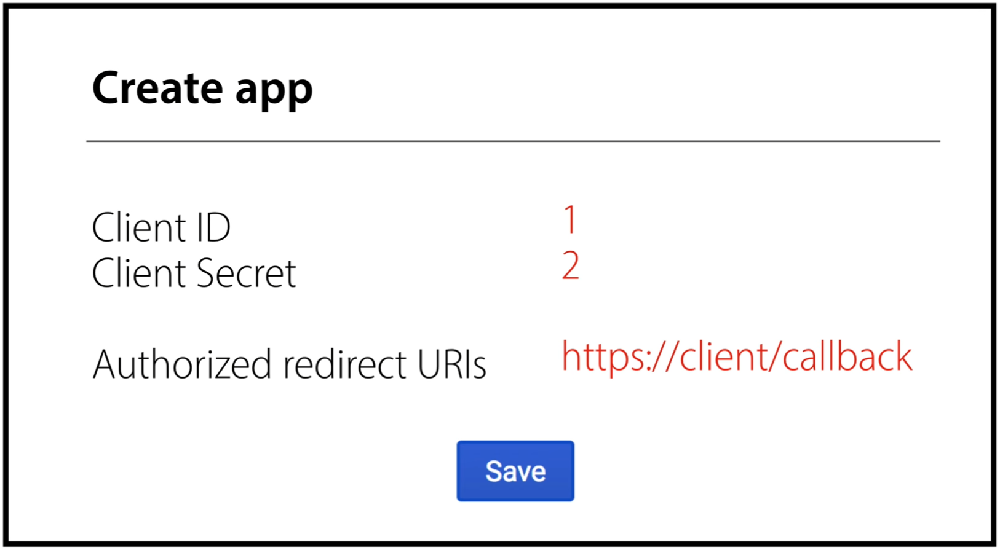

# OAuth

- 외부 서비스에서도 인증을 가능하게 하고 그 서비스의 API를 이용하게 해주는 것

## OAuth 배경

third party Application에 아이디와 비밀번호를 제공하고 싶지 않은 요구가 첫번째입니다. 개인정보를 여러 곳에 입력하면서 피싱에 둔감해지고 무엇보다 Application이 안전하다는 보장이 없기 때문에 보안에 취약했습니다.

당시에는 인증과 권한을 부여하는 요구를 만족 시킬 수 있는 인증방식이 없어서 Twitter의 주도로 OAuth 1.0이 탄생하였습니다.

### 비밀번호 인증방식의 문제

- 신뢰: 사용자가 애플리케이션에 ID/PW를 제공하기 꺼려함
- 피싱에 둔감해짐: 각종 애플리케이션들에 ID/PW 를 계속 제공하는 경우
- 접근범위가 늘어남에 따른 위험 부담: ID/PW를 모두 알고 있는 애플리케이션은 모든 권한을 가짐
- 신뢰성의 제한: PW 를 변경한다면 애플리케이션은 동작을 하지 못하게 됨
- 폐기문제: 권한을 폐기할 수 있는 유일한 방법이 PW를 변경하는 것,

## 그런데 OAuth1.0은..

구현이 복잡하고 웹이 아닌 어플리케이션에서의 지원이 부족하였습니다. HMAC을 통해 암호화를 하는 번거로운 과정을 겪습니다. 또한 인증토큰(access token)이 만료되지 않습니다

# OAuth 2.0

## 달라진 점

- 기능의 단순화, 기능과 규모의 확장성 등을 지원하기 위해 만들어 졌다
- 1.0는 만들어진 다음 표준이 된 반면 2.0은 처음부터 표준 프로세스로 만들어짐.
- https가 필수여서 간단해 졌다.
- 암호화는 https에 맡김.
- 1.0는 인증방식이 한가지였지만 2는 다양한 인증방식을 지원한다.
- api서버에서 인증서버를 분리 할 수 있도록 해 놓았다.

## OAuth2.0 구성

- Resource owner: 사용자.
- Client: Resource Server 에서 제공하는 자원을 사용하는 애플리케이션
- Resource server(API server): 자원을 호스팅하는 서버
- Authorization Server: 사용자의 동의를 받아서 권한을 부여하는 서버, 일반적으로 Resource Server 와 같은 URL 하위에 있는 경우가 많음.

## 인증과정

## OAuth 인증프로세스 (Authorization Code Grant 방식)

 
- 페이코가 적용한 방식
## 인증프로세스 상세(생활코딩 참고)

- 등록
  
  
   client를 Resource Server에 등록해야함
  
  
  
  등록시 위와 같은 데이터 필요
  
- Resource Owner의 승인

  

  이런 상황에서 Resource Server의 경우 여러 A,B,C,D 라는 기능을 가지고 있다고 가정하자

  

  

  Clinet에서 존재하는 버튼의 경우 위의 오른쪽과 같은 형식을 통해 Resource Server를 호출함

  
  Resource Server가 Resoucre Owner가 로그인이 되어있는지 확인함
  만일 로그인이 되어 있지 않으면 아래와 같이 로그인을 요구함

  

  로그인이 되어 있거나 로그인에 성공시 이 때서야 Resource Server가 접속한 Client_id와 Redirect_url를 확인함

  만일 Resource Server가 지니는 Client_id와 Redirect URL이 상이할 경우 접속을 끊음

  같을 경우 Resource Server가 Resource Owner에게 해당 권한에 대해 확인하는 메시지 전송

  

  

  Server나 DB에서 user id가 b,c나 권한에 대해 허용했다고 저장함

- Resource Server의 승인

  바로 토큰을 발급하는것이 아닌 auothorization code라는 임시 비밀번호를 Resource Owner에게 전송함

  

   응답header에 Location 부분에 줌으로써 redirection을 호출함

    

  

  

  client는 Resource Server에 위와 같은 데이터를 전송함. Resource Server는 authorization Code를 통해 Client id, secret, redirect uri과 동일 한지 확인함

- 액세스 토큰 발급

  
  authorization Code는 인증 받았기에 삭제하고 Resource Server가 Client에게 AccessToken을 반환함

- API 호출

  API 호출시 header에 authorization: Bearer <access_token>을 추가하여 보내는 것을 권장함

- refresh token

  access token의 경우 수명이 존재함. 새롭게 access token을 발급받는 방법. RFC 6749(Oauth 2.0에 관한 표준 문서)를 참고
  
  refresh token의 경우 access token을 발급할때 함께 발급이 됨
  
  refresh token의 경우 api 호출 중 invalid token Error 발생시 refesh token을 보내 다시 access token을 새로 발급함
  
  이때 refresh token도 같이 발급 될 수 도 있음.

