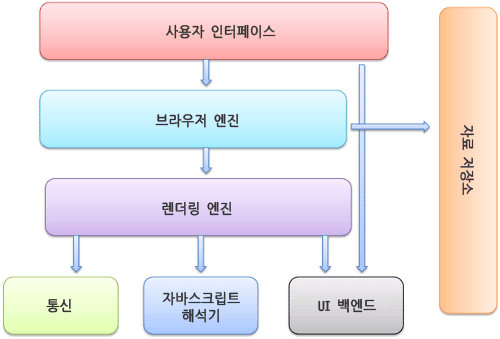
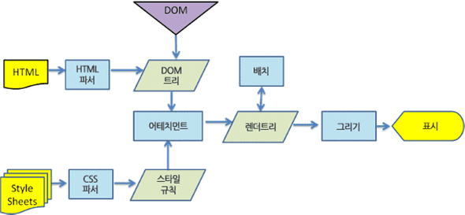
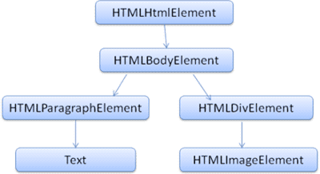

# browser rendering process

- browser elements
- browser rendering process

## browser elements

- 사용자 인터페이스 : 주소표시줄, 이전/다음 버튼, 홈버튼, 새로고침/정지 버튼 등 요청한 페이지를 보여주는 창 외에 사용자가 컨트롤 할 수 있는 부분이다.
- 브라우저 엔진 : 사용자 인터페이스와 렌더링 엔진 사이에 동작을 제어한다
- 렌더링 엔진 : 요청한 URI를 브라우저 엔진에게 받아서 server에게 요청한다(통신). server로 부터 URI에 해당하는 데이터(HTML, CSS, JavaScript)를 받아서 파싱한 후 렌더링한다(chrome webkit)
- 통신 : 렌더링 엔진으로부터 HTTP 요청 등을 받아서 네트워크 처리 후 응답을 전달한다.(OS 단에서 실행)
- 자바스크립트 해석기 : JavaScript 를 파싱한다(chrome V8)
- 자료 저장소 : 쿠키 등의 자료를 컴퓨터 하드디스크에 저장한다. (HTML5 부터 Web Database에 저장가능)
- UI 벡엔드 : render tree를 browser 에 그리는 역할을 담당한다



## browser rendering process

브라우저가 렌더링하는 과정을 간단하게 설명한다(uri 입력부터 서버와 통신하여 렌더링까지)
이떄 브라우저의 각 요소(element)의 기능을 함께 설명한다

1. 사용자가 사용자 인터페이스의 주소표시줄에 URI를 입력하여 브라우저 엔진에 전달한다
2. 브라우저 엔진은 자료 저장소에서 URI에 해당하는 자료를 찾고, 해당 자료를 쿠키로 저장했다면 그 자료를 렌더링 엔진에 전달한다
3. 렌더링 엔진은 브라우저 엔진에서 가져온 자료(HTML, CSS, image 등)를 분석한다. 동시에 URI 데이터를 통신, 자바스크립트 해석기, UI 백엔드로 전파한다
4. 또한 렌더링 엔진은 통신 레이어에 URI에 대한 추가 데이터(있다면)를 요청하고 응답할 때까지 기다린다
5. 응답받은 데이터에서 HTML, CSS는 렌더링 엔진이 파싱한다
6. 응답받은 데이터에서 JavaScript는 JavaScript 해석기가 파싱한다
7. JavaScript 해석기는 파싱한 결과를 렌더링 엔진에 전달하여 3번과 5번에서 파싱한 HTML의 결과인 DOM tree을 조작한다
8. 조작이 완료된 DOM node(DOM tree 구성요소)는 render object(render tree 구성요소)로 변한다
9. UI 벡엔드는 render object를 브라우저 렌더링 화면에 띄워준다

## rendering engine working process

렌더링 엔진은 URI를 통해 요청을 받아서 해당하는 데이터를 렌더링하는 역할을 담당한다
Safari는 WebKit, Firefox는 Gecko, CHrome은 Blink이라는 rendering engine 을 사용한다

### rendering engine 의 목표

- HTML, CSS, JS, 이미지 등 웹 페이지에 포함된 모든 요소들을 화면에 보여준다.
- 업데이트가 필요할때, 효율적으로 렌더링 할 수 있도록 자료구조를 생성한다.

### 대략적인 rendering engine 동작 과정


1. `DOM tree 구축`을 위한 HTML parsing, CSS, Javascript parsing : HTML 문서를 파싱한 후, content tree 내부에서 tag(a, div)를 DOM node 로 변환한다. 그 다음 CSS 파일과 함께 모든 스타일 요소를 파싱한다. 스타일 요소와 HTML 표시 규칙, Javascript 의 파싱 결과물을 토대로 render tree 를 생성한다
2. `render tree 구축` : HTML 과 CSS 를 파싱해서 만들어진 render tree 는 색상 또는 면적 등 시각적 속성을 갖는 사각형을 포함한다.
3. `render tree 배치` : render tree 가 생성이 끝나면, 배치가 시작된다. 각 node 가 정확한 위치에 표시되기 위해 이동한다.
4. `render tree 그리기` : 각 node 배치를 완료하면 UI 벡엔드에서 각 node를 가로지르며 paint 작업을 한다.

**1번과 2,3,4번은 병렬적으로 진행된다**
즉, 통신 레이어에서 data를 계속 받아오면서(통신 레이어)
받아온 HTML, CSS, Javascript 를 parsing 하면서(1번)
render tree에 node를 그린다(2,3,4번)

### webkit 의 동작 과정



### 1. HTML을 parsing 하여 DOM tree 를 생성한다

아래와 같은 HTML 을 parsing 하여 DOM tree 를 생성한다(DOM 으로 바꾼 HTML은 Javascript 가 조작할 수 있다)

```html
<html>
  <body>
    <p>Hello World</p>
    <div>
      
    </div>
    <script></script>
  </body>
</html>
```



브라우저는 tag의 parsing 과 실행을 동시에 진행한다
그러므로 아래 과정으로 HTML tag 를 parsing 한다

1. `<script>` tag 를 parsing 한다
2. `<script>` tag 를 실행한다
3. 실행이 완료된 후 다음 tag 를 파싱한다

> `<script>` tag의 실행이 완료된 후, 다음 tag 를 parsing 한다

그러므로

HTML5 에서 추가된 기능이 있다

> HTML5에서는 `<script>` tag를 비동기로 처리하는 속성을 추가했다

### 2. CSS(style sheets)를 parsing 하여 스타일 규칙을 얻는다

css parsing process https://d2.naver.com/helloworld/59361

css parsing 하여 CSSOM Tree 생성한다(스타일 규칙)

```css
body {
 	margin: 0;
 	padding: 0;
}

p {
 	font-size: 20px;
 	height: 20vh;
}

div {
  	width: 100%;
}

span {
 	width: 50px;
}

```

### 3. DOM tree를 생성하는 동시에, 이미 생성된 DOM tree 와 스타일 규칙(CSSOM)을 Attachment 한다.

- DOM tree를 구성하는 하나의 DOM node 는 attach 라는 method를 가진다. 
- 새로운 DOM node 가 추가되면 attach가 호출되어 render object를 생성한다
- render object는 render tree의 구성요소로써, 자신과 자식 요소를 어떻게 배치하고 그려야할지 안다
- node의 css box 를 표시할 정보를 가지고 있음
- 모든 DOM node가 전부 render object 로 생성되는 것은 아님 (ex head tag, display none tag 등)
- `<html>` 과 `<body>` DOM node 또한 render object 로 구성되는데 이들은 render tree root로써 render view 라고 부른다
- 나머지 DOM node 들은 render object 로 생성되어 이 render tree root에 추가된다

### 4. 구축한 render tree 를 배치(layout)한다

배치는 `<html>` 요소에 해당하는 최상위 render object 에서 시작한다. 화면에 왼쪽 위부터 render object에 해당하는 DOM node를 그려나간다

### 5. 배치가 끝난 render tree 를 그린다

render tree 탐색 후 해당하는 render object 의 paint method 를 호출한다