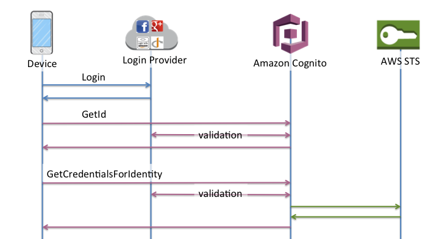

# 개요
AWS Cognito는 웹 및 모바일 앱에 대한 인증과 권한 부여 그리고 사용자 관리를 제공하고 기존의 아이디, 패스워드 방식 이외에도 Facebook, Amazon, Google 그리고 Apple과 같은 여러 회사의 소셜 로그인 기능을 제공하는 서비스 입니다.

Cognito는 사용자 풀(user pool)과 자격 증명 풀(identity pool)으로 구성되어 있는데, 이 둘을 조합하거나 또는 각각 별개의 형태로 사용할 수 있고, 이들 각각의 역할은 다음과 같습니다.

- 사용자 풀 - 사용자의 가입과 로그인을 제공하는 사용자 저장소
- 자격 증명 풀 - 사용자 풀에 저장된 정보를 바탕으로 로그인 또는 회원가입에 성공한 사용자에게 AWS 인프라의 여러 서비스에 대한 권한을 부여할 수 있는 서비스

# 사용자 풀(user pool)
사용자 풀은 사용자에 대한 정보를 가지고 있는 저장소와 같은 역할을 합니다. 위에서 언급했듯이 여러가지 방법의 로그인 또는 회원가입을 지원하고 있습니다.

성공적으로 사용자 인증 과정이 완료되면, Cognito는 JSON 형식의 웹 토큰(JWT)를 발행하며, 이 토큰을 사용해 특정 API에 대한 접근 보안 등 자격 증명을 수행하거나 AWS의 자격 증명으로 교환합니다.

AWS 자격 증명이란 사용자가 누구이고 요청 중인 서비스에 접근할 수 있는 권한이 있는지 여부를 확인하는 증명서를 말합니다.

또한 사용자 풀의 모든 사용자는 그들 각각의 프로필을 가지고 있으며, SDK(javascript, Android, iOS)를 통해 프로필에 접근할 수 있습니다.

## 사용자 풀이 제공하는 기능
- 가입 및 로그인
- 수정 가능한 사용자 로그인을 위한 웹 UI
- Facebook, Google, Amazon, Apple을 통한 소셜 로그인 및 사용자 풀의 SAML 자격 증명 공급자를 통한 로그인
- 사용자 관리 및 사용자 프로필
- 멀티 팩터 인증(MFA, 2중 인증), 이상 자격 증명 확인, 계정 탈취 보호, 전화 및 이메일 확인과 같은 보안 기능
- AWS Lambda 트리거를 이용한 Cognito의 인증 과정 등의 커스터마이징
> AWS Lambda란 AWS에서 제공하는 서버리스 컴퓨팅 서비스입니다. 간단하게 이야기하면, 어떤 동작을 하는 함수를 생성하고 AWS Lambda에 업로드 하면, 해당 Lambda가 호출되었을 때 해당 함수가 실행되게 되고, 함수의 결과를 응답하게 됩니다.

## 사용자 풀의 인증 flow
크게 인증은 두가지 단계로 일반화 할 수 있으며, 이들은 각각 **InitiateAuth**와 **RespondToAuthChallenge API**를 통해 구현됩니다.

> 챌린지란 Cognito에서 인증 수단을 뜻하는 말입니다. 예를 들어, 이메일 인증을 한다고 가정할때, 이메일로 코드를 보내고, OTP 코드를 응답하는 것과 같은 일련의 과정을 챌린지라고 통칭합니다.

인증이 실패하여 종료하거나 인증이 완료되어 토큰이 발핼될 때까지 사용자는 순차적으로 사전에 정의된 챌린지들을 수행하게 됩니다. 또한 챌린지는 만들고자 하는 앱에서 필요한 만큼 반복이 가능합니다.

이러한 인증 flow는 각각의 인증과정에서 제공되는 AWS Lambda 트리거를 사용하여 커스텀이 가능합니다. 이와 같은 트리거를 이용해 챌린지를 자유롭게 생성하고 응답을 확인할 수 있습니다.

## Lambda 트리거
Lambda 트리거는 Cognito에서 사용자 가입, 로그인과 같은 특정 작업 flow가 실행될 때 사전에 정의한 특정 시점에 대한 Lambda 함수가 존재하면, 해당 시점에 해당 함수가 실행되는 것을 의미합니다.

이를 이용하여 인증 문제 추가, 사용자 마이그레이션 등의 다양한 작업을 수행할 수 있습니다.

개발자가 커스텀 가능한 Lambda 트리거의 종류는 다음과 같습니다.
- 사용자 지정 인증 흐름
- 인증 이벤트
- 가입
- 메시지

### 사용자 지정 인증 흐름
**사용자 지정 인증 흐름**은 사용자 풀의 커스텀 인증 flow로 커스텀 챌린지를 만들고 사용할 수 있습니다.

#### 인증 문제 정의(Defint Auth Challenge)
만약 문제 정의 트리거에서 커스텀 챌린지가 정의된 경우, 인증 문제 정의 트리거는 커스텀 인증 흐름을 시작하는 트리거입니다.

#### 인증 문제 생성(Create Auth Challenge)
인증 문제 생성 트리거는 커스텀 챌린지를 생성하는 트리거입니다.

#### 인증 문제 응답 확인(Verify auth challenge response)
인증 문제 응답 확인 트리거는 유저의 응답이 유효한지 아닌지를 판별하기 위해 호출됩니다.

### 인증 이벤트
인증 이벤트 트리거는 Cognito의 인증과 관련된 트리거들의 모음입니다. 이 카테고리에 속하는 트리거를 이용하여, 로그인 과정에서 여러가지 처리를 할 수 있습니다.

#### 사전 인증(Pre Authentication)
사전 인증 트리거는 사용자가 로그인을 시도할 때 호출됩니다. 특정 사용자의 접근을 허용할지 등의 여부를 결정하는데 사용할 수 있습니다.

#### 사후 인증(Post Authentication)
사후 인증 트리거는 사용자가 로그인을 완료하였을 때 호출됩니다. 인증 이후의 커스텀 동작을 추가하는데 사용할 수 있습니다.

#### 사전 토큰 생성(Pre Token Generation Lambda)
사전 토큰 생성 트리거는 토큰이 발행되기 이전에 호출됩니다. 인증 토큰 클레임을 커스터마이징 하는데 사용할 수 있습니다. 단, acr, amr, aud, auth_time, azp, exp, iat, identities, iss, sub, token_use, nonce, at_hash 클레임은 수정이 불가능합니다.

>인증 토큰 클레임이란 JWT 토큰에 담긴 여러 Key, Value 쌍의 정보중 한 부분을 뜻하는 말입니다. 자세한 사항은 JSON Web Token - Wikipedia를 참고하세요.

### 가입
가입 트리거는 사용가의 가입과 관련된 트리거들의 모음입니다. 이 카테고리에 속하는 트리거를 이용하여, 회원가입 과정에서 여러가지 처리를 할 수 있습니다.

#### 사전 가입(Pre Sign-up)
사전 가입 트리거는 Cognito가 새로운 사용자를 가입시키기 직전에 호출됩니다.

#### 사후 확인(Post Confirmation)
사후 확인 트리거는 새로운 사용자가 승인된 후 호출됩니다. 커스텀 메시지를 전송하거나 커스텀 동작을 정의하여 사용할 수 있습니다.

#### 사용자 마이그레이션(Migrate User)
사용자 마이그레이션 트리거는 사용자가 비밀번호 로그인을 시도할 때 사용자가 사용자 풀에 존재하지 않거나, 비밀번호 찾기 flow에서 호출됩니다.

### 메시지
메시지 트리거는 메시지 전송과 관련된 트리거입니다. 이 카테고리에 속하는 트리거를 이용하여, 메시지 전송 과정에서 여러가지 처리를 할 수 있습니다.

#### 커스텀 메시지(Custom Message)
커스텀 메시지 트리거는 email, 문자 메시지 또는 멀티 펙터 인증 코드를 전송하기 전에 호출됩니다. 동적으로 메시지를 수정하거나 커스터마이징 하는데 사용할 수 있습니다.

# 자격 증명 풀(Identity Pools)
자격 증명 풀은 특정 사용자의 고유한 자격 증명을 만들고 사용자에게 AWS 인프라에 대한 접근권한을 부여할 수 있습니다. 자격 증명 풀은 다음과 같은 사용자를 포함할 수 있습니다.

- Cognito user pool 사용자
- Facebook, Google, Apple, SAML 인증 공급자로 인증된 사용자
- 기존의 인증 프로세스(서비스의 자체 인증 등)를 통해 인증된 사용자
  
**자격 증명 풀**을 이용하면 다른 AWS 서비스에 직접 접근하거나 API Gateway를 통해 서비스에 접근하도록 정의하는 권한을 가진 임시 AWS 자격 증명을 생성할 수 있습니다.

## 자격 증명 풀 인증 flow
자격 증명 풀의 인증 flow는 외부 소셜 로그인, 기존의 인증 프로세스를 통해 사용자에게 발급되는 자격 증명에 대한 인증 flow이며, 크게 4가지가 있습니다.

### 외부 공급자 인증 flow
2가지의 인증 방식이 존재하며, 이들 각각을 **향상된 인증 흐름** , **기본 인증 흐름**으로 부릅니다.

#### 향상된 인증 flow
2단계로 자격 증명을 발급받을 수 있는 flow이며,

- GetId: 승인된 Amazon Cognito 사용자 풀 또는 서드 파티 자격 증명 공급자의 ID 토큰을 제시하고 이 토큰을 자격 증명 풀 내의 자격 증명 ID와 교환합니다. 
- GetCredentialsForIdentity: 자격 증명 ID에 대한 AWS API credential을 반환합니다.

두번의 통신(디바이스와 Cognito간 통신을 의미)으로 자격 증명을 발급받을 수 있는 flow입니다.
백그라운드 cognito GetOpenIdToken 및 AssumeRoleWithWebIdentity를 수행하여 자격 증명 검색을 간소화합니다.

#### 기본 인증 flow
단계로 자격 증명을 발급받을 수 있는 flow이며,

- GetId: 승인된 Amazon Cognito 사용자 풀 또는 서드 파티 자격 증명 공급자의 ID 토큰을 제시하고 이 토큰을 자격 증명 풀 내의 자격 증명 ID와 교환합니다. 
- GetOpenIdToken: 자격 증명 풀에서 발급한 새 OAuth 2.0 토큰을 반환합니다.
- AssumeRoleWithWebIdentity: OAuth 2.0 토큰을 전달시 AWS API credentials을 획득 합니다.
  
세번의 통신(디바이스와 Cognito간 통신을 의미)으로 자격 증명을 발급받을 수 있는 flow입니다.

### 개발자 인증 자격 증명 인증 flow
자체 인증 시스템에서 인증된 사용자를 위한 자격 증명 인증 flow입니다.
2가지의 인증 방식이 존재하며, 이들 각각을 향상된 인증 흐름, 기본 인증 흐름으로 부릅니다.

#### 향상된 인증 flow
2단계로 자격 증명을 발급받을 수 있는 flow이며,

 1. 자체 시스템에서 로그인
 2. 자체 시스템에서 로그인 검증
 3. GetOpenIdTokenForDeveloperIdentity: open id 전달시 자격 증명 풀에 등록 후 open id와 토큰 리턴합니다.
 4. GetCredentialsForIdentity: open ID에 대한 AWS API credential을 반환합니다.

과정으로 구성되어 있습니다.

#### 기본 인증 flow
단계로 자격 증명을 발급받을 수 있는 flow이며,

 1. 자체 시스템에서 로그인
 2. 자체 시스템에서 로그인 검증
 3. GetOpenIdTokenForDeveloperIdentity: open id 전달시 자격 증명 풀에 등록 후 open id와 토큰 리턴합니다.
 4. AssumeRoleWithWebIdentity: 토큰을 전달시 AWS API credentials을 획득 합니다.
   
과정으로 구성되어 있습니다.

> AWS STS: AWS Security Token Service의 준말로 임시 보안 자격 증명으로 AWS 리소스에 대한 액세스를 제어하는 것이고 다시 말하자면 Access/Secret Key을 그대로 쓰는것이 아니라 MFA와 함께 사용하여 임시 Access/Secret key으로 AWSCLI를 사용하는 것 입니다.

## IAM
IAM이란 서비스에 대한 접근 권한을 관리하는 AWS의 서비스로 특정 role을 생성하고, 해당 role에 권한을 부여할 수 있습니다.

자격 증명 풀에서는 IAM을 이용하여, 인증된 사용자와 인증되지 않은 사용자의 역할을 정의할 수 있습니다.