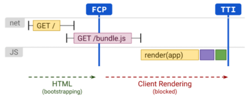
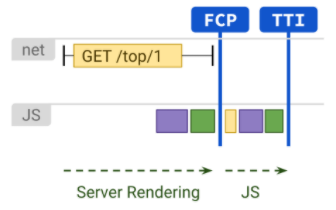
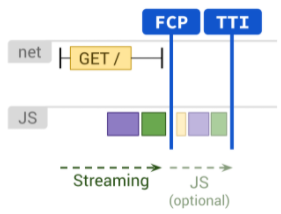
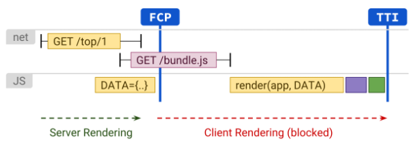
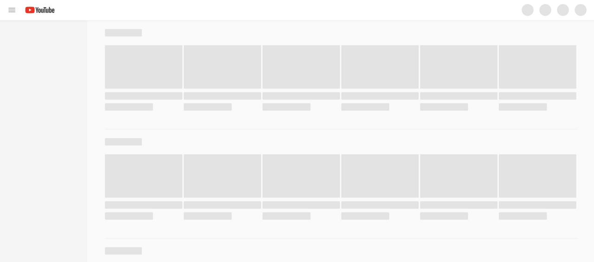

# CSR vs SSR vs SSG

- 웹 페이지를 렌더링하는 방식에는 크게 클라이언트 사이드 렌더링(CSR)과 서버 사이드 렌더링(SSR)이 있다.

## Client Side Rendering (CSR)

말 그대로 클라이언트(브라우저)에서 웹 페이지를 렌더링하는 것이다. 모든 로직, 데이터 가져오기, 템플릿, 라우팅은 서버가 아닌 모두 클리이언트에서 처리된다.

CSR의 경우 자바스크립트 번들의 크기의 영향을 많이 받기 때문에 적극적인 코드 분할(code splitting)을 고려해야 하며, "필요한 것만 필요할 때만 제공"해야 한다.

### CSR 동작 방식

1. 사용자가 웹 페이지를 방문하면(request), 브라우저는 최소한의 HTML 파일을 다운로드(response) 한다. 이 HTML 파일은 script, meta, link 등의 태그를 포함하며, 빈 컨텐츠의 index.html 파일이라고 보면 된다.

2. 브라우저는 index.html에 있는 자바스크립트 번들 파일을 다운로드한 다음 AJAX(AXIOS)를 통해 API 요청을 수행하여 동적 컨텐츠를 가져오고 파싱하여 최종 컨텐츠를 렌더링한다.
3. 사용자가 페이지를 이동할 경우, 서버에 추가 HTML파일을 요청하지 않고 이미 받은 자바스크립트를 이용하여 렌더링 한다.
   
### CSR 장점

- 후속 페이지 로드 시간이 더 빠르다. CSR을 위해 이미 모든 지원 스크립트가 사전에 로드되었기 때문에 CSR의 로드 시간이 줄어든다.

- 별도의 API를 호출할 필요가 없는 페이지이거나 지연 로딩 모듈이 필요하지 않다, 이미 스크립트가 캐싱된 경우 인터넷 없이도 해당 CSR 웹 애플리케이션을 실행할 수 있다.

- CSR은 서버를 호출할 때마다 전체 UI를 다시 로드할 필요가 없다.

### CSR 단점

- 초기 페이지 로드 시간이 SSR에 비해 느리다. CSR을 사용하면 브라우저는 브라우저에서 사용 가능한 컨텐츠로 HTML을 컴파일하기 전에 기본 HTML, CSS 및 모든 필수 스크립트를 로드하기 때문이다.

- SEO에 친화적이지 않다. 검색 엔진 크롤러가 해당 페이지에 처음 방문했을때는 빈 페이지이기 때문에 이해할 수가 없다. 물론 자바스크립트를 실행시킬 수 있는 구글 크롤러와 같은 검색엔진 크롤러가 등장하고 있긴하지만, 아직 많은 검색 엔진 크롤러들이 지원되지 않는다.

- 페이지 메타데이터의 변경을 위한 추가적인 노력이 필요하다. 한 페이지에서 다른 페이지로 변할 경우 이를 인지 시켜주기 위해 각 페이지에 대한 메타 데이터를 설정하고 클라이언트에서 렌더링하기 위해 추가 노력이 필요하다.

- 브라우저가 페이지를 표시하기 전에 HTML 및 JavaScript 파일을 다운로드하고 프레임 워크를 실행하는 동안 사용자는 빈페이지를 보게 되므로 사용자 경험(UX)가 좋지 않다.
  
- 클라이언트의 하드웨어 및 소프트웨어에 너무 많이 의존한다. 사용자 기기에 따라, 하위 지원되는 하드웨어 및 소프트웨어 사용자라면, 최적의 시간에 페이지를 렌더링하지 못하게 될 확률이 크다. 페이지의 이탈률은 페이지 로드시간에 정비례한다. 또한 이탈률이 높을수록 검색엔진 순위도 낮아 질 수 있다.
  
## Server Side Rendering (SSR)

서버의 HTML로 렌더링하는 방식이다. 이렇게 하면 브라우저에서 응답을 받기 전에 데이터 패칭 및 템플릿 작성이 처리되므로 클라이언트에서 위 행위에 대 추가 왕복이 발생하지 않는다.

### SSR 동작 방식

1. 사용자가 웹 페이지를 방문하면(request), 서버는 리소스를 확인하고 페이지 내에 있는 서버측 스크립트를 실행 후 HTML 컨텐츠를 컴파일 및 준비한다.
   
2. 컴파일된 HTML은 추가 렌더링 및 표시를 위해 클라이언트 브라우저로 전송된다(response).

3. 브라우저는 HTML을 다운로드하고 최종 사용자가 사이트를 볼 수 있도록 한다.

4. 브라우저는 자바스크립트를 다운로드하고 실행하면서 페이지를 대화형(interactive)으로 만든다.

5. 사용자가 페이지를 이동할 경우, 위 동작을 반복한다.

### SSR 장점

- 초기 페이지 로드시간이 빠르다(FP 및 FCP가 빠르다). 렌더링이 준비된 HTML 파일을 브라우저에서 로드하기 때문에 CSR에 비해 더 빠르다.

- 서버에서 페이지 로직 및 렌더링을 실행하면 많은 자바스크립트를 클라이언트에 보내지 않아도 되므로 TTI(Time to Interactive)를 빠르게 수행할 수 있다.

- SEO에 친화적이다. 이미 다 만들어진 페이지를 검색엔진 크롤러가 요청에 대한 응답으로 받기 때문이다.

- 클라이언트 하드웨어 및 소프트웨어 성능에 영향을 덜 받는다. 일반적으로 서버는 더 높은 컴퓨팅 성능과 훨씬 더 높은 네트워킹 속도를 가진 시스템이다. 클라이언트에서는 서버에서 완성된 페이지만 렌더링해 주면 된다. 즉 클라이언트의 부담이 CSR에 비해 덜하다.

### SSR 단점

- 페이지 이동시마다 서버에서 페이지를 생성하는데 시간이 걸리기 때문에 TTFB(Time to First Byte)가 느리다.

- 페이지 로드가 너무 무겁다면, 오히리 사용자 경험을 개선하는게 아니라 해칠 수 있다. 초기 페이지 로드시 데이터가 많이 필요한 대시 보드가 예가 될 수 있다.

- 서버는 항상 각 요청이 올때마다 HTML파일을 생성하기 때문에 CDN 수준에서의 컨텐츠 캐시가 되지 않는다.

- 서버의 호스팅이 필요하다. 클라이언트에서 자바스크립트를 이용해 렌더링하는 CSR에 비해 서버 사이드에서 HTML파일과 안에 내용을 생성해야 하기 때문에 서버 호스팅이 필요하다.

- CSR에 비해 더 많은 개발 노력이 필요하며, SSR 프레임워크를 사용한다면 추가적인 러닝 커브에 대한 비용이 발생한다.

### 극단적인 CSR과 SSR은 서로 상반된다!

CSR의 장점은 SSR의 단점, CSR의 단점은 SSR의 장점이다. 

## Static Site Generator(SSG)

SSR처럼 서버로부터 완성된 HTML을 받아오지만, 다른 점은 HTML 파일의 생성시점이 **빌드 타임**이라는 것이다. Static이라는 용어가 들어간 것은 HTML이 정적이라는 것이지 페이지가 정적이라는게 아니므로 오해하지 말아야 한다.

Next.js에서 권장하는 렌더링 방식이기도 하다.

### SSG 동작 방식

1. 사용자가 웹 페이지를 방문하면(request), 엣지 캐싱(edge caching)된 HTML 클라이언트로 반환해 준다.

2. 브라우저는 HTML을 다운로드하고 최종 사용자가 사이트를 볼 수 있도록 한다.
> ### 엣지 캐싱(edge caching)이란?
> 
> 최종 사용자에게 더 가까운 컨텐츠를 저장하기 위해 캐싱 서버를 사용하는 것이다. 대표적으로 CDN을 많이 사용한다.

### SSG 장점

- 빌드 타임에 HTML 파일이 생성되기 때문에 빠른 FP, FCP, TTI를 제공한다. 또한 매 요청마다 생성하는 것이 아니므로, SSR과 달리 일관성있게 빠른 TFB를 달성할 수 있다.

- 이미 생성된 HTML 파일을 받기 때문에 SEO 친화적이다. build 명령은 실제로 사이트를 방문하는 사람의 워크플로를 벗어나므로 시간이 좀 걸리더라도 문제되지 않는다.

### SSG 단점

- 모든 URL에 대해 개별 HTML 파일을 생성해야 한다. 따라서 URL을 미리 예측할 수 없거나 URL을 예측할 수 없으면 적용이 어렵다.

### SSR은 항상 SSG보다 항상 별로인가?

속도는 SSG보다 느릴 수있다. 하지만 SSR의 장점은 SSG에서 가능한 것보다 더 많은 "실시간" 데이터를 가져와 보다 완전한 요청에 대한 응답(response)을 하는 것이다.

그렇지만 SSG에 비해 성능은 좋지 않기 때문에 반드시 필요한 경우에만 사용하는 것을 권한다.

## Universal Rendering

SSR을 통해 빠른 FCP를 구현한 다음 클라이언트에서 rehydration이라는 기술을 통해 다시 렌더링하는 방식이다.
> Rehydration rendering은 프론트엔드 웹 개발에서 사용되는 최적화 기법 중 하나로, 서버 사이드 렌더링(Server Side Rendering, SSR)과 클라이언트 사이드 렌더링(Client Side Rendering, CSR)의 장점을 결합한 방식입니다. 이 기법은 빠른 초기 로딩 시간과 동적인 상호작용을 동시에 제공하려는 목적으로 사용됩니다.

쉽게 말해 초기 로딩시에는 SSR처럼 작동하고 그 이후에는 CSR로 작동하는 방식이며, Next.js, Nuxt.js, angular universal 등이 이를 지원한다.

### Univeral Rendering 장점

SSR을 통해 빠른 FCP를 구현하므로 CSR의 단점을 개선할 수 있다.

### Univeral Rendering 단점

- 별도의 서버가 필요하며, 구현 또는 구현을 위한 프레임워크 학습에 들어가는 비용이 크다.

- 페이지가 빨리 로드되며 인터렉션이 가능한 것처럼 보이지만, 실제로 클라이언트에서 자바스크립트가 실행되고 이벤트 핸들러가 적용될 때까지 입력에 응답할 수 없어, 사용자 경험이 안좋아질 수 있다.

## Incremental Static Regeneration (ISR)

​(증분 정적 재생성)은 런타임 중에 정적 페이지를 만들거나 업데이트 수 있도록 해주는 SSG과 SSR의 하이브리드 솔루션이다.

Next.js에서 제공하는 기능이기도 하며, 전체 사이트를 다시 빌드할 필요없이 페이지별로 정적 생성을 사용할 수 있게 해준다.

### ISR 동작 방식

1. 사용자가 웹 페이지를 방문하면(request), 요청에 의해 페이지가 생성되지만 데이터가 오기를 기달려야하는 SSR과 달리 즉시 대체 페이지(fallback page)가 제공된다. 이 단계에서 대부분 placeholder 및 스캘래톤을 표시한다.

2. 데이터가 확인되면 최종 페이지가 캐시되고, 사용자는 SSG와 마찬가지로 캐시된 버전의 페이지를 받게 된다.

3. 재검증시에도 사용자는 먼저 캐시된 버즌을 받고 업데이트된 버번을 받는다. (캐싱 전략: Stale-while-revalidate)

### ISR 장점

SSR과 달리 페이지가 즉시 제공되며(fallback page), 빠른 경험으로 사용자 경험도 좋아진다.

### ISR 단점

페이지 디자인에 따라 첫번째 의미있는 페인팅을 지연시킬 수도 있다.