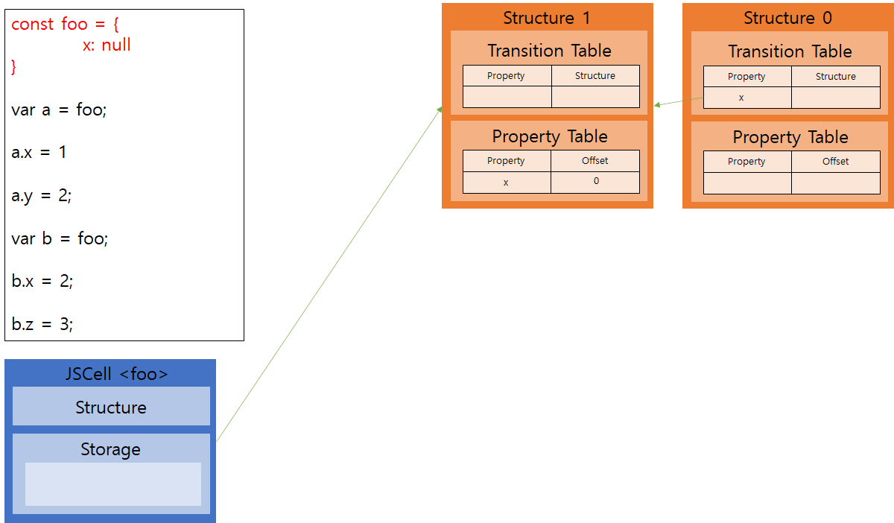

# Prototype vs Class
자바스크립트는 기본적으로 클래스가 없습니다.

대신 프로토타입이라는 개념이 있어 ‘객체들간의 상속’을 구현할 수 있습니다. 

어쨌든 자바스크립트는 프로토타입 기반 언어이기 때문에 클래스 기반 언어와 달리 컴파일러 입장에서 특별히 신경 써 주어야 할 것이 하나 더 있습니다.

## 필드 구조
클래스 기반 언어의 경우 같은 클래스에 속한 객체들은 모두 같은 필드 구조를 가집니다.

 따라서 어떤 객체의 특정한 멤버 변수에 접근할 때, 어떤 변수에 접근하는지, 메모리의 어느 위치를 참조하면 되는지를 수행하기 전 컴파일 타임 때 미리 알 수가 있습니다.

예를 들어 A라는 클래스의 객체들은 x,y라는 필드를 가지고 있고, A 타입의 객체들을 만들 때 변수 x는 A가 저장된 위치의 0번 offset, 변수 y는 A가 저장된 위치의 1번 offset이라고 미리 정해 놓는다면, 컴파일하면서 a.x에 접근하는 녀석은 [a + offset(x)], a.y에 접근하는 녀석은 [a + offset(y)]의 메모리 값을 읽어오도록 주소값으로 대체해서 코드를 생성하면 됩니다.

상속을 생각하더라도 상속받은 녀석이 부모 클래스의 멤버 변수를 없애는 일은 없기 때문에 추가되는 녀석들을 뒤에 붙이면 문제가 생기지 않습니다. (물론 멤버 함수의 경우에는 다형성이 있기 때문에 이야기가 달라집니다.)


위 그림이 클래스 기반 언어와 자바스크립트의 차이를 가장 잘 보여주는 그림이라 할 수 있습니다.

클래스 기반 언어(왼쪽)는 오프셋 값만으로 모든 멤버 변수에 접근할 수 있지만, 자바스크립트(오른쪽)는 수행 중간에 필드 구조가 변경될 수 있기 때문에 기본적으로 [프로퍼티 이름 + 값] 세트를 모든 객체가 들고 있어야 합니다.
 
만약 객체 100개를 생성했는데, 100개가 모두 같은 필드 구조를 가지고 있다 해도 언제 바뀔 지 모르기 때문에 계속 저 테이블을 들고 다녀야 합니다.

중복해서 나타나는 멤버 변수 이름을 다 가지고 있기 때문에 일단 메모리는 당연히 문제가 되고, 더불어 성능에도 문제가 생깁니다.

# Hidden classes
이러한 문제를 멋지게 해결한 것이 hidden class라는 개념입니다.

이름에서도 알 수 있듯이 비록 자바스크립트에는 클래스가 없지만, 엔진 안쪽에 숨겨진 클래스 개념을 두는 최적화 기법입니다.


쉽게 표현하자면 JSCell은 오브젝트를 담는 자료구조이고, Structure는 hidden class 자료구조입니다.

JSCell만 놓고 보면 기존 클래스 기반 언어의 방식과 유사해 보입니다. 실제 프로퍼티 값들만을 저장하고, 대신 자신이 (현재) 속한 hidden class에 대한 포인터를 가지고 있습니다.

구조는 조금 복잡한데, m_propertyTable은 현재 나를 hidden class로 가지고 있는 오브젝트들이 어떤 필드 구조를 가지고 있고, 각각의 필드가 어느 오프셋에 저장되어 있는지를 나타내는 테이블입니다.

객체의 멤버 변수를 참조할 때 이 테이블을 참조함으로써 어떤 위치의 값을 읽으면 되는지 알아낼 수 있는 것입니다.

그리고 필드 구조가 런타임에 변할 수 있다라는 요구조건을 만족시키는 것이 바로 m_transitionTable입니다. 중간에 객체의 필드 구조가 변한다면 이 테이블을 참조하여 객체가 다른 히든 클래스로 옮겨가거나 혹은 새로 생성하게 됩니다.


왼쪽 위의 코드에서 a.y = 2 부분이 수행되고 나면 히든 클래스가 위 그림과 같이 형성되는데, 그 과정은 다음과 같습니다.


아무 필드가 없는 객체는 [Structure 0]을 참조합니다.



먼저 foo 가 x필드를 지닌 상태로 생성되면 [Structure 1]이 생성되고, 프로퍼티 테이블에 x(offset = 0)가 추가된다.

[Structure 0]의 트랜지션 테이블에 x가 추가된다. 앞으로 [structure 0]을 가리키는 객체에서 x라는 필드가 추가된다면, 트랜지션 테이블을 참조하여 [Structure 1]로 옮겨가게 된다.


a의 x 필드에 값이 매핑되면 storage에 해당 값이 추가됩니다.


a.y = 2가 수행되면서 y라는 필드를 추가하려고 한다. x때와 마찬가지로, [Structure 2]를 만들고, [Structure 1]에 y가 추가되는 경우에 대한 링크를 만든다.

최종적으로 a는 [Structure 2]를 가리키고 있으므로, x에 접근할 때는 offset 0번을, y에 접근할 때는 offset 1번을 가져다 쓰면 된다.

여기에서 var b = foo 이 수행되면 아래와 같은 상태가 됩니다.


b가 처음 만들어지면서 [Structure 0]을 가리키는데, [Structure 0]의 트랜지션 테이블을 보니 x가 추가될 때의 링크가 있기 때문에, b의 히든 클래스를 [Structure 1]로 변경한다.


b.x = 2가 수행되면서 x 필드에 값이 매핑되면 storage에 해당 값이 추가됩니다.


여기서 b.y를 추가한다면 [Structure 2]를 가리키도록 변경된다.

여기서 b.z를 추가한다면 새로운 [Structure 3]을 만들 것이고, [Structure 1]의 트랜지션 테이블에 z가 추가된다.

# Chrome에서 동일 히든 클래스 여부 확인하기

여러 객체가 참조하고 있는 히든 클래스가 동일한지 아닌지를 알아보는 방법이 있습니다.

 V8의 디버거 겸 셸인 d8을 이용할 수도 있지만, Chrome의 개발자 도구를 통해 더욱 쉽게 확인할 수 있습니다.

먼저 Chrome을 실행시킨 뒤, 다음의 순서를 따라해 보세요.

1. Chrome에서 개발자 도구를 실행시킨다.
2. 콘솔에서 다음 코드를 실행한다.

```javascript
function Person(name) {
 this.name = name;
}

var foo = new Person("yonehara");
var bar = new Person("suzuki");
```
3. 스냅샷을 찍는다.
4. Memory 탭에서 'Person'으로 검색한다.

위 코드를 실행한 직후의 메모리 상태가 다음과 같이 표시될 것입니다. 스냅샷에서 보시는 바와 같이, 두 Person 객체의 map이라는 항목의 ID가 동일하네요. 히든 클래스는 코드 상에서 Map이라 불립니다. 이 ID가 일치한다는 것은 두 객체가 참조하는 히든 클래스가 동일하다는 뜻입니다.


그럼 foo 객체에 다른 프로퍼티, job을 추가해 보겠습니다. 이론상으로 foo 객체는 새로운 히든 클래스를 참조하며, 기존의 히든 클래스는 새로운 히든 클래스를 참조하게 됩니다.
```javascript
function Person(name) {
 this.name = name;
}

var foo = new Person("yonehara");
var bar = new Person("suzuki");
foo.job = "frontend";
```

다시 한번 스냅샷을 찍어 보겠습니다. 보시다시피 이제 각 Person 객체의 map ID가 달라졌습니다. 즉, foo 객체와 bar 객체가 서로 다른 히든 클래스를 참조하고 있다는 뜻이지요. map 항목 아래를 보시면 transition이라는 항목이 있습니다. 아쉽게도 조건까지는 알 수 없지만 bar 객체가 참조하는 히든 클래스가 내부적으로 foo의 히든 클래스를 참조한다는 사실도 확인할 수 있습니다.

# 고성능 자바스크립트 코드 작성

따라서, 자바스크립트 코드의 성능 향상을 최대화하려면 동적 프로퍼티 추가를 줄여야 할 수도 있다.

NodeJS에서 반복문을 실행하고 있다고 가정하자. 

객체에 동적 프로퍼티를 추가하면 반복문 내부에 성능 차이가 나타난다.

따라서 반복문 내부에서 프로퍼티를 동적으로 추가하는 대신 반복문 외부에서 프로퍼티를 만들어 사용하는 것이 좋다.

즉 V8이 기존의 히든 클래스를 재사용할 때, 성능이 훨씬 향상된다.

