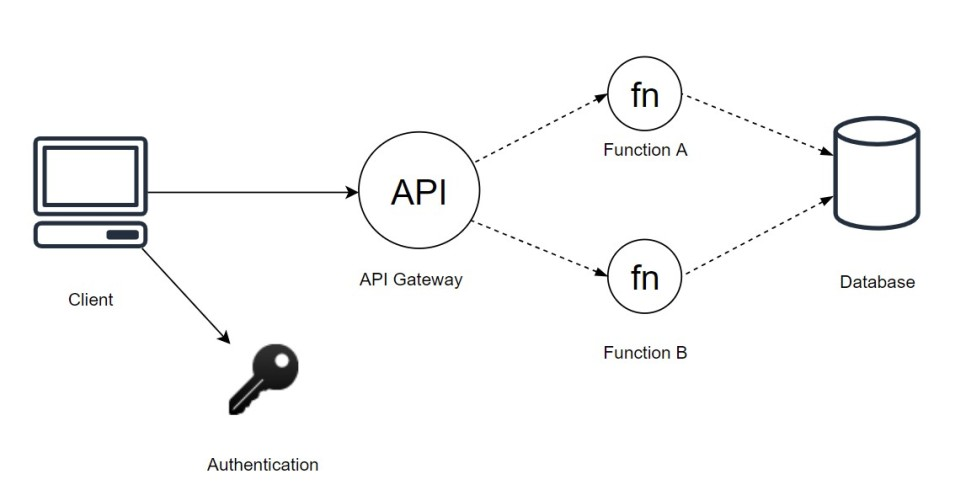
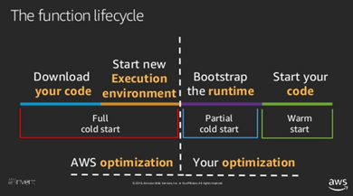
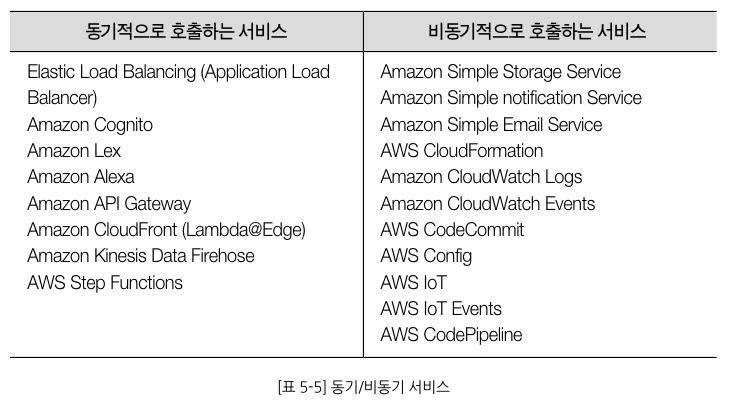

# AWS Lambda로 시작하는 서버리스

## 서버리스   

### 서버리스란   

 - 서버에서 처리하는 작업을 클라우드 기반 서비스로 처리하는 것   
 - 즉 직접 구축 하지 않고 서비스를 사용함으로써 구축 및 관리 비용을 낮추고    
 - 서버 운영에 따라 발생하는 유지 보수 어려움을 줄이기 위해 필요한 순간에만 컴퓨팅 서비스를 제공하는 것   
 
### 서버리스의 형태   

 - BaaS(Backend as a Service): 백엔드의 부분 부분을 서비스로 제공 받는 것   
   * 해당 환경이 만들어진 이유는 클라이언트 환경의 발전 때문에   
 - FaaS(Function as a Service): 실행할 함수 단위만 개발   
   * 서버를 구성하고 코드를 배포하던 형식을 줄이고, 원하는 로직만 함수 기반으로 구현   
   * 함수 호출 시 컨터이너(또는 VM)이 실행되며 정의한 함수가 런타임 내 실행된 다음 컨테이너가 종료됨   
   * 단일 함수로 간단한 작업 뿐만이 아닌 여러 함수, 다른 서비스 연결하는 복잡한 로직 구현 가능   
   * AWS Lambda 가 대표적   
  
### 서버리스 구조   

 - client에서 Authentication Service 호출 후 인증을 받고 API Gateway 호출하여 원하는 함수에 접근 하는 구조   

### Scale-out과 Scale-Up   

 - 스케일 아웃: 서버 여러대를 추가하여 시스템 확장하는 방법으로 서버별 균등 배분을 위해 로드밸런서가 필수임   
 - 스케일 업: CPU나 RAM을 업그레이드 하는 방식   
 - 기존에 사용하던 온프레미스 환경의 구조의 경우 직접 위의 두 가지를 고려하여 확장 및 업그레이드를 해야하지만 FaaS의 경우 스케일링이 자동화 되어 있음   

### 서버리스를 사용하는 이유?   
  
 - 관리보다 개발에 집중하여 서비스 출시를 앞당김   
 - 함수 단위 로직으로 코드 유지보수나 기능 추가에 효율적   
 - 이벤트 기반 실행으로 경제적이며 유연한 대응 가능   
 - 반복적으로 타 시스템과 연계하여 비즈니스 인사이트를 도출할 때 유용   
 
### 서버리스 단점
 
 - 장기간 지속하 작업에는 기능적/비용적으로 부적합
 - 함수가 항상 준비 상태가 아님
   * 실행시 약간의 지연이 발생하는 콜드 스타트가 발생
   * 함수 실행 후 다른 함수 실행 시 잠시 대기 했다가 다시 실행되기에 웜 스타트가 발생함   
  
## AWS Lambda

### AWS Lambda란   

 - AWS에서 제공하는 FasS 서비스   

### AWS Lambda의 동작   

 - AWS Lambda는 이벤트를 감지하여 아마존 리눅스 환경의 Micro VM을 띄우고 함수를 실행함   
   * 즉 람다 실행 -> 언어별 런타임 환경 준비 -> 환경 변수 등 실행 환경 맞춤 -> Micro VM 실행 -> 이벤트 처리   
 - 바로 처리가 아닌 일련의 과정이 있기에 Cold Start 발생   
 
### AWS Lambda의 Cold Start 그리고 Warm Start   

 - micro Vm이 올라갔다 내려간 뒤 다시 실행하면 Full cold start 부터 시작
 - Micro VM 유지 되는 시간에 요청 오면 Partial cold Start 가 바로 진행
 - cold start를 줄일 수 있는 쉬운 방안은 지속적인 호출을 통해 micro Vm을 유지하는 방안임
 
### AWS Lambda의 런타임   
 
 - 사용시 다른 언어들로 작성한 코드들도 동일한 기본 환경에서 실행 가능함   
 - AWS Lambda 서비스와 작성한 함수 코드 사이에 위치해 이벤트와 컨텍스트 정보 등 응답을 중계해주는 역할을 수행   
 - 함수 생성시 런타임을 선택 가능하며 필요시 런타임 환경을 변경 가능함   
 - 런타임 지원이 중단 되면 Lambda는 호출을 비활성화하며 사용 중단된 런타임은 보안 업데이틀 기술지원을 받을 수 없기에 마이그레이션이 필수적임   
 
### AWS Lambda의 Event   
 

 - 동기식: 클라이언트가 람다 함수에 이벤트를 보내고 클라이언트는 함수의 응답을 받음   
   * 파라미터 값은 invoke로 실행함   
 - 비동기식: 클라이언트의 요청 이벤트와 람다 함수 사이에 대기열을 이용하는 것   
   * 클라이언트는 성공 응답만 받음   
   * 호출 유형 파라미터 값을 Event로 설정해야함   
   * 오류 발생시 계속 재시도함. 이때 동시성 설정이 작게 되어있을 경우 (492코드) 서버 오류 (500코드) 일 때는 이벤트를 대기열로 보내고 최대 6시간동안 최대 5분 간격으로 재시도 수행하며 이벤트가 대기열에서 삭제 됨   
   * 오류 상황에 대한 섬세한 컨트롤을 위해서 Amazon SQS(메시지 대기열 시스템, Amazon Simple Queue Service)나 Amazon SNS(푸시 서비스, Amazon Simple Notification Service)등을 사용하는 것을 추천함

### 메모리 할당과 실행 제한 시간   

 - AWS Lambda는 설정한 1개의 인스턴스를 동일하게 사용하는 것   
 - 메모리는 128MB에서 3008MB까지 64MB 단위로 직접 설정 가능함   
 - 실행 제한 시간은 최대 900ms까지 설정 가능함   
 - 리소스(CUP 성능, 네트워크 대역폭, 디스크 I/O)의 경우 메모리 설정에 따라 자동으로 할당됨
 
### 태그   

 - 키 값 형식의 태그 사용 가능
 - 태그 사용시 특정 함수의 호출 빈도 그리고 비용등 추적 프로세스를 갖출 수 있음   
 - 최대 50개까지 지정 가능하며 키의 최대길의는 128자, 값의 최대 길이는 256자임
 - 대소문자를 구분하며 UTF-8로 표현 가능한 문자, 공백, 숫자 그리고 특수문자만 사용 가능함

## API Gateway   

### Amazon API Gateway

 - 사용자가 쉽게 API 생성, 게시, 관리, 모니터링, 보안 까지 관리 가능한 완전 관리형 서비스   
 - CORS 지원, 권한 부여 및 액세스 제어, 제한 모니터링 및 API 버전 관리 등 API와 괸련된 모든 작업 처리   
 - 선택 옵션으로는 REST API, WebSocket API, HTTP API 존재   
 
### HTTP API
 
 - 클라이언트가 서버에게 프로코톨과 도메인, URL을 이용하여 요청(Request)을 하고 서버가 처리후 응답(Response)하는 API   
 - 특징   
   * 비연결성: 클라이언트와 서버가 단 한번의 연결을 통해 정보를 주고받고 서버가 응답을 한번 하면 연결을 끊음   
     - 장점: 서버의 리소스 낭비 X   
     - 단점: 매번 새로운 연결 시도 및 해체 때문에 오버헤드 발생   
     - 해결책: KeepAlive를 통해 주기적으로 패킷을 보내 접속을 유지시키는 방식 사용. But 서버의 메모리를 과도하게 사용할 수 있음   
   * 무상태   
     - 상태 값이 존재 하지 않으며 요청 받은 정보에 대해 주고 받기만 함   
     - 상태 유지를 위해 클라이언트의 쿠키, 서버의 세션 또는 토큰을 통해 관리함   
     - 쿠키와 세션의 경우 위변조의 위험과 메모리를 사용하기에 과부하의 원인이 되기도 함   
   * HTTP Method   
     - 클라이언트가 서버로 Request를 보낼 때 어떤 목적을 가지는지 HTTP 메소드에 명시함   
     - GET, HEAD, POST, PUT, PATCH, DELETE 등등 이 존재   
   * 응답 상태코드   
     - 서버가 클라이언트의 요청에 대해 숫자로 상태코드를 반환함. 404 에러 또는 500번대 에러가 예시임   

### REST API

 - 자원에 고유한 URI를 부여하는 방식   
 - 특징   
   * 클라이언트/서버   
     - 서버의 경우 API를 제공하고 클라이언트에서 사용자 인증아니 컨텍스트 등을 직접 관리하는 구조로 서로의 역활이 명확하기에 의존성이 낮아짐   
   * 무상태   
     - 상태가 존재 하지 않으며 요청 받은 정보에 대해 주고 받기만 함   
   * 캐싱 처리 가능   
     - HTTP 프로토콜 표준에서 사용하는 Last-Modified 태그나 E-Tag를 이용하여 캐싱 구현 가능   
   * 계층화   
     - 서버의 경우 다중 계층으로 구성 가능하며 보안, 암호화 계층, 로드 밸런싱을 추가하여 구조적으로 유연하게 관리 가능   
   * Code-On-Demand   
     - 서버로부터 스크립트를 받아 클라이언트에서 실행 가능   
   * 인터페이스의 일관성   
     - URI로 지정한 자원(Resource)에 대해 통일된 인터페이스를 수행하는 아키텍처 스타일로 언어나 플랫폼에 구애 받지 않지만 아래와 같은 일관성 제약조건이 필요함   
       * Identification of resources: Resource를 URI로 식별한다   
       * Manipulation of resources through representations: Representations(PUT, GET, DELETE, POST 등)를 전송하여 Resource를 조작한다   
       * Self-Descriptive Messages: 메시지만으로 어떤 기능인지 이해할 수 있어야 한다. HTTP URI는 자원을, HTTP Method는 행위를, MIME Type은 표현 방식을 의미한다

### HTTP API와 REST API 선택기준   

 - 금액의 경우 HTTP API가 3배 저렴하며  대기시간 또한 최대 60% 이상 줄일 수 있음   
 - HTTP API의 경우 프록시 기능만 제공하며 그에 최적화 되어 있음   
 - HTTP API와 REST API 지원 정보   

   
   

## 메시징 서비스   

### AaMazon SQS   

 - AWS에서 제공하는 메시지 큐 서비스
 - MOM(Message Oriented Middleware): 비동기 메시지를 사용하는 프로그램 간의 데이터 송수신 미들웨어
 - 메시지 큐: MOM을 구현한 시스템
 - 오래 걸리는 통신이 있으면 사용자에게 우선적으로 보여주는 선처리와 비동기 통신을 이용하여 후처리 하는 것이 특징
 - RabbitMQ, ActiveMQ, Kafka 등이 존재
 

