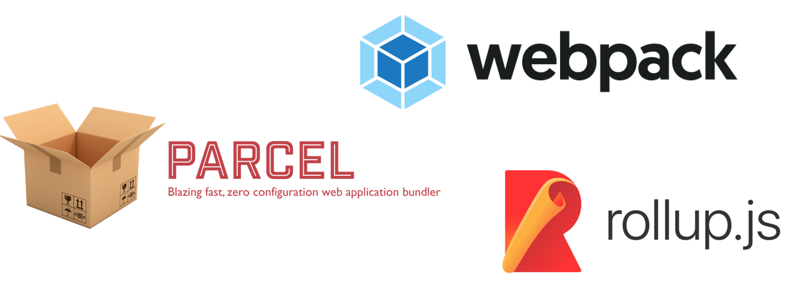

## Webpack 등장 배경

### 페이지 로딩 속도 저하


웹 사이트를 개발할 때 JS, CSS, IMG 등 수많은 리소스 파일이 생겨납니다.

위 사진은 GitHub 페이지를 로딩했을 때 다운로드 된 파일입니다. Type 을 보면 script, stylesheet, jpeg 등 다양한 파일이 있습니다.

완성된 웹사이트를 로딩했을 때 많은 파일이 다운로드 된다는 것을 알 수 있습니다.

많은 파일이 다운로드 되는 것의 단점은, 서버와의 접속이 많을수록 **웹 로딩은 느려진다는 것**입니다.

### JS 모듈화 이슈

```html
<script src="/js/vendor/vendor01.js"></script>
<script src="/js/module01.js"></script>
<script src="/js/lib/library01.js"></script>
<script src="/js/module02.js"></script>
<script src="/js/module03.js"></script>
```

위 코드는 일반적인 방식인 태그로 자바스크립트를 모듈화하는 예제입니다.

이렇게 사용하면 여러 개의 파일을 로딩하더라도 같은 스코프를 공유하기 때문에 **전역 변수의 충돌**이 발생할 수 있습니다.

그리고 라이브러리 로딩 순서에 따른 이슈, 복잡도에 따른 관리 문제도 생길 수 있습니다.

### Bundler 등장



위와 같은 두 문제를 해결하기 위해 등장한 도구가 바로 번들러입니다.

> 번들러란 필요한 의존성을 추적하여 해당하는 의존성들을 **그룹핑 해주는 도구**입니다.

이러한 번들러 중 가장 많이 사용되는 도구가 바로 **웹팩**입니다.

### Bundler의 장점


웹팩의 공식 사이트에 있는 사진입니다. 이렇게 애플리케이션을 구성하는 몇십, 몇백 개의 자원들을 하나의 파일로 병합 및 압축해 주는 동작을 **모듈 번들링**이라고 합니다.

> 이처럼 번들러를 사용하면 여러 개의 파일을 하나로 묶어주기 때문에 **네트워크 접속의 부담을 줄여 더 빠른 서비스를 제공**할 수 있습니다.
>
> 또한, Module 을 사용하여 매우 복잡하고 긴 코드를 작성할 때 사용 용도에 따라 파일 단위로 구분한 뒤, **다른 파일에서 해당 클래스나 함수가 필요할 때 가져와서 사용**할 수 있도록 해줍니다. 외부 라이브러리의 의존성도 쉽게 관리할 수 있습니다.


------


## 웹팩의 4가지 주요 속성 

### entry

> entry 속성은 웹팩에서 웹 자원을 변환하는 데 필요한 **진입점**이자 자바스크립트 파일 경로입니다.

entry 속성에서 번들링하고 싶은 파일들을 선언합니다.

여기에 지정된 파일은 웹 애플리케이션의 전반적인 구조와 내용이 담겨 있어야 합니다.

왜냐하면 웹팩이 entry 속성에 지정된 파일을 가지고 웹 애플리케이션에서 사용되는 모듈들의 연관 관계를 이해하고 분석하기 때문입니다.

웹팩은 엔트리를 통해서 필요한 모듈들을 로딩하고, 하나의 파일로 묶는 과정을 진행합니다.

### output

> output 속성은 웹팩을 돌리고 난 **결과물의 파일 경로**를 의미합니다.

번들된 결과물을 처리할 위치를 output에 기록합니다.

### loader

> 웹팩이 웹 애플리케이션을 해석할 때 JS 파일이 아닌 **HTML, CSS, IMG, 폰트 등을 변환할 수 있도록 도와주는 속성**입니다.

웹팩은 모든 파일을 모듈로 관리하지만 JS 만 알고 있어서 다른 파일들을 웹팩이 이해할 수 있도록 변경해주는 것이 로더의 역할입니다.

### plugin

> 웹팩의 기본적인 동작에 **추가적인 기능을 제공**하는 속성입니다.

로더랑 비교하면 로더는 파일을 해석하고 변환하는 과정에 해당하고 플러그인은 해당 결과물의 형태를 바꾸는 과정에 해당합니다.


------


## entry와 output 

### module 


> 웹팩은 **JS 파일과 IMG 파일 등 모두 모듈**로 인식합니다.

그래서 JS 코드에서 import 구문을 사용해서 IMG 와 CSS 파일을 가져올 수 있는 것입니다.

모듈을 지원하지 않는 브라우저에서도 웹팩을 사용하면 모듈을 적용할 수 있습니다.

위에서 본 사진을 기준으로 **왼쪽 위 .js 파일을 entry** 라고 합니다. entry를 기준으로 모든 모듈을 찾은 후 하나의 코드로 만들어 줍니다.

따라서 오른쪽 그림을 보면 하나의 .js 파일이 생성된 것을 볼 수 있습니다. 이렇게 만들어진 **결과물을 output** 이라고 합니다.


### 실습

> 파일 구조

```null
node_modules
src
 ┣ app.js
 ┗ math.js
index.html
package-lock.json
package.json
```

> app.js

```js
import { sum } from './math.js';

console.log(sum(1, 2));
```

> math.js

```js
export function sum(a, b) {
  return a + b;
}
```

> index.html

```null
<!DOCTYPE html>
<html lang="en">
  <head>
    <title>webpack</title>
  </head>
  <body>
    <script type="module" src="./src/app.js"></script>
  </body>
</html>
```

엔트리와 아웃풋을 실습하기 위해 패키지를 설치하겠습니다.

```sh
npm install -D webpack webpack-cli
```


------


## 웹팩을 실행할 때 필수 3가지 옵션

기본값으로 줘야 하는 3가지 옵션에 대해 살펴보겠습니다.

###  mode

> mode 옵션은 웹팩에 내장된 **최적화 방법 중 어느 것을 사용할지** 웹팩에게 알려주는 역할을 합니다.

- **production** : DefinePlugin 의 process.env.NODE_ENV 를 production 으로 설정합니다.
- **development** : DefinePlugin 의 process.env.NODE_ENV 를 development 로 설정합니다.
- **none** : 기본 최적화 옵션으로 설정합니다.

> mode 에 따라 웹팩 설정을 다르게 실행하고 싶다면 객체 대신 함수를 반환해야 합니다.

```js
var config = {
  entry = './app.js'
};

module.exports = (env, argv) => {
  if (argv.mode === 'development') {
    config.entry = './dev/app.js';
  };

  if (argv.mode === 'production') {
  };

  if (argv.mode === 'none') {
  };

  return config;
};
```

### entry

> entry 옵션은 애플리케이션 **번들링을 시작할 지점**을 의미합니다. 만약 배열을 값으로 전달하면, 배열에 담긴 모든 요소가 번들링됩니다.

HTML 페이지마다 하나의 포인트를 가집니다. 그래서 SPA(Single Page Application)은 하나의 포인트를 가지게 되고, MPA(Multiple Page Application)은 페이지별로 하나의 포인트를 가지게 됩니다.

```js
module.exports = {
  // SPA
  entry: './index.js'

  // MPA
  entry: {
    main: './main.js',
    contact: './contact.js'
  }
}
```


> 엔트리에 지정된 파일은 웹 애플리케이션의 전반적인 구조와 내용이 담겨 있어야 합니다.

예시를 통해 알아보겠습니다.

아래와 같은 SPA 의 index.js 코드가 있다면 index.js 파일에서 다른 js 파일도 불려져 사용되고 있어서 웹팩을 실행하면 해당 파일들의 내용까지 해석하여 파일을 빌드해줄 것입니다.

```js
import LoginView from './LoginView.js';
import HomeView from './HomeView.js';
import PostView from './PostView.js';

function initApp() {
  LoginView.init();
  HomeView.init();
  PostView.init();
}

initApp();
```


> 위와 같이 모듈 간의 의존 관계가 생기는 구조를 **디펜던시 그래프(Dependency Graph)**라고 합니다.


### output

> 번들링 **결과물을 저장할 경로**입니다.

최상위 output 키는 웹팩으로 번들링하거나 로드하는 번들, assets 그리고 다른 것들을 어떻게, 어디에 내보내야 하는지 설정하는 옵션들을 가지고 있습니다.

###  

### 실습

> webpack.config.js

```js
const path = require('path');

module.exports = {
  mode: 'development',

  entry: {
    main: './src/app.js',
  },

  output: {
    filename: '[name].js',
    path: path.resolve('./dist'),
  },
};
```

output 에서 os 마다 경로가 다르므로 .resolve 를 이용해서 절대 경로를 작성했습니다.

그리고 명령어를 통해 쉽게 build 하기 위해 package.json 의 scripts 코드를 수정했습니다.

> package.json

```json
{
  "name": "webpack-example",
  "version": "1.0.0",
  "description": "",
  "main": "index.js",
  "homepage": ".",
  "dependencies": {},
  "devDependencies": {
    "webpack": "^5.36.2",
    "webpack-cli": "^4.6.0"
  },
  "scripts": {
    "test": "echo \"Error: no test specified\" && exit 1",
    "build": "webpack"
  },
  "author": "",
  "license": "ISC"
}
```

이제 짧은 명령어로 파일을 빌드할 수 있습니다.

```sh
npm run build
```


------


## loader

### module을 사용할 수 있게 한 loader

> 웹팩은 **JS 파일과 IMG 파일 등 모두 모듈**로 인식합니다.

이것이 가능한 이유는 웹팩의 로더 덕분입니다. 로더는 TS 같은 다른 언어를 JS 문법으로 변환해 주거나 이미지를 data URL 형식의 문자열로 변환합니다. 또한, CSS 파일을 JS 에서 직접 로딩할 수 있도록 해줍니다.

### loader 동작 원리

로더를 직접 만들어보면서 동작 원리에 대해 알아보겠습니다 

> myloader.js

```js
module.exports = function myloader(content) {
  console.log('myloader가 동작함');

  return content;
};
```

> webpack.config.js

```js
const path = require('path');

module.exports = {
  mode: 'development',

  entry: {
    main: './src/app.js',
  },

  output: {
    filename: '[name].js',
    path: path.resolve('./dist'),
  },

  module: {
    rules: [
      {
        test: /\.js$/, // .js 확장자로 끝나는 모든 파일
        use: [path.resolve('./myloader.js')], // 방금 만든 로더를 적용
      },
    ],
  },
};
```

**test** 에는 로딩에 적용할 파일을 지정했습니다. 파일명뿐만 아니라 파일 패턴을 정규표현식으로 지정할 수 있는데 위 코드는 .js 확장자를 갖는 모든 파일을 처리하겠다는 의미입니다.

**use** 에는 이 패턴에 해당하는 파일에 적용할 로더를 설정하는 부분입니다. 방금 만든 myloader 함수의 경로를 지정했습니다.

```sh
npm run build
```

명령어를 실행한 후 console 결과를 확인하면 myloader가 동작함 글자를 확인할 수 있습니다.

결과가 두 번 실행이 된 이유는 **.js 확장자를 갖는 모든 파일을 처리하겠다고 설정**해서 app.js 와 math.js 를 모두 실행했기 때문입니다.

```sh
myloader가 동작함
myloader가 동작함
asset main.js 4.1 KiB [compared for emit] (name: main)
runtime modules 670 bytes 3 modules
cacheable modules 110 bytes
  ./src/app.js 61 bytes [built] [code generated]
  ./src/math.js 49 bytes [built] [code generated]
webpack 5.36.2 compiled successfully in 103 ms
```


### css-loader 

> src/style.css

```css
body {
  color: green;
  background-color: lightblue;
}
```

css-loader 를 설치했습니다.

```sh
npm install -D css-loader
```

webpack.config.js 의 module 설정을 변경했습니다.

> webpack.config.js

```js
const path = require('path');

module.exports = {
  mode: 'development',

  entry: {
    main: './src/app.js',
  },

  output: {
    filename: '[name].js',
    path: path.resolve('./dist'),
  },

  module: {
    rules: [
      {
        test: /\.css$/, // .css 확장자로 끝나는 모든 파일
        use: ['css-loader'], // css-loader를 적용
      },
    ],
  },
};
```

### 자주 사용하는 style-loader 알아보기

> css-loader 로 처리하면 자바스크립트 코드로만 변경되었을 뿐 **돔에 적용되지 않았기 때문에 스타일이 적용되지 않은 상태**입니다.

모듈로 변경된 스타일 시트는 돔에 추가되어야만 브라우저가 해석할 수 있습니다.

> style-loader 는 **자바스크립트로 변경된 스타일을 동적으로 돔에 추가하는 로더**입니다. CSS 를 번들링하기 위해 css-loader 와 style-loader 를 함께 사용하겠습니다.

style-loader 를 설치했습니다.

```sh
npm install -D style-loader
```

웹팩 설정을 추가했습니다.

> webpack.config.js

```js
const path = require('path');

module.exports = {
  mode: 'development',

  entry: {
    main: './src/app.js',
  },

  output: {
    filename: '[name].js',
    path: path.resolve('./dist'),
  },

  module: {
    rules: [
      {
        test: /\.css$/,
        use: ['style-loader', 'css-loader'], // style-loader를 앞에 추가
      },
    ],
  },
};
```

css 적용 결과를 확인하기 위해 html 코드를 수정했습니다.

> index.html

```index
<!DOCTYPE html>
<html lang="en">
  <head>
    <title>webpack</title>
  </head>
  <body>
    <h1>안녕하세요 웹 스터디 짱짱</h1>
    <script src="./dist/main.js"></script>
  </body>
</html>
```

설정을 마친 후 build 를 하고 결과를 확인해보겠습니다.

```sh
npm run build
```