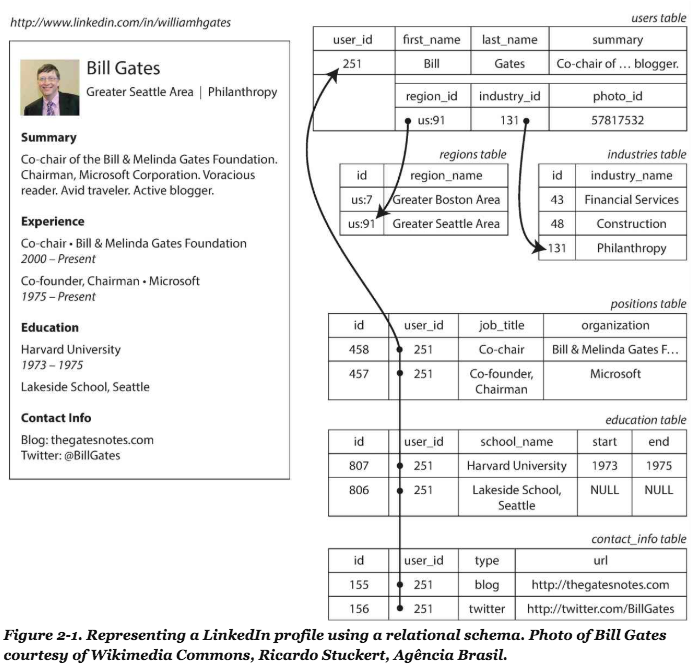
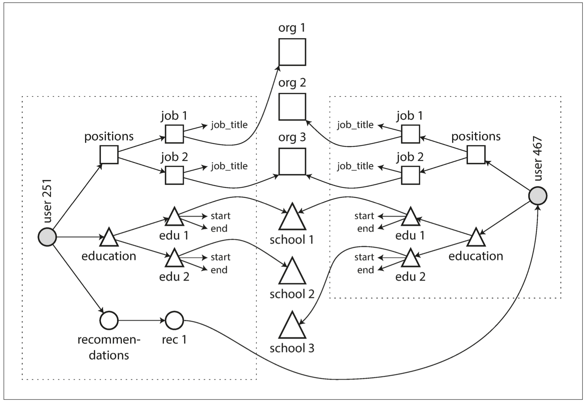
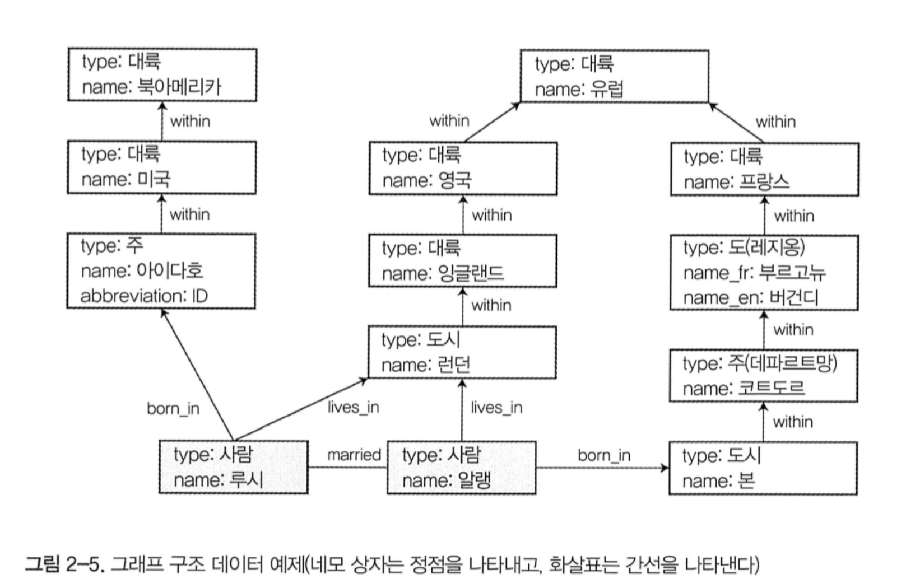

# 1장. 신뢰할 수 있고 확장 가능하며 유지보수하기 쉬운 애플리케이션

과거와 달리 현재는 계산 중심이 아닌 데이터 중심적 애플리 케이션을 만듬

표준 구성 요소: ex) DB, 캐시, 검색 색인, 스트림, 일괄 처리 등등

이런 표준 구성에 대해 각 애플리케이션 마다 요구 사항이 다르기에 구축 시스템 또한 저마다의 특성을 지님(ex DB)

## 데이터 시스템에 대한 생각

데이터 시스템이라는 포괄적인 용어로 묶어야 하는 이유
- 데이터 저장과 처리를 위한 여러 도구들이 전통적인 분류에 딱 들어 맞지 않음(ex: 데이터베이스 처럼 지속성을 제공하는 아파치 카프카, 메시지 큐로 사용하는 데이터 스토어인 레디스 등 )
- 단일 애플리케이션으로는 데이터 처리와 저장 모두를 만족 시킬 수 없고 다양한 도구들을 연결할 필요가 있음

## 신뢰성

- 애플리케이션은 사용자가 기대한 기능을 수행한다

- 시스템은 사용자가 범한 실수나 예상치 못한 소프트웨어 사용법을 허용할 수 있다

- 시스템 성능은 예상된 부하와 데이터 양에서 필수적인 사용 사례를 충분히 만족한다.

- 시스템은 허가되지 않은 접근과 오남용을 방지한다.

위 모든 것이 올바르게 동작함을 의미하며 무언가 잘못되더라도 올바르게 동작함을 신뢰성 의미로 생각할 수 있음

- 결함: 잘못될 수 있는 일 -> 예측하고 대처할 수 있는 시스템을 내결함성 또는 탄력성을 지녔다 표현

- 내결함성을 지녔다고 해서 모든 종류의 결함을 견딜수 있다는 것이 아닌 특정 유형의 결함에 대해 내성을 지녔다고 이야기하는게 타당함

- 장애: 사용자에게 필요한 서비스를 제공하지 못하고 시스템 전체가 멈춘 경우 -> 이런 장애가 결함으로 발생하지 않도록 구조를 설계하는 것이 좋음

- 하드웨어 결함
  - 하드웨어 자체 결함으로 MTTF(하드디스크의 평균 장애 시간)은 약 10 ~ 50년으로 보고됨
  - 시스템 장애율을 줄이기 위해 각 하드웨어 구성요소에 중복을 추가함
  - But 데이터 양과 애플리케이션의 계산 요구가 늘어 남에 따라 많은 하드웨어가 사용되어 있고 이에 비례하는 하드웨어 결함율이 증가함
  - 소프트웨어 내결함성 기술을 통해 해당 문제를 해결함

- 소프트웨어 오류
  - 하드웨어의 경우 장비들 관의 오류가 약상관관계를 지님
  - But 소프트웨어 오류의 경우 예상하기 어렵고 오류간 큰 상관관계를 지님
    - 잘못된 특정 입력이 있을 떄 모든 애플리케이션 서버 인스턴스가 죽는 소프트웨어 버그 ex) 리눅스 커널의 버그로 인해 애플리케이션이 일제히 멈췄던 적이 있음
    - 한 구성 요소의 장애가 다른 구성 요소의 장애를 야기하고 차례차례 더 많은 결함이 발생하는 연쇄 장애

- 인적 오류
  - 인적 오류의 경우 전체 결함중 10~25%를 차지함
  - 이런 인적 오류를 줄이는 접근 방식
    - 오류의 가능성을 최소하는 방향으로 시스템을 설계하라.
    - 사람이 가장 많이 실수 하는 부분에서 사람의 실수로 장애가 발생할 수 있는 부분을 분리하라.
    - 단위 테스트부터 전체 시스템 통합 테스트까지 모든 수준에서 철저하게 테스트 수행하라.
    - 장애 발생의 영향을 최소화하기 위해 인적 오류를 빠르고 쉽게 복구할 수 있도록 하라.
    - 성능 지표와 오류율과 같은 상세하고 명확한 모니터링 대책을 마련하라.

## 확장성

증가하는 부하에 대처하는 시스템 능력을 표현하는 용어로 "X는 확장 가능하다" 또는 "Y는 확장 불가능하다"를 의미 하기보다는 "시스템이 특정 방식으로 커지면 이에 대처하기 위한 선택은 무엇인가에 대한 질문을 고려한다"는 의미임.

### 부하 기술하기

얼마나 요청을 받는지 설명할 수 있는 지표로 현재 부하를 파악하는게 필요함.

부하 매개변수: 시스템 설계에 따라 달라지며 초당 요청 수, 데이터베이스 읽기 대 쓰기 비율 등등 사용함

트위터 예시
- 트위터 주요 동작은 트윗 작성(사용자가 팔로워에게 새로운 메시지 게시, 평균 초당 4.6k 요청, 피크 시 초당 12k)과 홈 타임라인(사용자가 팔로우한 사람의 작성 트윗을 봄, 초당 300k)
- 문제상황: 개별 사용자가 인기 있는(팔로우가 많은) 사람을 팔로우 하고 인기 있는(팔로우가 많은) 사람이 개별 사용자에게 트윗 작성.
- 방안1. 새로운 트윗이 작성되면 전체 트윗을 모아놓는 테이블에 삽입한다. 사용자가 자신의 홈 타임라인을 요청하면, 팔로우하는 모든 사람을 찾아서 그 사람의 트윗을 시간순으로 결합한다.
- 방안2. 새로운 트윗이 작성되면 사용자를 팔로우하는 모든 사람을 찾아서, 팔로워 각자의 홈 타임라인 캐시에 새로운 트윗을 insert 한다.
- 트위터는 방안 1을 처음 선택했으나 추후에 부하에 의해 방안 2로 전환함
- 그러나 방안 2의 경우 팔로워 수의 사용장에 따라 너무 큰 부하를 요구하기에 팔로워 수에 따라 1과 2를 혼합하게 사용하도록 수정함

### 성능 기술하기

일단 부하 매개변수를 결정하면(cpu 사용량을 보겠다, 초당 TPS 를 확인하겠다 등), 다음 두 가지 방법으로 성능을 측정하여 지표화 할 수 있다.

- 부하 매개변수를 증가시키고 시스템 자원을 변경하지 않고 유지하면 성능은 어떻게 영향을 받을까?
- 부하 매개변수를 증가시켰을 때 성능이 변하지 않고 유지되기를 원한다면 얼마나 많이 자원을 늘려야 할까?

두 질문 모두 성능 수치가 필요하다. 이런 성능 수치는 대표적으로 처리량과 응답시간으로 구성된다

- 처리량: 초당 처리할 수 있는 레코드 수로 하둡과 같은 일괄 처리 시스템이 주로 사용

- 응답시간: 요청시 서버의 응답 시간으로 온라인 시스템에서 주로 사용

  - 지연 시간: 응답 시간과 비슷하게 쓰이지만 응답 시간과 달리 요청이 처리되길 기다리는 휴지 상태인 시간

이중 응답 시간의 경우 매번 동일하지 않기에 분포로 측정해야한다. 이런 응답 시간의 경우 특이 값이 존재 하기에 주로 산술적인 평균 시간을 통해 측정하지만 좋은 지표가 아니다. 따라서 산술적인 평균보다는 백분위 즉 중앙값을 사용하는 것을 추천한다.  중앙값은 50분위로 p50 으로 기술하곤 하는데, 이는 사용자의 절반은 중앙값보다 빠르고, 절반은 느리다는 의미이다. 아마존은 내부 서비스의 응답 시간 요구사항을 p999 로 나타내곤 한다. 이는 요청 1000 개 중에서 가장 느린 한 개의 응답속도를 나타내는 숫자이다.

그런데 이 p999가 꼬리 지연 시간으로 주로 VIP같이 많은 데이터를 사용한 고객의 응답시간일 가능성이 높다. 따라서 이런 고객이 행복하게 하는 것이 판매량에 중대한 영향을 끼치기에 속도개선을 하기 위해 노력한다.

하지만 이런 노력이 과해 p999 보다 소수인 p9999(어쩌면 더 높은 VIP)의 응답속도를 개선하기 위한 최적화 작업의 비용이 너무 많이 들기에 최적화 작업을 수행하지 않는다. 즉 비용적인 측명과 응답시간의 백분위를 고려하여 최적화 작업을 수행한다.

p999 를 최적화해야 하는 다른 이유가 있을까? 큐 대기 지연(queueing delay) 또한 그 이유 중 하나가 될 수 있다. 서버는 병렬로 소수의 작업만 처리할 수 있기 때문에, 소수의 느린 요청 처리만으로도 후속 요청 처리가 지체된다. 이 현상을 선두 차단(head-of-line blocking) 이라 한다.

### 부하 대응 접근 방식

부하 매개변수가 어느 정도 증가하더라도 좋은 성능을 유지하려면 어떻게 해야 할까? 사람들은 확장성을 두 가지로 분리하여 이야기하곤 한다.

- scaling up: 좀 더 강력한 장비로 이동한다.

- scaling out: 다수의 낮은 장비에 부하를 분산한다.

고사양 장비는 보통 매우 비싸기 때문에, 대게 규모 확장이 효율적이다.

일부 시스템은 탄력적(elastic)이다. 즉 부하 증가를 감지하면 컴퓨팅 자원을 자동으로 추가할 수 있다. 반면 그렇지 못한 시스템은 사람이 수동으로 시스템을 확장해주어야 한다. 탄력적인 시스템은 부하를 예측할 수 없을 만큼 높은 경우 유용하지만, 그렇지 못한 경우에는 수동으로 확장하는 시스템이 더 간단하고 운영장 예상치 못한 일이 더 적다.

다수의 장비에 stateless 한 서비스를 배포하는 일은 상당히 간단하다. 하지만 stateful 한 테이터 시스템을 분산하는 일은 매부 복잡하기 때문에, 확장 비용이나 데이터베이스를 분산으로 만들어야 하는 요구가 있기 전까지는 단일 노드에 데이터베이스를 유지하는 것이 최근까지의 통념이다.

다만 최근에는 분산 시스템을 위한 도구와 추상화가 좋아지면서, 이 통념이 적어도 일부 애플리케이션에서는 바뀌었다. 대용량 데이터와 트래픽을 다루지 않는 경우에도 분산 데이터 시스템이 향후 기본 아키텍처로 자리 잡을 가능성이 있다.

대게 대규모로 동작하는 시스템의 아키텍처는 해당 시스템을 사용하는 애플리케이션에 특화되어 있다. 범용적이고 모든 상황에 맞는 확장 아키텍처는 없다. 읽기의 양, 쓰기의 양, 저장할 데이터의 양, 데이터의 복잡도, 응답 시간 요구사항, 접근 패턴 등에 맞추어 아키텍처를 설계하여야 한다.

특정 애플리케이션에 적합한 확장성을 갖춘 아키텍처는 주요 동작이 무엇이고, 잘 하지 않는 동작이 무엇인지에 대한 가정을 바탕으로 구축된다. 이 가정은 곧 부하 매개변수가 된다.

## 유지보수성

소프트웨어의 비용은 대부분 유지보수에 들어간다. 모든 사람은 레거시 시스템을 유지보수하는것을 좋아하지 않는다. 희망적인 점은, 유지보수 중 고통을 최소화할 수 있게 소프트웨어를 설계할 수 있다는 것이다. 그러기 위해서 주의를 기울어야 하는 원칙은 다음과 같다.

- 운용성: 운영팀이 시스템을 원활하게 운영할 수 있게 쉽게 만들어라

- 단순성: 시스템에서 복잡도를 최대한 제거해 새로운 엔지니어가 시스템을 이해하기 쉽게 만들어라

- 발전성: 엔지니어가 이후에 시스템을 쉽게 변경할 수 있게 하라. 그래야 요구사항 변경 같은 예기치 않은 사용 사례를 적용하기가 쉽다. 이 속성은 유연성, 수정 가능성, 적응성으로 알려져 있다.

### 운용성: 운영의 편리함 만들기

좋은 운영성이란 동일하게 반복되는 태스크를 쉽게 수행하게끔 만들어, 운영팀이 고부가가치 활동에 노력을 집중한다는 의미이다. 즉, 동일 반복 태스크를 쉽게 할 수 있게 만들어야 한다.

### 단순성 : 복잡도 관리

프로젝트가 커짐에 따라 시스템은 매우 복잡해지고 이해하기 어려워진다. 복잡도는 다양한 증상으로 나타난다. **상태 공간의 급증, 모듈 간 강한 커플링, 복잡한 의존성, 일관성 없는 명명과 용어, 성능 문제 해결을 목표로 한 해킹, 임시방편으로 문제를 해결한 특수 사례** 등이 이런 증상이다.

개발자가 시스템을 이해하고 추론하기 어려워지면 시스템에 숨겨진 가정과 의도치 않은 결과 및 예기치 않은 상호작용을 간과하기 쉽다. 따라서 시스템은 단순해야 한다.

시스템을 단순하게 만든다는게 반드시 기능을 줄인다는 의미가 아닌 **우발적** 복잡도를 줄인다는 뜻이다. 이 복잡도를 해결하기 위한 취상의 도구는 **추상화**다. 이런 추상화는 큰 시스템의 일부를 잘 정의되고 재사용 가능한 구성 요소로 추출할 수 있게 한다.

### 발전성 : 변화를 쉽게 만들기

시스템의 요구사항은 지속적으로 변화한다. 이 책에서는 다양한 애플리케이션이나 다른 특성을 가진 서비스로 구성된 대규모 데이터 시스템 수준에서 민첩성을 높이는 방법을 찾는다. 데이터 시스템 변경을 쉽게 하는 건 시스템의 간단함과 추상화와 밀접한 관련이 있다. 이해하기 쉬운 시스템은 수정하기 쉽다. 하지만 데이터 시스템 수준에서 민첩성을 언급할 때는 발전성이라는 개념을 따로 사용하겠다.

## 정리

- 애플리케이션이 유용하려면 다양한 요구사항을 충족시켜야 한다.
  - 기능적 요구사항(데이터를 조회, 검색, 처리)
  - 비기능적 요구사항(보안, 신뢰성, 법규 준수, 확장성, 호환성, 유지보수성)
  - 이 장에서는 신뢰성, 확장성, 유지보수성을 살펴보았다.
- 신뢰성
  - 결함이 발생해도 시스템을 올바르게 동작하게 한다.
- 확장성
  - 부하가 증가해도 좋은 성능을 유지하기 위한 전략
- 유지보수성
  - 시스템에서 작업하는 엔지니어와 운영 팀의 삶을 개선한다.
  - 좋은 추상화와 좋은 운용성으로 유지보수성을 증가시킬 수 있다.


# 2장. 데이터 모델과 질의 언어

## 데이터 모델과 질의 언어

데이터 모델은 소프트웨어가 어떻게 작성됐는지 뿐만 아니라, 해결하려는 문제를 **어떻게 생각해야 하는지** 에 대해서도 지대한 영향을 미친다.

대부분의 애플리케이션은 하나의 데이터 모델을 다른 데이터 모델 위에 계층을 둬서 만든다. 각 계층은 다른 계층과 데이터 표현을 통해 소통한다. 예를 들면

- 애플리케이션은 현실 문제를 보고 객체나 데이터 구조, 그리고 API를 모델링 한다.

- 데이터 구조는 JSON, XML, 문서, RDB로 저장된다.

- 위의 데이터 구조들은 네트워크 바이트 단위로 저장되며, 이 바이트를 가지고 데이터를 질의, 탐색, 조작할 수 있다.

기본 개념은 다음과 같다. **각 계층은 명확한 데이터 모델을 제공해 하위 계층의 복잡성을 숨긴다.** 이 추상화는 다른 계층의 사람들이 효율적으로 함께 일 할 수 있게끔 한다.

이런 데이터 모델의 선택은 결국 소프트웨어가 할수 있는 일/ 없는 일에 대한 지대향 영향을 주기에 매우 중요하다.

이 장에서는 다양한 범용 데이터 모델을 살펴본다. 특히 관계형 모델, 문서 모델, 그래프 기반 데이터 모델을 비교한다.

## 관계형 모델과 문서 모델

관계형 데이터베이스의 근원은 1960년대와 70년대에 메인프레임 컴퓨터에서 수행된 비즈니스 데이터 처리에 있다. 보통 트렌젝션 처리와 일괄 처리를 수행하였고, 오늘날에는 일반적인 데이터 처리 방식이다.

수 많은 모델들이 경쟁하였고, 1970년대에는 **네트워크 모델**과 **계층 모델**, 그리고 객체 데이터베이스, XML 데이터베이스가 나타났지만 관계형 데이터베이스는 위의 모델을 모두 무찌르고 현재 웹에서 볼 수 있는 대부분의 서비스에 사용되고 있다.

### NoSQL의 탄생

가장 최근 RDMS에 도전하는 데이터베이스로 다음과 같은 특징이 있다.

- 대규모 데이터셋이나 매우 높은 쓰기 처리량 달성을 관계형 데이터베이스보다 쉽게 할 수 있다
- 상용 데이터베이스 제품보다 무료 오픈소스가 많다.
- 관계형 모델에서 지원하지 않는 특수 질의가 가능하다.
- 동적이고 표현력이 풍부한 데이터 모델을 사용할 수 있다.

애플리케이션이 저마다 요구사항이 다르므로, 가까운 미래에는 관계형 데이터베이스와 요구사항을 충족시킬 수 있는 NoSQL 을 같이 사용하게 될 것이다. 이런 개념을 종종 **다중 저장소 지속성(polyglot persistence)** 라 한다.

### 객체 관계형 불일치

오늘날 대부분의 애플리케이션은 객체지향 프로그래밍 언어인데 반해, SQL 데이터 모델은 그렇지 않다. 따라서 데이터를 저장할 때 전환 계층이 필요하다. 이를 해결하기 위해 액티브레코드나 하이버네이트같은 ORM 프레임워크를 사용하기도 하지만, 두 모델 간의 차이를 완벽히 숨길 수는 없다.

예를 들면 링크드인 프로필을 저장한다고 했을 때, RDBMS 는 여러 테이블을 설계하여 그 테이블 사이의 관계를 가지고 데이터를 표현하게 된다. 



하지만, 이력서 같은 데이터 구조는 모든 내용을 갖추고 있는 **문서** 라서, JSON 표현에 매우 적합하다.

```json
{
  "user_id":251,
  "first_name": "Bill",
  "last_name": "Gates",
  "summary": "Co-chair of the Bill & Melinda Gates... Active blogger.", 
  "region_id ": "us :91", 
  "industry_id": 131, 
  "photo_unl": "/p/7/000/253/05b/308dd6e.jpg",
  "positions": [ 
    {"job_title": "Co-chair ", "organization": " Bill & Melinda Gates Foundation"}, 
    {"job_title": "Co-founder, Chairman", "organization": "Microsoft"} 
  ], 
  "education": [ 
    {"school_name": " Harvard University ", "start": 1973, "end": 1975}, 
    {"school_name": "Lakeside School, Seattle", "start": null, "end": null} 
  ], 
  "contact_info": { 
    "blog": "http://thegatesnotes .com", 
    "twitter": "http:/Itwitter.comlBillGates" 
  }
 }
```

JSON 표현은 RDBMS 의 다중 테이블 스키마보다 더 나은 **지역성**을 갖는다. 관계형 테이블에서는 프로필을 가져오려면 여러 쿼리를 날리던지, 난잡한 다중 조인을 수행하여야 한다. JSON 모델은 모든 관련 정보가 한 곳에 있어, 질의 하나로 충분하다. 또한 사용자 프로필에서 직위, 학력 기록, 연락처 정보는 의미상 1:N 관계이다. 즉, 사용자 251은 N개의 직업을 가졌고, N 개의 학력이 있는 것이다.

### 다대일과 다대다 관계

위의 예제에서 region_id 와 industry_id 는 평문이 아니라 id 로 주어졌다. 평문이 아니라 아이디로 저장하면 다음과 같은 이점이 있다.

- 프로필 간 일관된 스타일과 철자
- 모호함 회피
- 갱신의 편의성
- 현지화 지원
- 더 나은 검색

핵심적인 것은 중복의 문제이다. ID 를 사용하는 경우, 사람에게 의미 있는 정보는 한 곳에만 저장하고 그것을 참조하는 모든 것은 ID 를 사용한다. ID 는 아무 의미가 없기 때문에, 식별 정보를 변경하여도 ID 는 동일하게 유지할 수 있다. 만약 정보가 중복되어 있다면, 정보 갱신시에 모든 정보를 갱신하여야 한다. 이것은 **쓰기 오버헤드와 불일치(일부 정보만 갱신됨)** 를 불러일으킬 위험이 있다.

중복된 데이터를 정규화하려면 RDBMS 처럼 many-to-one 관계가 필요한데, 이는 문서 모델에는 적합하지 않다.  그 이유는 문서 데이터베이스에서는 조인에 대한 지원이 약하기에 애플리케이션에서 조인을 흉내내야한다. 또한 애플리케이션에 점점 기능을 추가하면 할수록, 데이터 사이에 상호 연결되는 경향 즉, 관계가 발생하게 된다.

- 추천서 : 한 사용자가 다른 사용자를 추천한다고 가정하자. 추천받은 사용자의 추천서에서는 추천인의 이름과 사진을 확인할 수 있다. 추천인이 자신의 사진을 갱신하면 모든 추천서에도 사진이 갱신되어야 한다. 즉, 추천서는 추천인의 프로필을 참조한다.



## 문서 데이터베이스는 역사를 반복하고 있나?

N대 M 관계를 표현하는 것은 역사적으로 발생했던 일이다. 과거 계층 모델은 현재 문서 데이터베이스에서 사용하는 JSON 모델과 비슷하지만 현재와 마찬가지로 M대 N 모델을 표현하기 위한 해결 책이 필요했다. 이에, 관계형 모델과 네트워크 모델이 대안으로 제시하였다. 이 모델을 간단하게 살펴보자

### 네트워크 모델

코다실 모델이라고도 불리며 계층 모델을 일반화 했다. 이런 네트워크 모델은 아래의 특징은 지닌다.

- 네트워크 모델에서 모든 레코드는 다중 부모가 있다.
- 레코드 간 연결은 프로그래밍 언어의 포인터와 유사하다.
- 레코드에 접근하려면 root 부터 대상 데이터까지 경로를 따라 접근하여야 한다. 이를 **접근 경로**라 부른다.

네트워크 모델에서 질의는 포인터를 움직이면서 노드를 순회하는 방식으로 이루어진다. 만약 레코드가 다중 부모를 가진다면, 애플리케이션 코드는 다양한 관계를 모두 추적하여야 한다. 이는 n차원 데이터 공간을 항해하는 것과 같다.

네트워크 모델은 1970년대 하드웨어를 잘 사용할 수 있다는 장점이 있지만, 데이터를 수정 / 질의하기 어렵다는 단점이 있었다. 원하는 데이터에 대한 접근 경로가 없다면 접근 경로를 변경 할수 있지만 수많은 데이터 베이스 질의 코드를 보고 새로운 접근 경로를 다루기 위해 재작성해야하는 어려움이 있다. 

### 관계형 모델

- 테이블은 로우의 컬렉션이다.
- 테이블의 일부 혹은 모든 로우를 읽을 수 있고, 일부 컬럼을 키로 설정하여 일부 로우를 읽을 수 있다.
- 외래 키 관계에 신경쓰지 않고 임의의 로우를 인서트 할 수 있다.
- SQL 을 통해 질의를 하면, 쿼리 옵티마이저가 어떻게 데이터를 질의할지, 어떤 인덱스를 사용할지 자동으로 결정한다. 새로운 방식으로 쿼리하고 싶다면, 인덱스를 새로 추가해주면 쿼리 옵티마이저가 자동으로 적당한 인덱스를 사용한다.
- 질의 최적화기를 한번 만들면 데이터베이스를 사용하는 모든 애플리케이션에서 혜탁을 받을 수 있다는 장점이 있다.

### 문서 데이터베이스와의 비교

- 문서 데이터베이스는 상위 레코드 내에 중첩된 테이블을 저장 : 이는 네트워크 모델과 동일
- 하지만 N:1 이나 M:N 관계를 표현할 때는 RDBMS 의 방법을 사용함 : **문서 참조**라는 키를 저장하고 있다가 질의 시점에 외부 도큐먼트와 조인

### 관계형 데이터베이스와 오늘날의 문서 데이터베이스

- 문서 데이터베이스의 장점 : 스키마 유연성, 지역성에 기반한 더 나은 성능, 저장 모델이 애플리케이션에서 사용하는 데이터 모델과 흡사한 경우 있음
- 관계형 데이터베이스의 장점 : 조인, N:1, M:N 관계를 더 잘 지원함

### 어떤 데이터 모델이 애플리케이션 코드를 더 간단하게 할까

애플리케이션에서 데이터가 문서와 흡사한 구조라면, 문서 모델을 사용하는 편이 좋다. 비슷한 구조의 테이블을 여러 개로 샤딩하여 배치하면 지역성이 낮아지기 때문에 스키마를 다루기 힘들고 불필요하게 애플리케이션 코드가 복잡해진다.

문서 모델에는 다음과 같은 제한이 있다.

- 바로 하나의 데이터에 접근할 수 없다. 예를 들면 빌 게이츠 > 학력 과 같은 식으로 데이터에 엑세스하여야 한다.

- 조인을 지원하는 게 미흡하다.

- 애플리케이션의 M:N 관계 지원이 미흡하다. 비정규화를 할 수 있지만, 데이터를 수정할 때 데이터의 일관성을 유지하기 위해 추가적인 작업을 하여야 한다. 애플리케이션에서 조인을 구현하는 것은 느릴 뿐만 아니라, 코드를 복잡하게 만든다.

즉 데이터 항목간의 관계 유형에 따라 어떤 데이터 모델이 가장 좋은지는 달라진다. 예를 들어 상호 연결이 많은 데이터의 경우 문서 모델 보다는 관계형 모델이 관계형 모델보다는 네트워크 모델이 매우 유리하다.

### 문서 모델에서의 스키마 유연성

JSON 은 어떤 스키마를 강요하지 않는다. 이 말은, 문서에 임의의 키값을 추가할 수 있고 데이터를 읽을 때 클라이언트는 필드의 존재 여부를 보장하지 않는다는 의미이다. 다음의 예제로 확인해 보자

```javascript
if (user && user.name && !user.first_name) {
  // 기존 데이터는 first_name이 없음
  user.first_name = user.name.split( " " )[0];
} 
```

문서 데이터베이스는 위의 사례처럼 새로운 필드를 가진 문서를 생성하고, 애플리케이션 코드에서 위와 같이 처리해주면 된다. 반면에 RDBMS 는 데이터를 마이그레이션 하여야한다.

```sql
ALTER TABLE users ADD COLUMN first_name text;
UPDATE users SET first_name = substring_index(name, " , 1);
```

보통 다른 RDBMS의 ALTER 는 수 밀리초 내에 수행되지만, MySQL 은 테이블 전체를 복사하기 때문에 큰 테이블을 변경할때는 수분에서 수십분간의 중단이 발생하게 된다. 또난 UPDATE문의 경우 모든 로우가 해당 되기에 데이터 양에 따라 오래 걸릴 수 있다.

문서 데이터베이스는 테이블 내의 구조가 모두 동일하지 않은 경우에 유용하다.

> - 다른 여러 유형의 오브젝트가 있고 각 유형의 오브젝트별로 각기 다른 테이블에 넣는 것은 실용적이지 않다.
> - 사용자가 제어할 수 없고 언제나 변경할 수 있는 외부 시스템 구조에 의해 데이터 구조가 결정된다.

하지만 모든 레코드가 동일한 구조라면, 스키마를 강제하는 것이 문서화와 구조를 강제하기 위한 유용한 방법이 될 수 있다.

### 질의를 위한 데이터 지역성

한번에 많은 데이터를 가져올 때 스토리지 지역성을 사용하면 효율이 좋다. RDMBS 에서는 데이터가 다중 테이블로 나눠지게 되는데, 이 경우에는 코드가 복잡해지고 성능이 떨어지게 된다. 다만 지역성의 이점은 한번에 많은 데이터를 가져올 때만 유용하다. 문서 데이터베이스는 오히려 데이터를 변경하여 문서의 크기를 증가시키면, 전체 문서를 모두 업데이트해야 하여 쓰기 성능이 저하되는 경우가 있다.

지역성을 유지하는 개념은 RDBMS 에도 적용되는 경우가 많은데, 테이블 내에 테이블 데이터를 교차하여 입력할 수 있게 한다.

RDBMS 는 JSON 형테의 데이터를 컬럼에 추가할 수 있게 지원하기 시작했고, 문서 데이터베이스는 조인을 지원하거나 참조를 자동으로 확인할 수 있는 기능을 지원하게 되었다.

## 데이터를 위한 질의 언어

데이터를 질의하는 방법에는 선언형과 명령형이 있다. 이것은 무엇을 의미할까?

프로그래밍에서 일반적으로 많이 사용하는 것은 명령형이다. 코드로 보면 다음과 같다.

```javascript
function getSharks() {
    var sharks = [];
    for (var i = 0; i < animals.length; i-H-) {
        if (animals[i].Family === " Sharks ") {
            sharks.push(animals[i]);
        }
    }
    return sharks;
} 
```

반면에 선언형 조회는 다음과 같다.

```sql
SELECT * FROM animals WHERE Family = 'Sharks'; 
```

명령형 언어는 특정 순서로 특정 연산을 수행하게 지시한다. 즉, 로직의 내부를 디테일하게 지정해주는 것이다. 반면에 선언형 조회는 데이터를 질의할 때 목표를 달성하기 위한 방법이 아니라, 알고자 하는 데이터의 패턴, 즉 어떻게 데이터를 변환할지(정렬, 그룹화, 집계 등) 결정해주면 된다. 어떤 인덱스와 조인 함수를 사용할지는 데이터베이스에서 결정할 문제이다.

선언형 질의 언어는 데이터베이스의 상세 구현이 숨겨져 있기 때문에, **질의를 변경하지 않더라도 성능을 향상시킬 수 있다.** 이는 주요한 장점이며 데이터베이스에게 자동으로 최적화 할 수 있는 여지를 준다.

마지막으로 선언형 언어는 병렬 프로그랭에 적합하다. 명령형 코드는 특정 순서로 수행하게끔 지정하기에 병렬처리가 매우 어럽지만 선언형은 결과의 패턴만 결정하기에 병렬 실행으로 더 빨라질 가능성이 있다.

### 웹에서의 선언형 질의

이런 선언형 질의에 대해 CSS와 JS로 예를 들어 보자.

```html
<ul>
    <li class="selected">
    	<p>
            Sharks
        </p>
        <ul>
            <li>blue Shark</li>
            <li>red Shark</li>
        </ul>
    </li>
    <li>
    	<p>
            Whales
        </p>
        <ul>
            <li>blue Whale</li>
            <li>red Whale</li>
        </ul>
    </li>
</ul>
```

현재 선택된 것을 css를 통해 나타내면 아래와 같다

```css
li.selected > p {
    background-color: blue;
}
```

JS를 통해 나타내면 아래와 같다

```javascript
var liElements = document.getElementsByTagNme("li");
for (var i=0; i< liElements.length; i++){
    if(liElements[i].className === "selected") {
        var childrend = liElements[i].childNodes;
        for(var j=0; j<children.length; j++) {
            var child = childrend[j];
            if(child === Node.ELEMENT_NODE && child.tagName === "P") {
                child.setAttribute("style", "background-color: blue");
            }
        }
    }
}
```

위와 같이 동일한 행동에 대해 js의 경우 코드량이 길어질 뿐만 아니라 이해하는데 오래 걸린다 또한 아래와 같은 오류를 지니고 있다.

- css의 경우 변경에 대해 브라우저가 자동으로 감지하여 색을 넣어주고 지워주지만 js의 경우 파란색을 지워주는 로직이 없기에 그대로 유지된다.
- js의 경우 getElementsByClassName나 document.evaluate와 같은 새로운 API를 사용하고 싶다면 코드를 재작성 해야한다.

## 맵리듀스 질의

많은 컴퓨터에서 대용량 데이터를 처리하기 위한 기술이다. 질의 로직은 처리 프레임워크가 반복적으로 호출하는 코드 조각으로 표현한다. 여러 함수형 언어에 있는 map(collect) 과 reduce(fold, inject) 를 기반으로 한다.

다음 예제로 sql와 mapReduce를 비교해 보자. 

해양 생물학자가 되어 바다에서 동물을 볼 때마다 데이터베이스 관찰 기록을 추가하기로 한다. 지금부터 한 달에 얼마나 자주 상어를 발견하는지 보고서를 작성하려고 한다.

postgresql에서는 다음과 같이 질의를 표현할 수 있다.

```sql
SELECT date_trunc('month', boservation_timestamp) AS observation_month,
sum(num_animals) AS total_animals
FROM observations
WHERE family = 'Sharks'
GROUP BY observation_month;
```

이 질의는 상어과로 관측치를 필터링 한 후, 관측치가 발생한 달력의 월로 그룹핑하고 그 달의 모든 동물 수를 합친다. 같은 기능을 몽고DB의 맵리듀스로 표현하면 다음과 같다.

```javascript
db.observations.mapReduce(
    function map() {
        var year = this.observationTimestamp.getFullYear();
        var month = this.observationTimestamp.getMonth() + 1
        emit(year + "-" + month, this.numAnimals); // 모든 문서에 대해 해당 값(년+월, 관측의 모든 동물)을 방출한다.
    },
    function reduce(key, value) { // map 함수가 방출한 key, value 로 그룹화된다.
        return Array.sum(values); // 특정 월의 관측치에서 모든 동물 수를 합친다. 
    },
    {
        query: {family: "Sharks"}, // 상어 종만 거르기 위한 필터
        out : "monthlySharkReport"
    }
)
```

맵리듀스의 사용성 문제는 연계된 자바스크립트 함수 두 개를 신중하게 작성해야 한다는 점이다. 이는 종종 하나의 질의를 작성하는 것보다 어려운데, 이유는 두 함수는 입력으로 전달된 데이터만 사용하고 추가적인 데이터베이스 질의를 수행할 수 없어야 하기 때문이다. 이런 이유로 몽고DB 는 집계 파이프라인이라고 하는 선언형 질의 언어 지원을 추가했다.

```json
db.observations.aggregate([
    { $match: {family: "Sharks"}},
    { $group: {
        _id: {
            year: { $year : "$boservationTimestamp"},
            month : { $month : "$observationTimestamp"}
        },
        totalAnimals: {$sum: "$sumAnimals"}
    }}
]);
```

## 그래프형 데이터 모델

만약에 데이터에서 다대다 관계가 매우 일반적이라면 어떻게 해야 할까? 관계형 모델은 다대다 관계를 다룰 수 있지만, 데이터 간 연결이 더 복잡해지면 그래프로 데이터를 모델링하는 편이 더 자연스럽다.

그래프는 두 유영의 객체로 이루어진다. **정점**(노드나 엔티티라고 한다)과 **간선**(관계나 호 라고도 한다)이다. 일반적으로 다음 관계를 그래프형 데이터 모델로 모델링 할 수 있다.

- 소셜 그래프: 정점은 사람이고 간선은 사람들이 서로 알고 있음을 나타낸다.

- 웹 그래프: 정점은 웹 페이지고 간선은 다른 페이지에 대한 HTML 링크를 나타낸다.

- 도로나 철도 그래프: 정점은 교차로이고 간선은 교차로 간 도로나 철로 선을 나타낸다.

이와 같은 예제에서 잘 알려진 여러 알고리즘이 있다. 그러나, 그래프는 이런 데이터에만 국한된 데이터베이스가 아니다. 그래프 데이터베이스 단일 데이터 저장소에 완전히 다른 유형의 객체를 일관성 있게 저장할 수 있는 강력한 방법을 제공한다. 예를 들면 정점은 사람, 장소, 이벤트, 체크인, 사용자가 작성한 코멘트가 될 수 있고 간선은 어떤 사람이 서로 친구인지, 어떤 위치에서 체크인이 발생했는지, 어떤 포스트에 코맨트를 달았는지를 나타낼 수 있다. 예를 들면 다음과 같다.



위와 같은 그래프 구조에 대해 나타내는 방법이 여러가지가 있다. 이중 속성 그래프 모델과 트리플 저장소 모델을 설명하고 그래프용 선언형 질의 언어 세 가지(사이퍼, 스파크, 데이터로그)를 살펴 본다.

### 속성 그래프

각 정점은 아래의 요소로 구성된다.

- 고유한 식별자
- 유출 간선 집합
- 유입 간섭 집합
- 속성 컬렉션

각 간선은 아래의 요소로 구성된다.

- 고유한 식별자
- 간선 시작 정점
- 간선 끝 정점
- 두 정점 간 관계 설명 레이블
- 속성 컬렉션

이 모델의 중요한 점은 아래와 같다

- 정점은 다른 정점과 간선으로 연결된다.
- 정점이 주어지면 정점의 유입과 유출 간선을 효율적으로 찾을 수 있고 그래프를 순회할 수 있따.
- 다른 유형의 관계에 서로 다른 레이블을 사용하면 단일 그래프에 다른 유형의 정보를 저장하면서도 데이터 모델을 깔끔하게 유지할 수 있다.

위에 있는 그림 2-5는 RDBMS에서 표현하기 여러운 여러 사례를 속성 그래프가 나타낼 수 있는 예시이다.

예를 들어 각 국가마다 지역의 구조가 다르며 데이터의 입도(루시 태어난곳 주 but 알랭은 도시)가 가지각색이다.

### 사이퍼 질의 언어

속성 그래프를 위한 선언형 질의 언어이다. 아래는 그림 2-5의 왼쪽을 사이퍼 질의로 표현한 것 이다.

```json
CREATE
 (NAmerica:Location {name: 'North America', type: 'continent'}),
 (USA:Location {name: 'United States', type: 'country'}),
 (Idaho:Location {name: 'Idaho', type: 'state'}),
 (Lucy:Person {name: 'Lucy'}),
 (Idaho) -[:WITHIN]-> (USA) -[:WITHIN]-> (NAmerica),
 (Lucy) -[:BORN_IN]-> (Idaho)
```

왼쪽 부분만 나타내었지만 모든 부분을 나타내면 아래와 같은 질문에 사이퍼가 어떻게 질의를 표현하는지 보여준다.

##### 질문: 미국에서 유럽으로 이민 온 모든 사람들의 이름 찾기

```JSON
MATCH
 (person) -[:BORN_IN]-> () -[:WITHIN*0..]-> (USA:Location {name: 'United States'}),
 (person) -[:LIVES_IN]-> () -[:WITHIN*0..]-> (EU:Location {name: 'Europe'})
RETURN person.name
```

이 쿼리는 다음과 같이 읽힌다

- person은 어떠한 정점을 향하는 BORN_IN 유출 간선을 가진다. name이 'United States' 인 Location 타입의 도달할 때까지 일련의 WITHIN outgoing 간선을 찾아라

- 같은 person의 정점은 LIVES_IN outgoing 유출 간선도 갖는다. 이 간선과 WITHIN outgoing 간선을 따라가면 name이 'Europe' 인 Location 타입 정점에 도달한다

### SQL의 그래프 질의

 위와 같은 질의에 SQL을 이용하여 답을 하면 아래와 같은 질의가 필요하다.

```sql
WITH RECURSIVE
	-- in_usa 는 미국 내 모든 지역의 정점 ID 집합이다.
	in_usa(vertex_id) AS (
		SELECT vertex_id FROM vertices WHERE properties->>'name' = 'United States'
		# 1. name이 미국인 정점을 찾아 in_use 정점 집합의 첫 element로 만든다.
	UNION
		SELECT edges.tail_vertex FROM edges
			# 2. in_use 집합의 정점들은 모둔 within 유입 간선을 따라가 같은 집합에 추가한다.
			# 모든 within 간선을 방문할 때까지 수행한다.
			JOIN in_usa ON edges.head_vertex = in_usa.vertex_id
			WHERE edges.label = 'within'
),
-- in_europe 은 유럽 내 모든 지역의 정점 ID 집합이다.
	in_europe(vertex_id) AS (
		SELECT vertex_id FROM vertices WHERE properties->>'name' = 'Europe'
		# 3. name 이 유럽인 정점을 찾아 1번과 동일하게 in_europe 집합을 만든다.
	UNION
		SELECT edges.tail_vertex FROM edges
		JOIN in_europe ON edges.head_vertex = in_europe.vertex_id
		WHERE edges.label = 'within'
	),
-- born_in_usa 는 미국에서 태어난 모든 사람의 정점 ID 집합이다.
	born_in_usa(vertex_id) AS ( 
		# 4. 미국에서 태어난 사람을 찾기 위해 in_usa 집합의 각 정점에 대해 born_in incoming 간선을 따라간다
		SELECT edges.tail_vertex FROM edges
			JOIN in_usa ON edges.head_vertex = in_usa.vertex_id
			WHERE edges.label = 'born_in'
	),

	-- lives_in_europe 은 유럽에서 태어난 모든 사람의 정점 ID 집합이다.
	lives_in_europe(vertex_id) AS (
		# 5. 동일하게 유럽에 사는 사람을 찾기 위해 in_europe 집합의 각 정점에서 lives_in incoming 간선을 따라간다
		SELECT edges.tail_vertex FROM edges
			JOIN in_europe ON edges.head_vertex = in_europe.vertex_id
			WHERE edges.label = 'lives_in'
	)

SELECT vertices.properties->>'name'
FROM vertices
-- 미국에서 태어나 유럽에서 자란 사람을 찾아 join 한다.
JOIN born_in_usa ON vertices.vertex_id = born_in_usa.vertex_id
# 마지막으로 join을 이용해 미국에서 태어난 사람과 유럽에서 태어난 사람의 교집함을 구한다.
JOIN lives_in_europe ON vertices.vertex_id = lives_in_europe.vertex_id;
	
```

cypher 4줄이 SQL에서 29줄로 늘어난다. 따라서 모델 선택은 중요하다.

### 트리플 저장소와 스파클

트리플 저장소 모델은 그래프 모델과 거의 동등하다. 같은 생각을 용어만 다르게 설명한다.

트리플 저장소는 모든 정보를 (주어(subject), 서술어(predicate), 목적어(object)) 처럼 3 구문의 형식으로 저장한다. 

i.e. 짐, 좋아하다, 바나나 → Jim, likes, bananas

- Jim: 주어

- likes: 서술어(동사)

- bananas: 바나나 목적어

subject 주어는 그래프의 정점과 동일하다. 목적어는 다음 두 가지 중 하나다

- 주어 정점의 원시 데이터 값(String, integer) 즉 속성이다. 예를 들어 (루시,나이,33)
- 그래프의 다른 정점: 서술어가 그래프의 간선이 되고, 주어는 꼬리 정점, 목적어는 머리 정점이 된다. 예를 들어(루시, 결혼하다, 알랭)

아래는 사이퍼에서 나타낸것을 터틀 형식의 트리플로 작성되었다.

```
@prefix : <urn:example:>.
_:lucy a :Person.
_:lucy :name "Lucy".
_:lucy :bornIn _:idaho.
_:idaho a :Location.
_:idaho :name "Idaho".
_:idaho :type "state".
_:idaho :within _:usa.
_:usa a :Location.
_:usa :name "United States".
_:usa :type "country".
_:usa :within _:namerica.
_:namerica a :Location.
_:namerica :name "North America".
_:namerica :type "continent".
```

#### 스파클(SPARQL) 질의 언어

RDF 데이터 모델을 사용한 트리플 저장소 질의 언어이다.

[미국에서 유럽으로 이민온 사람 찾기](#질문-미국에서-유럽으로-이민-온-모든-사람들의-이름-찾기)를 다음과 같이 표현할 수 있다.

```sql
PREFIX : <urn:example:>

SELECT ?personName WHERE {
	?person :name ?personName.
	?person :bornIn / :within* / :name "United States".
	?person :livesIn / :within* / :name "Europe".
}
```


