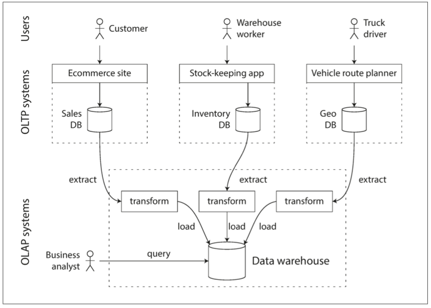
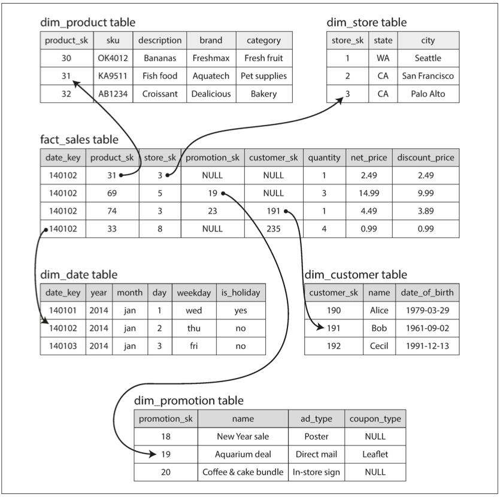

# 3장. 저장소와 검색

기본적으로 데이터베이스는 두 가지 작업을 수행한다

1. 데이터를 받으면 데이터를 저장한다.
2. 나중에 그 데이터를 요청하면 데이터를 제공한다.

이번 장에서는 위의 과정을 살펴볼 것이다. 즉, **데이터베이스가 데이터를 저장하는 방법과, 데이터를 요청하였을 때 다시 찾을 수 있는 방법을 설명하려고 한다**

크게 두 가지 파트로 나눠서 설명할 것이다. 관계형 데이터베이스와 NoSQL 의 저장소 엔진에 대해 설명한다. 그 후에 **로그 구조** 계열 저장소와 **페이지 지향** 계열 저장소 엔진을 검토할 것이다.

# 데이터베이스를 강력하게 만드는 데이터 구조

다음과 같은 데이터베이스를 상상해 보자

```bash
#!/bin/bash

db_set() { 
    echo " $1,$2 " >> database 
} 
db_get() { 
    grep "^$1," database | sed -e "s/^$1,//" | tail -n 1 
} 
```

작동예시

```bash
$ db_set 123456 '{"name": "London", "attractions":["Big Ben", "London Eye"]}'

$ db_set 42 '{"name": "San Francisco", "attractions":["Golden Gate Bridge"]}'

$ db_get 42
{"name": "San Francisco", "attractions":["Golden Gate Bridge"]}

$ db_set 42 '{"name": "San Francisco", "attractions":["Exploratorium"]}'

$ db_get 42
{"name": "San Francisco", "attractions":["Exploratorium"]}

$ cat database
123456,{"name": "London", "attractions":["Big Ben", "London Eye"]}
42,{"name": "San Francisco", "attractions":["Golden Gate Bridge"]}
42,{"name": "San Francisco", "attractions":["Exploratorium"]}
```

키-값 저장소를 함수 두 개로 구현하였다. 위의 함수를 호출하면 데이터베이스에 key 와 value 를 저장하고 다시 가져올 수 있다. 이 데이터베이스는 다음과 같은 특징을 가지고 있다.

- db_set 을 호출할때마다 파일의 끝에 새로운 데이터를 추가하므로, 키를 갱신하여도 이전 버전에 영향을 미치지 않는다.
- 최신 값을 찾기 위해선 파일의 가장 마지막(tail -n 1) 을 살펴보아야 한다.
- db_get 함수는 매번 키를 찾을때마다 파일 전체를 탐색해야 한다. 검색 비용이 O(n) 이다.

검색 성능을 개선하기 위해서는 다른 방법이 필요하다. 즉, 인덱스이다. 인덱스의 일반적인 개념은 **어떤 부가적인 메타데이터를 유지하는 것**이다. 이는 데이터를 검색하는 데 도움을 준다. 이런 인덱스는 추가적인 구조이기에 거의 대부분의 인덱스는 쓰기 성능을 하락시킨다. 데이터를 쓸 때마다 인덱스 또한 매번 갱신하여야 하기 때문이다. 그렇기 때문에, 데이터베이스 관리자나 개발자가 애플리케이션의 질의 패턴을 확인하고, 필요 이상의 오버헤드를 발생하지 않는 적당한 인덱스를 선택하여야 한다.

## 해시 색인

key - value 데이터는 대부분 dictionary type 과 유사하며 해시맵으로 구현한다. 그렇다면 인메모리 데이터 구조를 사용하여 인덱스을 할 수 있지 않을까?

가장 간단하게 구현할 수 있는 색인 전략은 다음과 같다. 키를 데이터 파일의 바이트 오프셋(값을 바로 찾을 수 있는 위치)에 매핑해 인메모리 해시 맵을 유지하는 전략이다. 새로운 key - value 를 추가할 때마다 데이터 오프셋을 갱신하기 위해 해시 맵도 갱신하여야 한다.


이 방식은 각 키의 값이 자주 갱신될 때 적합하다. 그러나 파일에 항상 추가만 하게 되면 결국 디스크 공간이 부족해지게 된다. 이 상황은 어떻게 피할 수 있을까? 특정 크기의 세그먼트로 로그를 나누면 효율적이다. 특정 크기에 도달하면 세그먼트 파일을 닫고 새로운 세그먼트 파일에 이후 쓰기를 수행한다. 그 후에, 세그먼트 파일에 대해 컴팩션을 수행하면 된다. 컴팩션은 로그의 중복된 키를 버리고 각 키의 최신 값만 유지하는 것을 의미한다.


그리고 여러 개의 세그먼트 파일을 동시에 컴팩션 할 수 있는데, 세그먼트는 보통 이뮤터블하므로 컴팩션 작업은 백그라운드 쓰레드에서 진행한다. 캠퍽션 중에 요청이 들어오면 이전 세그먼트를 바라보게 하고, 컴팩션이 완료되면 새로 생성된 세그먼트를 바라보게 하면 무중단으로 진행할 수 있다.


이 생각을 구현하려면 세부적으로 많은 사항들을 고려하여야 한다.

- 파일 형식
  - CSV 는 로그에 적합한 형식이 아니다. 바이트 단위의 문자열 길이를 부호화한 다음, 원시 문자열을 부호화하는 바이너리 방식을 사용하는 편이 더 빠르고 간단하다.
- 레코드 삭제
  - 키 삭제시 데이터 파일에 특수한 삭제 레코드를 추가해야 한다. 로그 세그먼트가 병합될 때, 삭제된 키의 이전 값을 무시하고 데이터를 병합한다.
- 고장 복구
  - 데이터베이스가 재시작되면 인메모리 해시 맵은 손실된다. 원칙적으로는 전체 세그먼트 파일을 읽어 각 키의 오프셋을 확인하여 해시 맵을 다시 생성할 수 있다. 그러나 너무 고통스러운 과정이다. 메모리에 있는 해시 맵 스냅샷을 디스크에 저장하면 복구 속도를 높일 수 있다.
- 부분적으로 레코드 쓰기
  - 로그에 레코드를 추가하는 도중에 데이터베이스가 죽을 수 있다. 체크섬을 포함하여 로그의 손상된 부분을 탐지할 수 있다.
- 동시성 제어
  - 하나의 쓰기 쓰레드만 사용하면 동시성을 유지할 수 있다. 데이터 파일세그먼트는 추가 전용이거나 불변이므로 다중 스레드로 동시에 읽기를 할 수 있다.

추가 전용 설계는 좋은 전략이다. 순차적인 쓰기 작업이기 때문에 무작위 쓰기보다 빠르고, 동시성과 고장 복구가 훨씬 간단해진다. 다만 해시 테이블 또한 제약사항이 있는데, 메모리에 저장해야 하기 때문에 키가 너무 많으면 문제가 된다. 또한 range search 에 효율적이지 않다. 범위 검색 시에도 해시 맵에서 모든 개별 키를 조회하여야 한다.

## SS테이블과 LSM트리


키로 정렬된 형식을 SS테이블(정렬된 문자열 테이블) 이라고 부른다. SS 테이블은 해시 색인을 가진 로그 세그먼트보다 큰 몇가지 장점이 있다.

1. 세그먼트 병합은 파일이 사용 가능한 메모리보다 크더라도 간단하고 효율적이다. 접근 법은 merge sort와 유사하다.

2. 파일에 특정 키를 찾기 위해 모든 키의 색인을 유지할 필요 없다. ex) handiwork 찾기
3. 읽기 요청은 요청 범위 내에서 여러 키-값 쌍을 스캔 해야하기 때문에 해당 레코드들을 블록으로 그룹화하고 디스크에 쓰기 전에 압축한다.

### SS 테이블 생성과 유지

디스크 상에 키를 정렬하여 유지할 수도 있지만, 메모리에서 하는 것이 훨씬 쉽다. 레드 블랙 트리나 AVL 트리 같은 데이터 구조를 사용하면, 임의 순서로 키를 삽입하고 정렬된 순서로 키를 다시 읽을 수 있다. 이에 저장소 엔진을 다음과 같이 만들 수 있다.

1. 쓰기가 들어오면 balanced tree 데이터 구조에 추가한다. 이 인메모리 트리를 memtable 이라고 한다.
2. memtable 이 수 메가바이트 정도 임곗값보다 커지면 SS 테이블 파일로 디스크에 기록한다.
3. 읽기 요청이 오면 memtable 에서 키를 찾는다. 그 다음 디스크의 최신 세그먼트에서 찾는다. 이를 반복한다.
4. 병합과 컴팩션을 백그라운드에서 수행한다.

만약 데이터베이스가 고장나면 아직 디스크에 쓰지 않은 memtable 은 손실된다. 이런 문제를 피하기 위해서는 매번 쓸 때마다 분리된 로그를 디스크상에 유지하면 된다. 해당 로그는 memtable 복원할 때만 필요하기에 정렬되어 있지 않아도 된다. memtable을 SS 테이블로 기록하면 해당 로그는 버리면 된다.

### SS 테이블에서 LSM 트리 만들기

여기에 기술된 알고리즘은 key - value 저장소 엔진 라이브러리에서 사용한다. 이 중에서 카산드라와 Hbase 에서도 유사한 저장소 엔진을 사용한다. 원래 이 색인 구조는 Log-Structured Merge-Tree (또는 LSM 트리) 란 이름으로 발표되었다. 정렬된 파일 병합과 컴팩션 원리를 기반으로 하는 저장소 엔진을 LSM 저장소 엔진이라 부른다.

루씬은 엘라스틱서치나 솔라에서 사용하는 전문 검색 색인 엔진인데, 용어 사전을 저장하기 위해 이와 유사한 방법을 사용한다. 검색 질의로 단어가 들어오며 단어가 언급된 모든 문서를 찾는다. 키를 단어(용어)로, 값은 단어를 포함한 모든 문서의 ID 목록으로 하는 key - value 구조로 구현한다. 루씬에서 용어와 포스팅 목록의 매핑은 SS 테이블과 같은 정렬 파일에 두고, 필요에 따라 백그라운드에서 병합한다.

### 성능 최적화

LSM 트리 알고리즘은 존재하지 않는 키를 찾기 위해서 모든 세그먼트를 다 뒤져야 하는 문제가 있다. 이를 막기 위해, 저장소 엔진은 보통 블룸 필터(Bloom filter: 집합 내용을 근사한 메모리 효율적 데이터 구조로, 키가 DB에 존재하지 않는지 알려줌) 를 추가적으로 사용한다. 또한 SS 테이블을 압축 / 병합하는 순서와 시기를 결정하는 다양한 전략이 있다. 가장 일반적으로 size-tiered 와 leveled compaction 을 많이 사용한다. Hbase 는 size-tiered 를, 레벨 DB 와 록스 DB 는 leveled compaction 을 사용한다. 카산드라는 둘 다 지원한다.

- size-tiered
  - 상대적으로 좀 더 새롭고 작은 SS 테이블을 상대적으로 오래되었고 큰 SS 테이블에 연이어 병합한다.
- leveled compection
  - 키 범위를 더 작은 SS 테이블로 나누고 오래된 데이터는 개별 레벨로 이동하여, 컴팩션을 점진적으로 진행한다. 이는 디스크 공간을 덜 사용하게 된다.

**LSM 트리의 기본 개념은 백그라운드에서 연쇄적으로 SS 테이블을 지속적으로 병합하는 것이다.** 이 개념은 데이터셋이 가능한 메모리보다 훨씬 더 크더라도 여전히 효과적이고, 데이터가 정렬되어 있기 때문에 range search 를 효율적으로 할 수 있다.

## B Tree

현재 가장 널리 사용되는 인덱스 구조는 B-tree 로 LSM 색인과는 상당히 다르다. 대부분의 관계형 데이터베이스에서 표준 색인 구현으로 B-tree 를 사용하고, 비관계형 데이터베이스에서도 사용한다.

앞에서 살펴본 LSM 색인은 데이터베이스를 수 메가바이트 이상의 가변크기 세그먼트로 나누고, 항상 순차적으로 세그먼트를 기록한다. 반면에 B-tree 는 4kb 크기(혹은 더 큰)의 고정 크기 블록이나 페이지로 나누고, 한 번에 하나의 페이지에 읽기 또는 쓰기를 한다.

각 페이지는 주소나 위치를 이용해 식별할 수 있다. 이 방식으로 하나의 페이지가 다른 페이지를 참조할 수도 있다. 다른 페이지를 참조하여 페이지 트리를 만들 수 있다.

다음과 같은 프로세스를 통해 데이터를 찾는다.

1. 여러 페이지 중 한 페이지를 root 로 지정한다.
2. 루트로부터 child 로 내려가면서 페이지 참조를 통해 하위 페이지로 내려간다.
3. 최종적으로는 leaf page 를 포함하는 페이지에 도달한다. 이 페이지는 각 키의 값이나, 값을 찾을 수 있는 페이지의 참조를 가지고 있다.


한 페이지에서 하위 페이지를 참조하는 개수를 분기 계수(branching factor) 라 부른다. 이 값은 페이지 참조와 범위 경계를 저장할 공간의 크기에 의존적인데, 보통 수백 개에 달한다.


B-tree 의 키값을 갱신하려면, 먼저 키를 포함하고 있는 리프 페이지를 검색하고, 페이지의 값을 바꾼 다음에 페이지를 디스크에 다시 기록한다. 키를 추가하려면 새로운 키를 포함하는 범위의 페이지를 찾아 해당 페이지에 키와 값을 추가한다. 만약 그 페이지에 여유 공간이 없다면, 페이지를 반쯤 채워진 페이지 두개로 찢고, 상위 페이지에 하위 페이지의 범위를 알 수 있게 기록한다.

이 알고리즘은 트리가 계속 balanced 상태임을 보장한다. n 개의 키가 있는 B-tree 는 깊이가 항상 O(logn) 이다. 대부분의 데이터베이스에서 B-tree 의 depth 는 3이나 4 면 충분하므로 검색하려는 페이지를 찾기 위해 많은 페이지 참조를 따라가지 않아도 된다.

### 신뢰할 수 있는 B Tree 만들기

B-Tree의 기본 쓰기 동작은 새로운 데이터를 디스크 상의 페이지에 덮어 쓴다. 이 동작은 페이지 위치를 변경하지 않는 다고 가정하며 덮어쓰더라도 기존에 페이지를 가리키는 모든 참조는 온전히 남는다. 그러나 LSM 트리의 경우 파일에 추가만 할 뿐 같은 위치에 파일은 변경하지 않는다.

또한, B-tree 에 키를 추가할 때 페이지가 가득차면 페이지를 분할하는 과정을 거치는데, 이는 매우 위험한 동작이다. 이 작업 중에 데이터베이스가 고장난다면 색인이 훼손되고, 고아 페이지(어떤 페이지하고도 연관관계가 없는 페이지)가 발생하기 때문이다. 이를 위해 디스크 상에 쓰기 전 로그(write-ahead log, WAL) 라고 하는 데이터 구조를 추가한다. 트리 페이지에 변경사항을 적용하기 전에 모든 B-tree 의 변경사항을 기록하는 추가 전용 파일이다. 데이터베이스가 고장나면, 복구할 떄 이 파일을 확인하면 된다.

같은 자리의 페이지를 갱신할 때는 주의 깊게 동시성 제어를 해야 한다. 그렇지 않으면 스레드가 일관성이 깨진 상태의 트리에 접근할 수 있다. 보통 래치(latch) 를 사용하여 트리의 데이터 구조를 보호한다. 이런 상황에서는 LSM 이 훨씬 간단한데, 유입 질의의 간섭 없이 백그라운드에서 모든 병합을 수행하고 이따금 원자적으로 새로운 세그먼트를 이전 세그먼트로 바꾸기 때문이다.

### B Tree 최적화

- 페이지 덮어 쓰기와 고장 복구를 위한 WAL 유지 대신에 일부 데이터베이스는 쓰기 시 복사 방식(copy-on-write scheme) 을 사용하는 경우도 있다. 변경된 페이지는 다른 위치에 기록하고, 트리에 상위 페이지의 새로운 버전을 만들어 새로운 위치를 가리키게 한다. 이 방식은 동시성 제어에도 유용하다.
- 페이지에 키를 축약해 쓰면 공간을 절약할 수 있다. 특히 트리 내부 페이지에서 키가 키 범위 사이의 경계 역할을 하는데 충분한 정보만 제공하면 된다. 페이지 하나에 더 많은 키를 채울 수 있다면, 트리의 분기 계수(branching factor) 가 높아지기 때문에 depth 가 낮아질 수 있다. (한 페이지는 4kb 를 준수해야 함을 기억하라)
- 트리에 포인터를 추가한다. 각 리프 페이지가 형제 페이지의 참조를 가지고 있다면, 상위 페이지로 가지 않고도 range search 가 가능하다.
- 프랙탈 트리(fractal tree)와 같은 B-tree 변형은 디스크 서치를 줄이기 위해 LSM 의 개념을 일부 차용하였다.

### B Tree 와 LSM Tree 비교

LSM 트리는 쓰기가 빠르고, B-tree 는 읽기가 빠르다. LSM 트리에서 읽기가 느린 이유는, 각 컴팩션 단계에 있는 여러 데이터 구조와 SS 테이블을 확인해야 하기 때문이다. 그러나 벤치마크는 세부 사항에 좌우되는 경우가 많기 때문에, 저장소 엔진의 성능을 측정할 때는 다음 사항을 고려하여야 한다.

#### LSM 트리의 장점

- B-Tree

  * 색인은 모든 데이터 조각을 최소한 두번 기록한다.

    * WAL에 한번, Tree page에 한번(페이지가 분리될 때 다시 기록) 이다.

  * 해당 페이지 내 몇 byte 만 바뀌어도 전체 페이지를 기록해야 하는 오버헤드가 존재하기도 한다.

  * 일부 엔진은 전원 장애가 발생했을 때 일부만 갱신된 페이지로 끝나지 않게 두번 덮어 쓴다.(innoDB)

- LSM

  * SS테이블의 반복된 compaction, merge 로 여러번 다시쓴다.

이렇게 한번 쓸때 여러번 쓰는 작업을 쓰기 증폭(write amplification) 이라 하는데 SSD의 경우 수명이 다 할때까지 블록에 덮어 쓰기 횟수가 정해져 있기 때문에 쓰기 증폭은 특별한 관심사 이다.

만약 application 에 쓰기가 많다면, 쓰기 증폭이 성능에 중요한 영향을 미친다.(저장소 엔진이 기록할수록 디스크 대역폭 내 처리량은 줄어든다)

1. LSM은 B tree 보다 쓰기 처리량을 높게 유지할 수 있다.
   * compaction과 merge 작업 때문에 B tree 에 비해 쓰기 증폭이 낮다. 특히 HDD 라면 순차 쓰기가 임의 쓰기 보다 훨씬 더 빠르기 때문에 적합하다.
   
2. LSM 트리는 압축률이 좋다. 

   * B tree 보다 더 적은 파일을 생성한다.

   * B tree 는 파편화로 인해 디스크 공간 일부가 남는다. (일부 공간을 사용하지 않음)

     

#### LSM 트리의 단점

LSM 트리의 단점은 compaction 과정으로 인해 진행 중인 읽기와 쓰기의 성능에 영향을 준다. 저장소 엔진은 compaction과정을 점진적으로 수행하고 동시 접근의 영향이 없게 수행하려 한다. 하지만 disk가 가진 자원은 한계가 있다. 그래서 compaction 연산이 끝날 때까지 요청을 대기해야 하는 상황이 발생하기 쉽다. 물론 처리량과 평균 응답 시간이 성능에 주는 영향은 작지만, 백분위로 비교하면 종종 매우 길어지는 시간이 존재한다. 하지만, B tree 의 성능은 상대적으로 예측하기 쉽다.

또 다른 compaction 문제는 높은 쓰기 처리량에서 발생한다. 초기 쓰레드와 백그라운드에서 수행하는 compaction 스레드가 대역폭을 공유하여 사용한다. 디스크의 쓰기 대역폭은 유한하나, 데이터베이스가 점점 커질수록 compaction을 위해 더 많은 디스크 대역폭이 필요하다. 

쓰기 처리량이 높다 하더라도 설정을 주의 깊게 하지 않으면 compaction 이 유입 속도를 따라가지 못하는 경우가 발생하는데, 유입 속도에 맞춰 compaction 이 줄어드는것이 아니기 때문에 명시적인 모니터링이 필요하다.

B 트리의 경우 각 키가 색인의 한곳에 존재하지만 LSM의 경우 다른 세그먼트에 같은 키의 다중 복사본이 존재할 수 있다. 강력한 트랜잭션 시맨틱(sementic)을 제공하는 DB의 경우 B트리가 훨씬 매력적이다. 많은 관계형 DB의 트랜잭션 격리는 키 범위의 잠금을 사용해 구현하는 반면 B 트리의 색인에서는 트리에 직접 잠금을 포함한다.

### 기타 색인 구조

지금까지 모두 key - value 색인을 살펴보았다. 대표적인 예는 관계형 DB 의 PK이다. secondary index 를 사용하는 방식도 매우 일반적이다. 보조 색인(secondary index)을 사용하기도 한다. 하지만, PK와의 차이점은 중복 유무이다.

### 색인 안에 값 저장하기

인덱스에서 키는 질의의 검색 대상이고, 값은 둘 중 하나, **래퍼런스(참조) 혹은 실제 값** 이다. 래퍼런스의 경우 로우가 저장된 곳을 **힙(heap) 파일** 이라고 하고 데이터를 순서 없이 쌓는다. 각 인덱스는 힙파일에서 위치만 참조하고 실제 데이터는 일정한 곳에 유지한다.

힙 파일 접근 방식은 키를 변경하지 않고 값을 갱신할 때 꽤 효율적이다. 새로운 값이 이전 값보다 적거나 같으면 레코드를 제자리에 덮어 쓸수 있다. 그러나 만일 새로운 값이 더 많은 공간을 필요로 하면 충분히 수용할 만한 새로운 곳으로 위치를 이동하고 모든 색인이 레코드의 새로운 위치를 가르키게끔 갱신하거나 이전한 힙 위치에 전방향 포인터를 남겨둬야한다.

인덱스에서 힙 파일을 참조하는 것이 읽기 성능에 불이익이 크기 때문에, 어떤 상황에서는 인덱스 안에 데이터를 저장하는 경우도 있다. 이를 클러스터드 인덱스라고 한다. MySQL 의 InnoDB 저장소 엔진에서는 테이블의 PK 가 언제나 클러스터드 인덱스이고, 보조 인덱스는 PK 를 참조한다. MySQL 은 테이블당 하나의 클러스터드 인덱스를 지정할 수 있다.

클러스터드 인덱스(인덱스 안에 데이터 저장)과 비클러스터드 인덱스(인덱스 안에 래퍼런스 저장) 사이의 절충안을 커버링 인덱스라고 한다. 이는 인덱스 안에 컬럼 일부를 저장한다. 이렇게 하면 인덱스만 사용하여 일부 질의에 응답이 가능하다.

모든 종류의 데이터 복제와 마찬가지로, 클러스터드 인덱스와 커버링 인덱스는 읽기 성능을 향상시킬 수 있지만, 추가적인 저장소가 필요하고 쓰기 과정에 오버헤드가 발생한다. 또한 복제로 인한 불일치를 판단할 수 없기 때문에, 데이터베이스는 트랜잭션 보장을 강화하기 위해 노력하여야 한다.

### 다중 칼럼 색인

여러 컬럼에 동시에 질의해야 하는 경우도 있다. 가장 일반적인 인덱스는 결합 인덱스(concatenated index) 이다. 하나의 컬럼에 다른 컬럼을 추가하는 방식으로 하나의 키에 여러 필드를 단순히 결합하는 인덱스이다. 이는 (성, 이름) 을 키로 전화번호를 값으로 하는 종이 전화번호부와 유사하다. 순서가 정렬되어 있기 때문에 특정 성을 가진 사람을 찾거나, 특정 성/이름 조합을 찾는데는 유용하지만, **특정 이름** 을 찾을 때는 쓸모가 없다.

다차원 인덱스는 여러 컬럼에 질의하는 좀 더 일반적인 방법이다. 다음 쿼리를 보자

```
SELECT * FROM restaurants WHERE latitude > 51.4946 AND latitude < 51.5079 
AND longitude > -0.1162 AND longitude < -0.1004; 
```

B-tree 나 LSM-tree 인덱스는 이런 유형의 질의에 효과적으로 대응할 수 없다. 한 가지 방법은 R 트리와 같은 지리 공간 인덱스를 구현하는 것이다. 이러한 트리는 다차원 인덱스를 활요하는 것으로 지리학적인 위치 뿐만 아니라 다른 쿼리에도 활용할 수 있다.

### 모든 것을 메모리에 보관

지금까지 설명한 데이터 구조는 모두 **디스크 한계에 대한 해결책** 이었다. 그러나 램이 점점 저렴해져서, 메모리에 전체를 보관하는 방식도 꽤 현실적이다. 이런 이유로 인메모리 데이터베이스가 개발되었다.

맴캐시드 같은 인메모리 key - value 저장소는 장비가 재시작되면 데이터가 손실되어 캐시 용도로만 사용된다. 그러나, 다른 인메모리 데이터베이스는 지속성을 목표로 한다. 이를 위해 특수 하드웨어를 사용하거나, 디스크에 변경사항 로그를 기록하거나 스냅샷을 기록하거나, 다른 장비에 인메모리 상태를 복재하는 전략을 사용한다.

인메모리 DB가 재시작 되는 경우 특수 장비를 사용하지 않는다면 지속성을 위한 디스크나 네트워크를 통해 복제본에서 상태를 다시 적재한다. 디스크 상의 파일은 쉽게 백업이 가능하고, 외부 유틸을 사용해 검사와 분석도 가능하다.

인메모리 데이터베이스의 성능 장점은 디스크에서 읽지 않아도 되어서가 아니다. 디스크 기반 저장소 엔진도 운영체제가 최근에 사용한 디스크 블록을 메모리에 캐시하기 때문에, 메모리가 충분한 경우 디스크에서 읽지 않는다. 인메모리 데이터 구조를 디스크에 기록하기 위해 부호화하는 오버헤드를 피할 수 있다는 점 때문에 성능상 장점이 있다.

## 트랜잭션 처리나 분석?

초창기 비즈니스 모델은 논리 단위의 형태로 읽기와 쓰기 그룹을 나타내는 commercial transaction 에 해당한다. 이렇게 발생된 record 는 사용자 입력 기반이기 때문에 온라인 트랜잭션 처리(Online Transaction Processing, OLTP) 라고 한다.

그러나, DB를 데이터 분석 용도로 점점 더 많이 사용하게 되었다. 이러한 분석용 질의는 의사결정을 돕고, 그 의사결정이 필요한 경영진이 참고하는데 이러한 DB 사용 패턴을 온라인 분석 처리(Online Analytic Processing, OLAP) 라고 한다.

| 특성           | OLTP | OLAP |
| ----- | :-------- | --------- |
| 주요 읽기 패턴 | 질의당 적은 수의 레코드, 키 기준으로 가져옴 | 많은 레코드에 대한 집계 |
| 주요 쓰기 패턴 | 입의 접근, 사용자 입력을 낮은 지연시간으로 기록 | 대규모 불러오기 또는 이벤트 스트림 |
| 주요 사용처    | 웹 애플리케이션을 통해 최종 사용자/소비자 | 의사결정 지원을 위한 내부 분석가 |
| 데이터 표현    | 데이터의 최신 상태(현재 시점) | 시간이 지나며 일어난 이벤트 이력 |
| 데이터 셋 크기 | 기가바이트에서 테라바이트 | 테라바이트에서 페타바이트 |

처음에는 동일한 DB를 사용하였지만, 90년대 이후 OLTP 시스템을 분석 목적으로 사용하지 않고 개별 데이터베이스에서 분석을 수행하는 경향을 보이는데 이 개별 데이터베이스를 데이터 웨어 하우스라고 불렀다.

#### 데이터 웨어하우징 (Data Warehousing)

기업은 수십가지의 트랜잭션 처리 시스템을 갖추고 있으며(고객 대면 웹사이트 강화, 매장 판매 관리, 시스템 관리, 창고 재고 이력, 운송 수단을 위한 경로 등등) 이러한 시스템은 OLTP 이다.

OLTP의 특징은 높은 가용성과 낮은 지연시간의 트랜잭션 처리를 기대하기 때문에 DB 관리자는 OLTP를 철저히 보호하려고 한다.

그래서 비즈니스 분석가의 OLAP 쿼리를 꺼려한다. 왜냐하면 dataset 의 많은 부분을 스캔해야 하는 쿼리와 비즈니스의 트랜잭션을 동시에 실행할 경우 DB에 성능 저하가 발생하기 때문이다.

Data Warehouse 는 이러한 OLAP 쿼리를 OLTP 에게 영향을 주지 않고 언제나 질의할 수 있는 DB 이다.

특징은 읽기 전용 복사본으로 OLTP 에서 추출하고 분석 친화적인 스키마로 변환하고 정제하여 Data warehouse 에 적재한다.

이렇게 Data Warehouse 로 데이터를 가져오는 과정을 ETL(Extract-Transform-Load) 라고 한다.



분석을 위해 OLTP가 아닌 OLAP에 질의하면 분석 패턴에 맞게 최적화된 쿼리를 실행할 수 있다.

그래서 이전까지 다루던 색인 알고리즘은 OLTP 에 적합했고, 이제부터는 OLAP에 적합한 알고리즘을 다뤄본다.

#### OLTP 데이터베이스와 데이터 웨어하우스의 차이점 (The divergence between OLTP databases and data warehouses)

SQL이 분석 질의에 더 적합하기 때문에 Data warehouse 는 일반적으로 RDB 모델을 사용한다.

SQL 질의를 생성하고 결과를 시각화하고 분석가가 drill-down, slicing, dicing 같은 작업을 통해 데이터를 탐색할 수 있게 해주는 여러 그래픽 데이터 분석 도구가 있다.

여기까지 보면 OLTP와 OLAP 둘 다 SQL 질의 인터페이스를 지원하기 때문에 비슷해 보이지만 각각 매우 다른 질의 패턴에 맞게 최적화됐기 때문에 시스템의 내부는 완전히 다르다.

### 분석용 스키마: 별 모양 스키마와 눈꽃송이 모양 스키마

(Stars and Snowflakes: Schemas for Analytics)

많은 data warehouse 는 별 모양 스키마(star schema - 차원 모델링 dimensional modeling) 로 알려진 정형화된 방식을 사용한다.



이 그림은 식료품 소매업에서 사용하는 data warehouse 이다. 스키마 중심에 fact table(사실 테이블, 위 그림에서 fact_sales 을 말함)의 각 row는 특정 시각에 발생한 event 에 해당한다.

통상적으로 fact 는 개별 이벤트(페이지 뷰, 사용자 클릭)를 담는데 이는 fact table 이 매우 커질 수 있다는 의미이다. 이러한 fact table 의 column 은 외래 키 참조로 dimension table 의 pk를 가지고 있다.

각 테이블의 row 가 이벤트이면, column은 육하원칙(5w1h )을 나타낸다.

이 예제에서는 하나의 상품이 판매되면, 상품의 정보, 날짜 시간 등을 모두 dimension table 을 통해 표현한다. 이러한 차원 테이블은 추가적인 정보를 부호화할 수 있고 휴일과 평일의 판매 차이를 질의할 수 있다.

이 템플릿의 변형을 눈꽃송이 모양 스키마(snowflake schema) 라고 하며 차원이 하위 차원으로 더 세분화 된다. 예를 들면 dim_product 테이블에 문자열로 브랜드와 범주를 저장했지만 FK로 분리하여 더 하위 테이블을 만들어낸다.

snowflake 가 더 정규화 되었지만, 작업은 star schema 가 더 편리하므로 분석가들은 star를 더 선호한다.

일반적인 data warehouse 는 테이블의 폭이 넓다고 표현하는데 column이 수백 개인 경우도 있기 때문이다.

