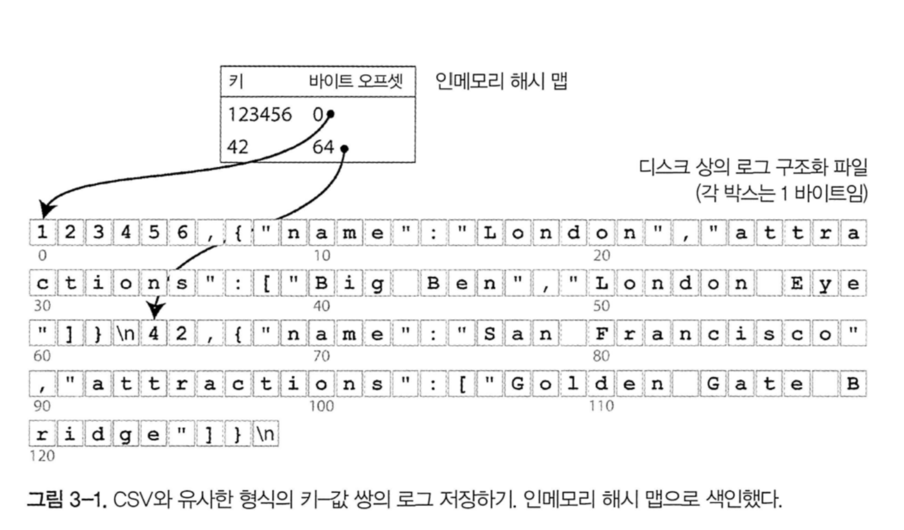
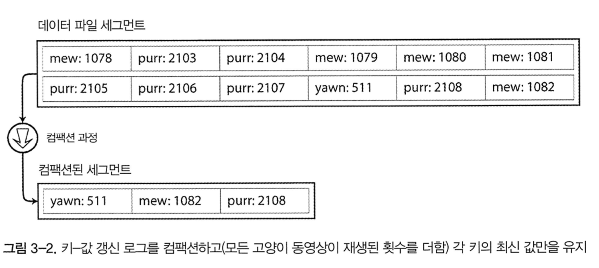
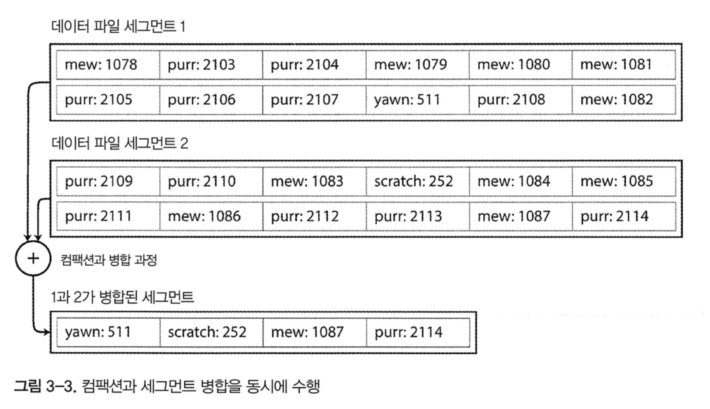
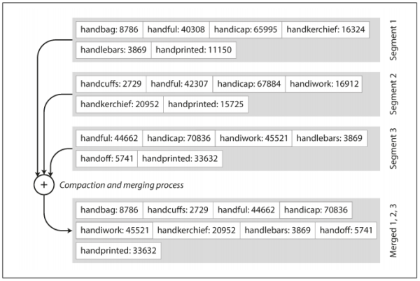
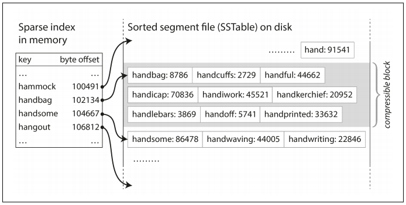
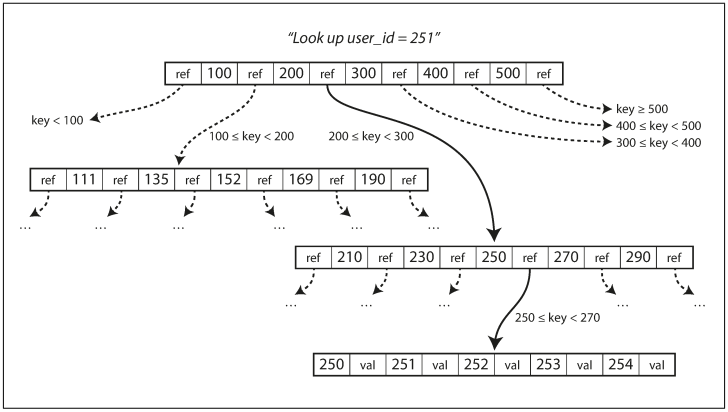
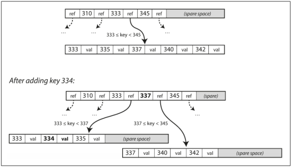

# 3장. 저장소와 검색

기본적으로 데이터베이스는 두 가지 작업을 수행한다

1. 데이터를 받으면 데이터를 저장한다.
2. 나중에 그 데이터를 요청하면 데이터를 제공한다.

이번 장에서는 위의 과정을 살펴볼 것이다. 즉, **데이터베이스가 데이터를 저장하는 방법과, 데이터를 요청하였을 때 다시 찾을 수 있는 방법을 설명하려고 한다**

크게 두 가지 파트로 나눠서 설명할 것이다. 관계형 데이터베이스와 NoSQL 의 저장소 엔진에 대해 설명한다. 그 후에 **로그 구조** 계열 저장소와 **페이지 지향** 계열 저장소 엔진을 검토할 것이다.

# 데이터베이스를 강력하게 만드는 데이터 구조

다음과 같은 데이터베이스를 상상해 보자

```bash
#!/bin/bash

db_set() { 
    echo " $1,$2 " >> database 
} 
db_get() { 
    grep "^$1," database | sed -e "s/^$1,//" | tail -n 1 
} 
```

작동예시

```bash
$ db_set 123456 '{"name": "London", "attractions":["Big Ben", "London Eye"]}'

$ db_set 42 '{"name": "San Francisco", "attractions":["Golden Gate Bridge"]}'

$ db_get 42
{"name": "San Francisco", "attractions":["Golden Gate Bridge"]}

$ db_set 42 '{"name": "San Francisco", "attractions":["Exploratorium"]}'

$ db_get 42
{"name": "San Francisco", "attractions":["Exploratorium"]}

$ cat database
123456,{"name": "London", "attractions":["Big Ben", "London Eye"]}
42,{"name": "San Francisco", "attractions":["Golden Gate Bridge"]}
42,{"name": "San Francisco", "attractions":["Exploratorium"]}
```

키-값 저장소를 함수 두 개로 구현하였다. 위의 함수를 호출하면 데이터베이스에 key 와 value 를 저장하고 다시 가져올 수 있다. 이 데이터베이스는 다음과 같은 특징을 가지고 있다.

- db_set 을 호출할때마다 파일의 끝에 새로운 데이터를 추가하므로, 키를 갱신하여도 이전 버전에 영향을 미치지 않는다.
- 최신 값을 찾기 위해선 파일의 가장 마지막(tail -n 1) 을 살펴보아야 한다.
- db_get 함수는 매번 키를 찾을때마다 파일 전체를 탐색해야 한다. 검색 비용이 O(n) 이다.

검색 성능을 개선하기 위해서는 다른 방법이 필요하다. 즉, 인덱스이다. 인덱스의 일반적인 개념은 **어떤 부가적인 메타데이터를 유지하는 것**이다. 이는 데이터를 검색하는 데 도움을 준다. 이런 인덱스는 추가적인 구조이기에 거의 대부분의 인덱스는 쓰기 성능을 하락시킨다. 데이터를 쓸 때마다 인덱스 또한 매번 갱신하여야 하기 때문이다. 그렇기 때문에, 데이터베이스 관리자나 개발자가 애플리케이션의 질의 패턴을 확인하고, 필요 이상의 오버헤드를 발생하지 않는 적당한 인덱스를 선택하여야 한다.

## 해시 색인

key - value 데이터는 대부분 dictionary type 과 유사하며 해시맵으로 구현한다. 그렇다면 인메모리 데이터 구조를 사용하여 인덱스을 할 수 있지 않을까?

가장 간단하게 구현할 수 있는 색인 전략은 다음과 같다. 키를 데이터 파일의 바이트 오프셋(값을 바로 찾을 수 있는 위치)에 매핑해 인메모리 해시 맵을 유지하는 전략이다. 새로운 key - value 를 추가할 때마다 데이터 오프셋을 갱신하기 위해 해시 맵도 갱신하여야 한다.



이 방식은 각 키의 값이 자주 갱신될 때 적합하다. 그러나 파일에 항상 추가만 하게 되면 결국 디스크 공간이 부족해지게 된다. 이 상황은 어떻게 피할 수 있을까? 특정 크기의 세그먼트로 로그를 나누면 효율적이다. 특정 크기에 도달하면 세그먼트 파일을 닫고 새로운 세그먼트 파일에 이후 쓰기를 수행한다. 그 후에, 세그먼트 파일에 대해 컴팩션을 수행하면 된다. 컴팩션은 로그의 중복된 키를 버리고 각 키의 최신 값만 유지하는 것을 의미한다.



그리고 여러 개의 세그먼트 파일을 동시에 컴팩션 할 수 있는데, 세그먼트는 보통 이뮤터블하므로 컴팩션 작업은 백그라운드 쓰레드에서 진행한다. 캠퍽션 중에 요청이 들어오면 이전 세그먼트를 바라보게 하고, 컴팩션이 완료되면 새로 생성된 세그먼트를 바라보게 하면 무중단으로 진행할 수 있다.



이 생각을 구현하려면 세부적으로 많은 사항들을 고려하여야 한다.

- 파일 형식
  - CSV 는 로그에 적합한 형식이 아니다. 바이트 단위의 문자열 길이를 부호화한 다음, 원시 문자열을 부호화하는 바이너리 방식을 사용하는 편이 더 빠르고 간단하다.
- 레코드 삭제
  - 키 삭제시 데이터 파일에 특수한 삭제 레코드를 추가해야 한다. 로그 세그먼트가 병합될 때, 삭제된 키의 이전 값을 무시하고 데이터를 병합한다.
- 고장 복구
  - 데이터베이스가 재시작되면 인메모리 해시 맵은 손실된다. 원칙적으로는 전체 세그먼트 파일을 읽어 각 키의 오프셋을 확인하여 해시 맵을 다시 생성할 수 있다. 그러나 너무 고통스러운 과정이다. 메모리에 있는 해시 맵 스냅샷을 디스크에 저장하면 복구 속도를 높일 수 있다.
- 부분적으로 레코드 쓰기
  - 로그에 레코드를 추가하는 도중에 데이터베이스가 죽을 수 있다. 체크섬을 포함하여 로그의 손상된 부분을 탐지할 수 있다.
- 동시성 제어
  - 하나의 쓰기 쓰레드만 사용하면 동시성을 유지할 수 있다. 데이터 파일세그먼트는 추가 전용이거나 불변이므로 다중 스레드로 동시에 읽기를 할 수 있다.

추가 전용 설계는 좋은 전략이다. 순차적인 쓰기 작업이기 때문에 무작위 쓰기보다 빠르고, 동시성과 고장 복구가 훨씬 간단해진다. 다만 해시 테이블 또한 제약사항이 있는데, 메모리에 저장해야 하기 때문에 키가 너무 많으면 문제가 된다. 또한 range search 에 효율적이지 않다. 범위 검색 시에도 해시 맵에서 모든 개별 키를 조회하여야 한다.

## SS테이블과 LSM트리





키로 정렬된 형식을 SS테이블(정렬된 문자열 테이블) 이라고 부른다. SS 테이블은 해시 색인을 가진 로그 세그먼트보다 큰 몇가지 장점이 있다.

1. 세그먼트 병합은 파일이 사용 가능한 메모리보다 크더라도 간단하고 효율적이다. 접근 법은 merge sort와 유사하다.

2. 파일에 특정 키를 찾기 위해 모든 키의 색인을 유지할 필요 없다. ex) handiwork 찾기
3. 읽기 요청은 요청 범위 내에서 여러 키-값 쌍을 스캔 해야하기 때문에 해당 레코드들을 블록으로 그룹화하고 디스크에 쓰기 전에 압축한다.

### SS 테이블 생성과 유지

디스크 상에 키를 정렬하여 유지할 수도 있지만, 메모리에서 하는 것이 훨씬 쉽다. 레드 블랙 트리나 AVL 트리 같은 데이터 구조를 사용하면, 임의 순서로 키를 삽입하고 정렬된 순서로 키를 다시 읽을 수 있다. 이에 저장소 엔진을 다음과 같이 만들 수 있다.

1. 쓰기가 들어오면 balanced tree 데이터 구조에 추가한다. 이 인메모리 트리를 memtable 이라고 한다.
2. memtable 이 수 메가바이트 정도 임곗값보다 커지면 SS 테이블 파일로 디스크에 기록한다.
3. 읽기 요청이 오면 memtable 에서 키를 찾는다. 그 다음 디스크의 최신 세그먼트에서 찾는다. 이를 반복한다.
4. 병합과 컴팩션을 백그라운드에서 수행한다.

만약 데이터베이스가 고장나면 아직 디스크에 쓰지 않은 memtable 은 손실된다. 이런 문제를 피하기 위해서는 매번 쓸 때마다 분리된 로그를 디스크상에 유지하면 된다. 해당 로그는 memtable 복원할 때만 필요하기에 정렬되어 있지 않아도 된다. memtable을 SS 테이블로 기록하면 해당 로그는 버리면 된다.

### SS 테이블에서 LSM 트리 만들기

여기에 기술된 알고리즘은 key - value 저장소 엔진 라이브러리에서 사용한다. 이 중에서 카산드라와 Hbase 에서도 유사한 저장소 엔진을 사용한다. 원래 이 색인 구조는 Log-Structured Merge-Tree (또는 LSM 트리) 란 이름으로 발표되었다. 정렬된 파일 병합과 컴팩션 원리를 기반으로 하는 저장소 엔진을 LSM 저장소 엔진이라 부른다.

루씬은 엘라스틱서치나 솔라에서 사용하는 전문 검색 색인 엔진인데, 용어 사전을 저장하기 위해 이와 유사한 방법을 사용한다. 검색 질의로 단어가 들어오며 단어가 언급된 모든 문서를 찾는다. 키를 단어(용어)로, 값은 단어를 포함한 모든 문서의 ID 목록으로 하는 key - value 구조로 구현한다. 루씬에서 용어와 포스팅 목록의 매핑은 SS 테이블과 같은 정렬 파일에 두고, 필요에 따라 백그라운드에서 병합한다.

### 성능 최적화

LSM 트리 알고리즘은 존재하지 않는 키를 찾기 위해서 모든 세그먼트를 다 뒤져야 하는 문제가 있다. 이를 막기 위해, 저장소 엔진은 보통 블룸 필터(Bloom filter: 집합 내용을 근사한 메모리 효율적 데이터 구조로, 키가 DB에 존재하지 않는지 알려줌) 를 추가적으로 사용한다. 또한 SS 테이블을 압축 / 병합하는 순서와 시기를 결정하는 다양한 전략이 있다. 가장 일반적으로 size-tiered 와 leveled compaction 을 많이 사용한다. Hbase 는 size-tiered 를, 레벨 DB 와 록스 DB 는 leveled compaction 을 사용한다. 카산드라는 둘 다 지원한다.

- size-tiered
  - 상대적으로 좀 더 새롭고 작은 SS 테이블을 상대적으로 오래되었고 큰 SS 테이블에 연이어 병합한다.
- leveled compection
  - 키 범위를 더 작은 SS 테이블로 나누고 오래된 데이터는 개별 레벨로 이동하여, 컴팩션을 점진적으로 진행한다. 이는 디스크 공간을 덜 사용하게 된다.

**LSM 트리의 기본 개념은 백그라운드에서 연쇄적으로 SS 테이블을 지속적으로 병합하는 것이다.** 이 개념은 데이터셋이 가능한 메모리보다 훨씬 더 크더라도 여전히 효과적이고, 데이터가 정렬되어 있기 때문에 range search 를 효율적으로 할 수 있다.

## B Tree

현재 가장 널리 사용되는 인덱스 구조는 B-tree 로 LSM 색인과는 상당히 다르다. 대부분의 관계형 데이터베이스에서 표준 색인 구현으로 B-tree 를 사용하고, 비관계형 데이터베이스에서도 사용한다.

앞에서 살펴본 LSM 색인은 데이터베이스를 수 메가바이트 이상의 가변크기 세그먼트로 나누고, 항상 순차적으로 세그먼트를 기록한다. 반면에 B-tree 는 4kb 크기(혹은 더 큰)의 고정 크기 블록이나 페이지로 나누고, 한 번에 하나의 페이지에 읽기 또는 쓰기를 한다.

각 페이지는 주소나 위치를 이용해 식별할 수 있다. 이 방식으로 하나의 페이지가 다른 페이지를 참조할 수도 있다. 다른 페이지를 참조하여 페이지 트리를 만들 수 있다.

다음과 같은 프로세스를 통해 데이터를 찾는다.

1. 여러 페이지 중 한 페이지를 root 로 지정한다.
2. 루트로부터 child 로 내려가면서 페이지 참조를 통해 하위 페이지로 내려간다.
3. 최종적으로는 leaf page 를 포함하는 페이지에 도달한다. 이 페이지는 각 키의 값이나, 값을 찾을 수 있는 페이지의 참조를 가지고 있다.



한 페이지에서 하위 페이지를 참조하는 개수를 분기 계수(branching factor) 라 부른다. 이 값은 페이지 참조와 범위 경계를 저장할 공간의 크기에 의존적인데, 보통 수백 개에 달한다.



B-tree 의 키값을 갱신하려면, 먼저 키를 포함하고 있는 리프 페이지를 검색하고, 페이지의 값을 바꾼 다음에 페이지를 디스크에 다시 기록한다. 키를 추가하려면 새로운 키를 포함하는 범위의 페이지를 찾아 해당 페이지에 키와 값을 추가한다. 만약 그 페이지에 여유 공간이 없다면, 페이지를 반쯤 채워진 페이지 두개로 찢고, 상위 페이지에 하위 페이지의 범위를 알 수 있게 기록한다.

이 알고리즘은 트리가 계속 balanced 상태임을 보장한다. n 개의 키가 있는 B-tree 는 깊이가 항상 O(logn) 이다. 대부분의 데이터베이스에서 B-tree 의 depth 는 3이나 4 면 충분하므로 검색하려는 페이지를 찾기 위해 많은 페이지 참조를 따라가지 않아도 된다.

### 신뢰할 수 있는 B Tree 만들기

B-tree 에 키를 추가할 때 페이지가 가득차면 페이지를 분할하는 과정을 거치는데, 이는 매우 위험한 동작이다. 이 작업 중에 데이터베이스가 고장난다면 색인이 훼손되고, 고아 페이지(어떤 페이지하고도 연관관계가 없는 페이지)가 발생하기 때문이다. 이를 위해 디스크 상에 쓰기 전 로그(write-ahead log, WAL) 라고 하는 데이터 구조를 추가한다. 트리 페이지에 변경사항을 적용하기 전에 모든 B-tree 의 변경사항을 기록하는 추가 전용 파일이다. 데이터베이스가 고장나면, 복구할 떄 이 파일을 확인하면 된다.

같은 자리의 페이지를 갱신할 때는 주의 깊게 동시성 제어를 해야 한다. 보통 래치(latch) 를 사용하여 트리의 데이터 구조를 보호한다. 이런 상황에서는 LSM 이 훨씬 간단한데, 세그먼트가 이뮤터블하기 때문이다.